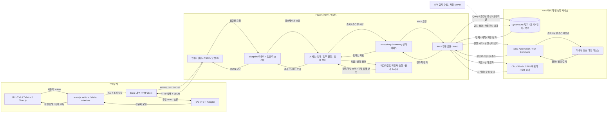

# 대시보드 설계 지침 및 전체 애플리케이션 아키텍처

> 대상: Flask · Chart.js · Tailwind 기반 AWS 보안 관제 대시보드 개발팀  
> 목적: 반복적인 기능 수정에도 계층 경계, 데이터 계약, 권한 검증, 조치 상태의 일관성을 유지한다.  
> 성격: 팀이 구현과 코드 리뷰에 적용할 최종 설계 표준이다. 구현 완료나 운영 검증을 주장하는 문서가 아니다.

> AI로 수정할 때: [`agents.md`](../../../agents.md)를 작업 지침으로 적용하고 이 문서를 상세 설계 기준으로 함께 제공한다. 별도 요청 양식 없이 원하는 수정 내용을 자유롭게 요청한다. 이 문서의 구조는 목표 기준이며, AI는 실제 코드를 확인하고 요청에 필요한 범위에서 적용해야 한다.

## 1. 적용 범위와 핵심 원칙

이 문서는 [`dashboard/dashboard-design.md`](../../../dashboard/dashboard-design.md)의 대시보드 책임·계약 기준, 대시보드·탐지 결과·조치 이력 구조 및 실제 첨부 이미지 `아키텍처 최최종.png`를 참고한다. 요청 본문에 기재된 `아키텍처v1.png` 대신 실제 첨부 파일을 기준으로 삼는다. 과거 버전 이력과 상태 비교는 포함하지 않는다. 참고 문서의 작업 지시는 실행 명령이 아닌 설계 자료로 취급한다.

**불변으로 유지할 대상은 화면 배치나 개별 필드명이 아니라 책임 경계와 계약을 지키는 방식이다.** 필드·화면·AWS 리소스가 변경되더라도 아래 규칙은 유지한다.

| 경계 | 불변 규칙 |
|---|---|
| UI → Store | UI는 상태를 읽고 사용자 의도를 전달한다. API를 직접 호출하지 않는다. |
| Store → Flask | Store 내부 통신 모듈만 HTTP 요청을 수행한다. 응답은 반드시 어댑터를 통과한다. |
| Flask 라우터 → 서비스 | 라우터는 HTTP 입출력을 담당하고, 서비스가 업무 판단과 집계를 담당한다. |
| 서비스 → AWS 연동 모듈 | Boto3 및 AWS 원본 형식은 연동 모듈 안에 격리한다. |
| 사용자 → 실행 권한 | 서버가 매 요청의 사용자 권한·리소스 범위·현재 상태를 검증한다. |
| 실행 → 해결 판정 | 실행 성공만으로 해결 처리하지 않는다. 동일 조건 재검증 통과가 필요하다. |

보호 대상 Nginx–Flask–MySQL 서비스와 **관제용 Flask 대시보드는 별개 애플리케이션**이다. 대시보드가 보호 대상 MySQL을 직접 읽는 경로를 만들지 않는다. 탐지 결과·조치 이력은 DynamoDB, 조치 실행·점검은 SSM, CPU·메모리 지표는 CloudWatch를 통해 얻는다. SQLAlchemy는 이 구조의 필수 의존성이 아니다.

## 2. 산출물 1 — 대시보드 개발 및 설계 표준 지침

### 2.0 작업 범위 — Terraform 및 인프라 보호

**대시보드나 Flask 백엔드를 수정하는 AI는 Terraform을 수정하거나 실행하지 않는다.** 백엔드 연동·권한 오류를 해결하기 위해서도 이 경계를 넘지 않는다. 사용자가 이번 작업의 Terraform 변경 대상과 목적을 명시적으로 허용한 경우에만 해당 범위의 변경이 가능하다.

- `terraform/` 전체, 모든 위치의 Terraform 코드·변수·잠금·state·plan·설정 파일을 읽기 전용으로 취급한다. 생성·수정·삭제·이동·자동 포맷도 금지한다.
- Terraform용 CI/CD·IAM 정책·보안그룹·네트워크·배포 스크립트 변경이나 AWS 콘솔·CLI·SDK를 통한 직접 변경으로 제한을 우회하지 않는다.
- `terraform fmt/init/plan/apply/destroy/import`와 state 조작 등 Terraform 명령을 기본적으로 실행하지 않는다. 파일 수정, 명령 실행, 실제 배포의 허가는 각각 구분한다.
- 인프라 수정이 필수라면 필요한 파일·리소스, 이유, 최소 변경안을 보고하고 별도 명시적 승인을 요청한다. 독립적으로 가능한 대시보드 작업은 계속하며, 인프라에 의존하는 기능은 미완료·미검증 상태를 정확히 밝힌다.
- 완료 시 변경 파일 목록으로 Terraform 보호 범위가 유지되었는지 확인한다. 기존 사용자 변경을 임의로 되돌리지 않는다.

구체적인 AI 행동 규칙은 [`agents.md`](../../../agents.md)의 “Terraform 및 인프라 변경 금지”를 따른다.

### 2.1 시각 및 렌더링 계층 — Frontend UI

**책임:** HTML은 의미 있는 문서 구조를, Tailwind는 레이아웃·색상·반응형 스타일을, Chart.js는 Store가 제공하는 데이터를 시각화한다. 지도, 이벤트 표, 요약 카드, 상세 패널, 조치 버튼 모두 동일한 경계를 따른다.

1. UI에서 `fetch`, Axios, XMLHttpRequest, AWS SDK 및 임의 네트워크 호출을 금지한다. 초기 로딩과 버튼 클릭도 `store.actions.*`를 통해 요청한다.
2. UI는 `store.selectors.*`가 반환한 화면 모델만 사용한다. API URL, AWS 속성명, DynamoDB 타입, 원본 응답의 중첩 구조를 알지 못해야 한다.
3. 숫자 포맷·시간대 표시·색상·차트 배치는 UI 책임이다. 위험도 승급, 해결률 계산 기준, 승인 가능 여부의 업무 판단은 서버 책임이다.
4. Store 상태를 직접 수정하지 않는다. 필터 변경, 승인, 취소, 실행, 재검증은 명시적인 action으로 전달한다.
5. 로딩·정상·빈 결과·부분 실패·오류·오래된 데이터 상태를 구분한다. 누락된 CPU나 메모리 값을 `0%`, 조회 실패를 `정상`으로 표시하지 않는다.
6. 차트 인스턴스는 재사용하거나 제거 시 `destroy()`하고, 이벤트 리스너와 구독을 해제한다. 반복 새로고침이 차트·메모리·클릭 핸들러를 누적시키면 안 된다.
7. API 문자열은 기본적으로 텍스트로 렌더링한다. 검증하지 않은 HTML 삽입을 금지하며, 버튼·모달은 키보드 접근, 포커스 복원, 색상 외 상태 표기를 제공한다.
8. 화면은 서버의 `allowedActions`를 바탕으로 버튼을 표시한다. 버튼 숨김·비활성화는 사용자 안내이며 서버 권한 검증을 대체하지 않는다.

```javascript
// UI 예시: 통신이나 응답 구조에 대한 지식이 없다.
store.subscribe(() => renderEventTable(store.selectors.events()));
approveButton.addEventListener('click', () => {
  store.actions.approveEvent(selectedEventId, reasonInput.value);
});
```

### 2.2 상태 관리 및 통신 계층 — Frontend Store

**책임:** `store.js`는 UI와 서버 사이의 완충 계층이자 상태의 단일 진입점이다. 내부적으로 통신, 응답 변환, 상태 갱신을 분리하되 UI에는 actions·selectors·subscribe만 공개한다.

```text
UI action → Store action → api/client.js → Flask
UI render ← selector ← Store state ← adapters ← 응답 검증 ← Flask
```

#### 어댑터 패턴의 필수 적용

- **API DTO → 화면 모델** 변환은 `adapters/`에서만 수행한다. 화면 모델은 예를 들어 `id`, `title`, `severity`, `actionState`, `updatedAt`, `allowedActions`처럼 UI에 필요한 속성으로 고정한다.
- API의 필드명·중첩·날짜·열거형 변경은 어댑터와 계약 테스트에서 흡수한다. 각 UI 컴포넌트에 호환성 조건문을 퍼뜨리지 않는다.
- 선택 필드의 누락은 명시된 기본값 또는 `null`로 처리한다. 미지의 심각도는 `UNKNOWN`으로 표시하고 경고를 남긴다. 필수 ID, 상태, 권한 필드가 유효하지 않으면 계약 오류로 처리하고 조치를 비활성화한다.
- 데이터가 없다는 의미의 `[]`와 응답을 해석하지 못했다는 의미의 오류를 구분한다. 잘못된 응답을 정상 빈 목록으로 바꾸지 않는다.
- 어댑터는 순수 함수로 작성한다. DOM 조작, HTTP 호출, Store 변경, 권한 판단을 넣지 않는다.
- 어댑터도 임의의 의미 변경을 자동 해결하지는 못한다. 필수 필드 제거·의미 변경은 API 계약의 호환성 절차를 거쳐야 한다.

#### 상태와 통신 규칙

| 항목 | 표준 |
|---|---|
| 상태 구성 | `filters`, `events`, `summary`, `metrics`, `vulnerabilities`, `history`, `infra`, `requests`로 구분한다. |
| 요청 상태 | 조회 단위별 `idle/loading/success/error`, `stale`, `lastUpdated`, `requestId`를 관리한다. |
| 요청 경쟁 | 필터 변경 시 이전 요청을 중단하거나 세대 번호를 비교해 오래된 응답이 최신 상태를 덮지 못하게 한다. |
| 조회 캐시 | 사용자·허용 범위·필터를 포함한 키를 사용하고, 로그아웃 시 제거한다. |
| 폴링 | Store가 중앙 관리한다. 화면별 타이머를 중복 생성하지 않으며 숨김·화면 이탈·종료 상태에서 정지한다. |
| 오류 복구 | GET은 제한된 지수 백오프와 지터를 적용한다. 변경 요청은 멱등성 계약 없이는 자동 재시도하지 않는다. |
| 조치 표시 | 응답 전에는 요청 중으로 표시한다. 승인·실행·해결을 낙관적으로 확정하지 않는다. |

**AWS 자격증명은 프론트엔드에 절대 제공하지 않는다.** Access Key, Secret Key, Session Token을 HTML·JavaScript·환경변수 번들·브라우저 저장소·API 응답에 넣지 않는다. 브라우저는 대시보드 사용자 세션만 사용하며, AWS 인증은 서버의 IAM 역할로 처리한다.

### 2.3 API 및 비즈니스 로직 계층 — Backend Flask

**책임:** Flask는 프론트엔드에 필요한 조회 모델을 제공하는 어그리게이터이며, 수동 조치를 통제하는 신뢰 경계다.

#### 라우터·서비스·AWS 통신의 파일 분리

| 모듈 | 허용 책임 | 금지 책임 |
|---|---|---|
| `blueprints/*/routes.py` | 요청 추출, 스키마 검증 호출, 서비스 호출, 응답 DTO·HTTP 상태 반환 | Boto3 import, 직접 DynamoDB 조회, SSM 실행, 업무 집계 |
| `services/` | 여러 소스 집계, 업무 규칙, 승인·실행 상태 전이, 리소스 권한 재확인 | Flask `request` 의존, HTTP 응답 조립, AWS 원본 형식 처리 |
| `repositories/` | 도메인 자료의 조회·저장·조건부 갱신 인터페이스 | HTTP 처리, 화면 스타일, 사용자 승인 정책 |
| `integrations/aws/` | Boto3 client, 페이지 처리, AWS 직렬화, SDK 오류 변환, 타임아웃 | UI 모델 결정, 사용자 권한 부여 |
| `schemas/` | 입력·출력 DTO, 필수값·타입·열거형 검증 | AWS 호출, 업무 실행 |

`create_app()`에서 설정, 보안 훅, 오류 처리기, Blueprint, 의존성을 등록한다. 전역 앱을 여러 파일에서 import하여 순환 의존성을 만들지 않는다. 이는 Flask의 [Application Factory](https://flask.palletsprojects.com/en/stable/patterns/appfactories/)와 [Blueprint](https://flask.palletsprojects.com/en/stable/blueprints/) 구성 방식을 따른다.

#### 어그리게이터 원칙

1. `correlated_findings_table`에서 이벤트·취약점 자료를 읽고 `remediation_actions_table`에서 승인·실행·재검증·증적을 결합한다. 실제 테이블명과 인덱스명은 서버 설정으로 주입한다.
2. 취약점 목록은 수집된 Inspector·Trivy 결과를 공통 취약점 모델로 정규화한다. 전체 취약점 화면을 제공하려면 수집 경로가 전체 대상 결과를 저장해야 하며, 상관분석에 포함된 일부 결과만으로 전체를 대표하지 않는다.
3. CPU·메모리 시계열은 CloudWatch에서 읽는다. 수집되지 않은 메모리는 `null`과 수집 상태로 전달한다.
4. `/api/summary`는 동일한 필터 범위의 전체 데이터를 기준으로 집계한다. `/api/events`의 현재 페이지 건수를 전체 건수로 사용하지 않는다. 큰 데이터는 인덱스와 사전 집계를 사용한다.
5. 위험도, 시간 구간, 단위, 해결률 분모·분자를 서버에서 일관되게 결정한다. 기본 해결률은 `재검증 통과 이벤트 수 / 해당 필터의 전체 이벤트 수 × 100`이며 분모가 0이면 `null`이다.
6. 조회별 `observedAt`, `asOf`, `partial`, `warnings`를 전달한다. 독립적인 API 응답들이 동일 시점의 원자적 스냅샷이라고 가정하지 않는다.
7. AWS 오류와 내부 스택을 그대로 노출하지 않는다. 공통 오류 코드와 `requestId`를 제공하고 상세 원인은 서버 로그에 남긴다.

#### 보안 미들웨어 및 실행 통제

- `/health`를 제외한 모든 API는 인증을 요구한다. 인증은 검증된 사내 OIDC 세션 또는 동등한 인증 계층과 연계하고, 인증되지 않은 요청은 기본 거부한다.
- Blueprint 공통 훅·데코레이터에서 인증과 기능 권한을 검사하고, 서비스에서 실제 이벤트의 계정·리전·리소스 접근 권한까지 검사한다. 클라이언트의 `userId`, 역할, 리소스 ARN을 신뢰하지 않는다.
- 권한은 `dashboard:read`, `soar:approve`, `soar:cancel`, `soar:execute`, `soar:verify`로 분리한다. 역할은 권한 묶음으로 정의하며 관리자 예외로 검증을 우회하지 않는다.
- HTTPS와 동일 출처 배포를 기본으로 한다. 세션 쿠키에는 `HttpOnly`, `Secure`, 적절한 `SameSite`를 적용하고, 모든 POST는 CSRF 토큰을 검증한다. 다른 출처가 필요하면 허용 목록을 명시한다.
- 서버 IAM 권한은 읽기와 실행을 분리하고 허용 테이블·리전·SSM 문서·대상으로 제한한다. IAM 정책의 단순 파일 분리는 권한 격리가 아니므로 실행 역할 위임 정책도 제한한다.
- `playbookId`는 서버 허용 목록에 매핑한다. 임의 명령, 임의 문서 ARN, 임의 실행 역할, 임의 대상 리소스를 브라우저 입력으로 실행하지 않는다.
- 승인 대상에는 이벤트, 플레이북 버전, 대상, 매개변수 해시, 만료 시각을 묶는다. 실행 시 값이 바뀌면 재승인을 요구한다.
- 승인·취소·실행의 경합은 DynamoDB 조건부 갱신 또는 트랜잭션으로 제어한다. Flask 프로세스 메모리 잠금만으로 중복 실행을 방지하지 않는다.
- 모든 변경 요청은 `Idempotency-Key`를 요구한다. 사용자·작업·대상 범위의 키와 요청 해시를 영속 저장하고 같은 요청에는 기존 결과를 반환한다. 같은 키로 다른 내용을 보내면 `409`다.
- 작업 상태와 감사 이벤트를 원자적으로 기록한 뒤 실행한다. 감사 기록을 저장할 수 없으면 새 조치를 시작하지 않는다. 비밀값은 감사 기록과 응답에서도 제거한다.

### 2.4 변경 시 반드시 통과할 검증

| 검증 | 차단해야 할 변경 |
|---|---|
| 의존성 경계 검사 | UI의 HTTP 호출·통신 모듈 직접 import, 라우터의 Boto3 import, 서비스의 Flask 요청 객체 의존 |
| API 계약 검사 | OpenAPI와 서버 응답 불일치, 필수 필드 제거, 열거형·단위·날짜 형식의 무단 변경 |
| 어댑터 검사 | 필드 누락·미지의 열거형·잘못된 타입 때문에 화면 전체가 중단되거나 정상 상태로 위장되는 경우 |
| 권한 검사 | 미인증 요청, 다른 계정의 이벤트 ID, 실행 권한 없는 승인자, CSRF 누락 요청의 통과 |
| 상태·동시성 검사 | 승인 없는 실행, 동시 실행의 중복 SSM 작업, 실행과 취소의 동시 성공 |
| 복구 검사 | SSM 접수 직후 서버 중단·응답 유실로 같은 조치가 중복 실행되는 경우 |
| 화면 통합 검사 | 필터 경쟁, 빈 데이터, 부분 실패, 장기 작업 폴링, 차트 중복 생성 |

API 계약은 `contracts/openapi.yaml`에서 관리하고 프론트·백엔드가 함께 검토한다. 새 선택 필드 추가는 기존 소비자가 무시할 수 있어야 하며, 파괴적 변경은 별도 계약 버전과 호환 기간을 마련한다. 테스트·의존성 버전·빌드 설정은 잠금 파일과 CI로 재현 가능하게 유지한다.

## 3. 산출물 2 — 대시보드 애플리케이션 전체 아키텍처

### 3.1 양방향 데이터 흐름

실선은 요청과 응답, 점선은 백그라운드 수집·실행 결과 반영을 나타낸다. AWS는 브라우저에 직접 응답하지 않으며 모든 조회 결과는 Flask와 Store 어댑터를 거친다.



**조회:** UI → Store → HTTP client → Flask 보안 검사 → Blueprint → 집계 서비스 → Repository → Boto3 → AWS. 응답은 역방향으로 반환하며 Store 어댑터가 UI 모델로 변환한다.

**수동 조치:** 승인 → 영속 상태 갱신 → `/execute` 접수 → 영속 작업 저장 → `202` 반환 → 작업자가 SSM 실행 → 결과 동기화 → Store가 `/api/history`로 조회 → UI 갱신 → `/verify`로 재검증한다. Flask 요청 안에서 SSM 완료를 기다리거나 프로세스 내부의 임시 스레드만으로 작업을 유지하지 않는다.

**자동 조치와의 접점:** 외부 자동 SOAR가 작성한 이력도 같은 조회 모델로 표시한다. 자동 조치의 상세 탐지 파이프라인은 대시보드 경계 밖이며, 수동 조치는 서비스가 검증한 후 SSM으로 전달하는 단일 경로를 사용한다.

**상태 동기화:** 작업자는 DynamoDB의 영속 작업 레코드를 lease로 점유하고 재시작 후 미완료 작업을 복구한다. 실행 의도·작업 ID·멱등 토큰을 먼저 저장하고, SSM 실행 ID를 연결한 다음 상태를 갱신한다. 시작 응답을 잃으면 접수 여부를 확인하며, 불확실한 작업을 새 실행으로 취급하지 않는다. Automation 시작에는 UUID 형식의 `ClientToken`을 사용할 수 있다. [AWS StartAutomationExecution](https://docs.aws.amazon.com/systems-manager/latest/APIReference/API_StartAutomationExecution.html)

Run Command 등 같은 멱등성 기능이 없는 호출은 별도의 접수 확인·중복 방지 전략을 가져야 한다. 가능하면 멱등성 있는 Automation이 Command를 감싸도록 구성하며, 확인 불가 상태에서는 재실행을 보류한다.

### 3.2 표준 디렉토리 구조

다음 구조는 책임 경계를 강제하기 위한 기준이다. `frontend/dist`를 Flask 또는 같은 출처의 역방향 프록시에서 제공한다. HTML은 업무 데이터가 없는 화면 틀이며 데이터 갱신은 Store를 거친다.

```text
dashboard/
├── contracts/
│   ├── openapi.yaml                 # 11개 API의 단일 계약
│   └── examples/                    # 정상·빈 결과·오류·부분 실패 DTO
├── frontend/
│   ├── index.html
│   ├── src/
│   │   ├── main.js                  # Store와 UI 초기 연결
│   │   ├── ui/
│   │   │   ├── components/          # 카드·표·모달·조치 버튼
│   │   │   ├── charts/              # Chart.js 수명주기 관리
│   │   │   └── pages/               # 관제·이벤트·취약점·인프라·이력
│   │   ├── store/
│   │   │   ├── store.js             # UI에 공개하는 유일한 진입점
│   │   │   ├── state.js
│   │   │   ├── actions.js
│   │   │   ├── selectors.js
│   │   │   ├── adapters/            # API DTO → 화면 모델
│   │   │   └── api/
│   │   │       ├── client.js        # fetch·세션·CSRF·timeout
│   │   │       ├── endpoints.js     # API 경로 정의
│   │   │       └── validators.js    # 응답 계약 검증
│   │   └── styles/input.css         # Tailwind 입력
│   ├── tests/                      # adapter·store·화면 통합
│   ├── dist/                       # 생성된 배포 산출물
│   ├── package.json
│   └── package-lock.json
├── backend/
│   ├── app/
│   │   ├── __init__.py              # create_app() / Blueprint 등록
│   │   ├── config.py                # 환경별 설정 / 비밀값 제외
│   │   ├── blueprints/
│   │   │   ├── health/routes.py     # /health, /api/infra/status
│   │   │   ├── events/routes.py     # /api/events
│   │   │   ├── overview/routes.py   # /api/summary, /api/metrics
│   │   │   ├── vulnerabilities/routes.py
│   │   │   ├── history/routes.py    # /api/history
│   │   │   └── soar/routes.py       # approve, cancel, /execute, /verify
│   │   ├── middleware/
│   │   │   ├── auth.py
│   │   │   ├── authorization.py
│   │   │   ├── csrf.py
│   │   │   └── request_context.py   # requestId / 구조화 로그
│   │   ├── schemas/                 # 공통 envelope·각 API DTO
│   │   ├── services/
│   │   │   ├── dashboard_service.py # 집계·화면별 조회 모델
│   │   │   ├── infra_service.py
│   │   │   ├── soar_service.py      # 승인·취소·실행
│   │   │   └── verification_service.py
│   │   ├── domain/
│   │   │   ├── models.py
│   │   │   ├── state_machine.py
│   │   │   └── policies.py          # 권한·대상·playbook 허용 목록
│   │   ├── repositories/
│   │   │   ├── findings.py
│   │   │   ├── actions.py
│   │   │   └── jobs.py              # 영속 작업·lease·멱등 키
│   │   ├── integrations/aws/
│   │   │   ├── session.py           # IAM role / Boto3 client 생성
│   │   │   ├── dynamodb.py
│   │   │   ├── ssm.py
│   │   │   └── cloudwatch.py
│   │   └── errors.py                # 전체 API의 JSON 예외 처리
│   ├── workers/reconcile.py         # 작업 실행·SSM 상태 동기화·복구
│   ├── tests/                      # 계약·권한·상태 전이·복구
│   ├── wsgi.py
│   ├── pyproject.toml
│   └── requirements.lock
└── docs/DASHBOARD_DESIGN_STANDARD.md
```

Python 패키지 디렉토리에는 필요한 `__init__.py`를 둔다. `soar` Blueprint는 공통 `/api` prefix를 강제로 붙이지 않고 각 경로를 명시하여 `/execute`, `/verify`를 그대로 제공한다. 임포트 규칙은 `UI → Store`, `라우터 → 서비스 → Repository → AWS 연동` 방향이며 역참조를 금지한다.

### 3.3 통합 API 공통 계약

#### 요청·응답 규약

- JSON의 필드명은 `camelCase`, 날짜는 UTC ISO 8601, API 시간 범위는 `[from, to)`를 사용한다. 로컬 시간대 변환은 UI에서 수행한다.
- 공통 필터는 `region`, `resource`, `from`, `to`다. 계정 범위는 인증 사용자의 허용 범위에서 결정한다. 필터는 권한을 넓힐 수 없다.
- 기간을 모두 생략하면 최근 24시간을 적용한다. 한쪽만 전달하거나 `from >= to`이면 `400`을 반환한다. 최대 조회 구간은 31일이다.
- `region` 생략은 허용된 전체 리전, `global`은 글로벌 자원, `unknown`은 위치 미상이다. 입력된 리전 식별자를 검증하고 공급자에 전달한다.
- 목록은 `limit` 기본 50·최대 200, 불투명 `cursor`로 페이지를 구분한다. 목록 정렬은 시각 내림차순·ID 보조 정렬로 고정하고 cursor를 필터·사용자 범위에 결합한다.
- 성공은 `data`와 `meta`, 실패는 `error`와 `meta`를 반환한다. 모든 JSON 응답에 `requestId`, `schemaVersion`, `asOf`, `partial`, `warnings`를 포함한다.
- 보호된 응답과 조치 응답의 공유 캐시는 금지한다. 서버 내부 조회 캐시는 사용자 범위와 필터를 분리한다.

```json
{
  "data": {"items": [], "nextCursor": null},
  "meta": {
    "requestId": "req-example",
    "schemaVersion": "1",
    "asOf": "2026-09-22T00:00:00Z",
    "partial": false,
    "warnings": []
  }
}
```

```json
{
  "error": {
    "code": "INVALID_STATE",
    "message": "현재 상태에서는 실행할 수 없습니다.",
    "details": {"currentState": "PENDING_APPROVAL"}
  },
  "meta": {
    "requestId": "req-example",
    "schemaVersion": "1",
    "asOf": "2026-09-22T00:00:00Z",
    "partial": false,
    "warnings": []
  }
}
```

`400`은 잘못된 형식·필터, `401`은 미인증, `403`은 권한 부족, `404`는 허용 범위 내 대상 없음, `409`는 상태·버전·멱등 키 충돌, `422`는 허용되지 않은 업무 매개변수, `429`는 호출 제한, `503`은 필수 의존 서비스 불가, `500`은 내부 오류다. `Retry-After`가 있으면 Store가 준수한다. 부분 결과를 의미 있게 표시할 수 있을 때만 `200`과 `partial: true`를 사용한다.

#### 표준 API 목록 — 총 11개

표의 반환 필드는 공통 envelope의 `data` 내부다. `:id`는 문서 표기이며 Flask에서는 `<string:event_id>`로 선언한다.

| # | Method / Path | 역할·입력 | 주요 반환 / 성공 코드 | 권한 |
|---|---|---|---|---|
| 1 | `GET /health` | 대시보드 프로세스의 생존 확인. AWS·보호 대상 상태와 분리 | `status: "ok"` / `200` | 인증 예외, 내부 구성 노출 금지 |
| 2 | `GET /api/infra/status` | 공통 필터의 리소스 및 Nginx·Flask·MySQL 상태 증거 조회. 새 점검 작업을 실행하지 않음 | `components[{id,status,observedAt,source}]`, `dependencies` / `200` | `dashboard:read` |
| 3 | `GET /api/events` | 공통 필터 + `severity`, `status`, `limit`, `cursor`. 보안 이벤트 목록 | `items[{id,title,severity,resource,actionState,version,allowedActions,updatedAt}]`, `nextCursor` / `200` | `dashboard:read` |
| 4 | `GET /api/summary` | 공통 필터의 전체 집계. 현재 페이지와 무관 | `totalEvents`, `bySeverity`, `pendingApproval`, `verifiedEvents`, `resolutionRate`, `scope` / `200` | `dashboard:read` |
| 5 | `GET /api/metrics` | 공통 필터 + `periodSeconds`. CPU·메모리 시계열. 기간 기본 300초, 허용 60·300·3600초 | `series[{resource,metric,unit,points}]`, `thresholds`, `periodSeconds` / `200` | `dashboard:read` |
| 6 | `GET /api/vulnerabilities` | 공통 필터 + `severity`, `source`, `limit`, `cursor`. Inspector·Trivy 정규화 목록 | `items[{id,cveId,resource,package,severity,source,observedAt}]`, `nextCursor` / `200` | `dashboard:read` |
| 7 | `GET /api/history` | 공통 필터 + `eventId`, `actionId`, `jobId`, `limit`, `cursor`. 감사 이력과 작업 진행 조회 | `items`, `jobs`, `nextCursor`; 상태·실행 ID·검증 결과·전후 증적 포함 / `200` | `dashboard:read` |
| 8 | `POST /api/events/:id/approve` | `{expectedVersion, reason, playbookId, parameters}`. 승인 스냅샷 저장. SSM 실행 안 함 | `eventId`, `actionId`, `approvalId`, `actionState: "APPROVED"`, `version`, `expiresAt` / `200` | `soar:approve` |
| 9 | `POST /api/events/:id/cancel` | `{expectedVersion, reason}`. 실행 접수 전 승인 대기 또는 승인 취소 | `eventId`, `actionId`, `actionState: "CANCELLED"`, `version` / `200` | `soar:cancel` |
| 10 | `POST /execute` | `{eventId, approvalId, expectedVersion}`. 승인 스냅샷으로 조치 작업 접수 | `eventId`, `actionId`, `jobId`, `actionState: "QUEUED"`, `version`, `statusUrl` / `202` | `soar:execute` |
| 11 | `POST /verify` | `{eventId, actionId, expectedVersion}`. 실행 완료 대상의 동일 기준 재검증 접수 | `eventId`, `actionId`, `jobId`, `actionState: "VERIFY_QUEUED"`, `version`, `statusUrl` / `202` | `soar:verify` |

네 POST 모두 `Content-Type: application/json`, `Idempotency-Key`, CSRF 토큰이 필요하다. 승인자·실행자·작업 시각은 서버가 결정한다. `expectedVersion`은 서버가 반환한 조치 집합 버전이며 이벤트당 활성 수동 조치는 하나만 허용한다. 승인 전 취소에는 같은 집합에 대한 취소 감사 ID를 생성한다.

`/api/metrics`는 데이터 소스가 지원하지 않는 기간·집계 요청을 명시적으로 거절하거나 실제 적용 기간을 반환한다. `points`의 값·단위를 명시하고 결측은 `null`로 유지한다. 기본 CPU·메모리 기준선은 80%이며 서버 정책값을 반환하므로 UI에 하드코딩하지 않는다.

`/api/infra/status`의 구성요소 상태는 `healthy/degraded/unhealthy/unknown`을 사용한다. 보호 대상 장애를 정상 조회한 경우 HTTP `200`과 `unhealthy`를 반환하며, 조회 자체가 불가능하면 `503` 또는 의미 있는 부분 응답으로 구분한다. 보호 대상 MySQL 상태는 SSM 점검 기록이나 모니터링 증거로 판단한다.

비동기 요청의 `statusUrl`은 `/api/history?jobId=...` 형태다. `jobs`에는 요청된 작업의 현재 상태와 오류·실행 ID를 별도로 반환하므로 이력 페이지의 위치와 무관하게 폴링할 수 있다. 작업 완료 여부는 이 경로로 확인하며 별도 12번째 API를 만들지 않는다. 권한이 바뀌면 폴링 요청에서도 재검증한다.

### 3.4 수동 조치와 재검증 상태 규칙

```text
PENDING_APPROVAL → APPROVED → QUEUED → RUNNING → EXECUTED
        └────────→ CANCELLED     │         └──→ EXECUTION_FAILED
                    ↑           └────────────→ EXECUTION_FAILED
APPROVED ────────────┘

EXECUTED → VERIFY_QUEUED → VERIFYING → VERIFIED
                                ├──→ VERIFICATION_FAILED
                                └──→ VERIFICATION_ERROR
```

- `/approve`는 승인만 저장한다. `/execute`는 유효한 승인·현재 버전·현재 권한을 재검증하고 작업 접수까지 수행한다.
- `/cancel`은 `PENDING_APPROVAL` 또는 `APPROVED`에서만 허용한다. `QUEUED` 이후에는 `409`이며, 실행 중 SSM 작업 중단이나 인프라 원복을 뜻하지 않는다.
- `APPROVED` 승인 만료 후 실행은 `409 APPROVAL_EXPIRED`다. 동일 버전 확인과 새 승인을 거쳐야 한다. 매개변수 변경 시 기존 승인을 재사용하지 않는다.
- `EXECUTED`는 실행 단계 성공, `VERIFIED`만 해결이다. 검증 실패는 실제 잔존 문제, 검증 오류는 점검 자체 실패이므로 구분한다.
- 실행 결과가 불확실하면 `RECONCILING`으로 보류한다. 이 상태는 실행·검증 단계 어느 쪽에서도 진입할 수 있고, 작업자가 AWS의 확인된 상태로 복귀시킨다. 새 실행은 차단한다.
- 실패·취소 이후 다시 조치하려면 새 `actionId`와 새 승인을 만든다. 기존 감사 이력은 수정하지 않는다. 검증 오류·실패 후 재점검은 같은 조치에 새 검증 `jobId`를 만들 수 있다.
- 재검증은 실행 전과 동일한 대상·점검 도구·규칙 버전·조건을 사용한다. 조건이 달라 비교 불가능하면 통과 처리하지 않는다.

필수 증적은 `eventId`, `actionId`, `jobId`, `actor`, `source(manual/automatic)`, `decision`, `playbookId`, `playbookVersion`, `parametersHash`, `beforeState`, `afterState`, `executionId`, `verification`, `createdAt`, `updatedAt`, `requestId`다. 내부 `ssm_execution_id`, `before_state`, `after_state` 등 저장 필드는 Repository에서 계약 필드로 변환한다. 시작 전에는 실행 ID와 전후 결과가 `null`일 수 있으며, 미수집과 빈 결과를 구분한다.

실행·검증의 단계별 실패도 감사 이력에 남기며, 자동·수동 조치 모두 동일한 권한 범위와 조회 모델로 표시한다. 운영자는 화면에서 누가 무엇을 승인했고 어떤 조건으로 실행·재검증했는지 추적할 수 있어야 한다.

## 4. 팀 코드 리뷰 승인 기준

- UI가 Store만 참조하고 모든 응답이 어댑터를 거치는가?
- 라우터, 업무 서비스, Boto3 연동 파일의 책임이 분리되어 있는가?
- 11개 API의 입력·출력·오류가 계약과 일치하는가?
- 서버가 매 요청의 기능 권한과 실제 리소스 범위를 검증하는가?
- 승인 스냅샷·상태 버전·멱등 키로 재시도와 동시 요청을 통제하는가?
- 서버 재시작과 AWS 응답 유실 후에도 작업을 복구하고 중복 실행을 막는가?
- 빈 결과·결측·부분 실패·오래된 데이터를 구분하는가?
- 실행 성공과 검증 통과를 구분하고 전후 증적을 남기는가?

위 기준 중 하나라도 위반하면 화면이 정상으로 보이더라도 변경을 승인하지 않는다.
