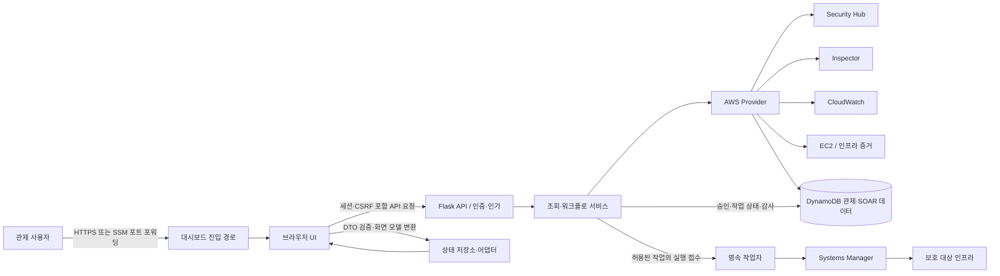

# 대시보드 설계 기준

## 문서 정보

| 항목 | 내용 |
|---|---|
| 적용 범위 | 보안 관제 대시보드의 웹 UI, Flask 백엔드, AWS 데이터 공급자, 진입 경로, 수동 조치 및 감사 계약 |
| 책임 역할 | 대시보드 설계·구현 담당, SOAR 담당, 인프라/IAM 담당, 검증 담당 |
| 관련 문서 | [`../README.md`](../README.md), [`../agents.md`](../agents.md), [`../project-management/glossary.md`](../project-management/glossary.md), [`../project-management/decisions.md`](../project-management/decisions.md) |
| 조사 근거 | 실제 저장소의 대시보드 설계 표준, OpenAPI, 백엔드·프런트엔드 코드를 읽기 전용으로 확인 |
| 이력 관리 | 설계 변경은 `../project-management/decisions.md`, 구현 현황은 `../project-management/tracking.md`에서 커밋 버전에 연결 |

이 문서는 대시보드가 제공해야 할 책임, 경계, 계약, 실패 처리와 검증 기준을 정의한다. 조사 시점의 실제 코드 상태는 설계 기준과 섞지 않고 추적 문서에 기록한다. `GET /health`의 프로세스 생존은 AWS 데이터 공급자나 보호 대상 서비스의 정상 상태를 증명하지 않는다.

## 목적과 범위

대시보드는 AWS 보안 관제 정보를 제한된 범위에서 조회하고, 권한을 가진 담당자가 수동 조치의 승인·접수·재검증을 수행하며, 그 과정의 증적을 확인하는 관제 시스템이다. 보호 대상 서비스의 사용자 트래픽 처리, 보호 대상 데이터베이스의 직접 조회, AWS 인프라 배포는 대시보드의 책임이 아니다. 백엔드는 보호 대상 MySQL에 직접 접속하지 않는다.

목표는 OpenAPI를 단일 API 계약으로 관리하고, UI와 백엔드 책임을 분리하며, 허용 범위 내 AWS Provider를 통해서만 데이터를 취급하는 것이다. 조회 기능이 공급자 미연결·권한 부족·부분 실패·오래된 데이터를 정상적인 0건 또는 정상 상태로 가장해서는 안 된다. 확인되지 않은 기능, 인증 공급자, 성능 임계값, 보존 기간 및 재시도 수치는 확정 설계인 것처럼 표현하지 않는다.

## 기능 구성과 데이터 흐름



다이어그램은 목표 책임 흐름이다. 조회는 브라우저가 AWS에 직접 접속하지 않고 Flask 백엔드의 공급자 계층을 거친다. 쓰기 경로는 조회와 분리하며, 서버가 권한·대상·상태·버전을 검증한 후 영속 작업으로 접수한다. 실제 원본이 DynamoDB 적재 경로인지 AWS 직접 조회인지는 공급자 설정과 응답 메타데이터로 식별한다.

| 경계/인터페이스 | 입력 | 출력 | 식별자·제어 조건 |
|---|---|---|---|
| 사용자 → 진입점 | 인증된 브라우저 세션 | HTML·정적 자산 | ALB 또는 SSM 경로, 네트워크 제한은 배포 설정 기준 |
| UI → API | 필터·페이지 커서·JSON 명령 | 공통 응답 봉투 | 세션 쿠키, CSRF, 권한, `requestId`, 변경 요청의 `Idempotency-Key` |
| API → 서비스/도메인 | 검증된 DTO와 사용자 범위 | 조회 모델 또는 상태 전이 요청 | 서버 측 리소스 범위와 `expectedVersion` |
| 서비스 → Provider/Repository | 조회 조건 또는 허용된 명령 | 정규화 자료·영속 작업·감사 증거 | 계정·리전·리소스 범위, 출처·수집 시각 |
| 작업자 → SSM | 허용된 작업 스냅샷 | SSM 실행 ID와 결과 증거 | 중복 방지, 문서/매개변수 허용 목록, 결과 불확실 시 재실행 금지 |
| API → UI | 성공·부분·오류 봉투 | 상태별 패널과 행동 안내 | 실패를 0건으로 변환하지 않으며 경고와 부분 범위를 표시 |

## UI와 상태 관리

브라우저 UI는 표현과 사용자 입력을 맡는다. API 호출은 중앙 Store의 액션으로 수행하며, Store는 API 클라이언트·응답 검증기·DTO 어댑터·화면 상태를 조정한다. 화면 모듈은 AWS SDK나 데이터베이스에 직접 접근하지 않고 API 형식과 업무 상태를 임의로 재해석하지 않는다. 브라우저에 AWS 자격 증명을 보관하지 않는다.

화면은 개요, 이벤트, 취약점, 인프라 상태, 작업·감사 이력의 논리 영역을 제공한다. 세부 메뉴와 시각 표현은 사용 흐름에 맞게 조정하되 각 지표의 범위·출처·기준 시각을 제공한다. 리소스 상태 `unknown`이나 관측값 `null`은 정상 또는 수치 0으로 치환하지 않는다. 점검 증거가 없을 때는 “증거 없음/확인 불가”로 표현한다.

| 상태 | 판별 근거 | 화면 원칙 및 다음 행동 |
|---|---|---|
| 초기/조회 중 | 요청 시작, 응답 미도착 | 해당 영역에 진행 상태 표시. 이전 자료는 마지막 갱신 시각과 함께 구별 |
| 정상 자료 | 계약 검증을 통과한 완전 응답 | 범위, 출처, `asOf`와 함께 표시 |
| 정상 0건 | 조회 성공 후 결과가 비어 있음 | “해당 범위에서 결과 없음”으로 표시; 시스템 안전 판정으로 표현하지 않음 |
| 부분 자료 | `meta.partial=true` 또는 경고 존재 | 이용 가능한 자료와 누락 원인을 표시; 집계가 부분 범위임을 명시 |
| 오래된 자료 | 자료 시각이 합의된 유효 조건을 벗어남 | 시각과 오래됨 상태, 재수집/운영 확인 안내. 유효 시간 기준이 미정이면 임의값을 적용하지 않음 |
| 공급자 미연결 | 명시적 구성 부재 응답 또는 연결 상태 | 미연결과 설정 담당 안내; 빈 목록으로 표시하지 않음 |
| 조회 실패 | 권한 거부, 시간 초과, 서비스 장애, 잘못된 응답 | 오류 종류와 요청 ID 표시, 안전한 다음 행동 제공; 정상 0건으로 바꾸지 않음 |
| 세션/권한 거부 | `401`/`403` 또는 범위 밖 리소스 | 로그인/권한 담당자 안내; 다른 사용자 범위의 이전 자료와 혼합 금지 |

새 필터·사용자·세션으로 바뀔 때 이전 범위 자료가 새 요청 결과처럼 잠시 노출되지 않게 요청 세대와 화면 범위를 검증한다. 패널은 독립적으로 갱신할 수 있으며 한 원본 장애가 다른 원본의 정상 자료를 숨기지 않게 한다.

## 백엔드 책임과 계층

Flask 애플리케이션은 앱 구성/라우트, 미들웨어, DTO·오류 계약, 서비스와 도메인 로직, Repository, AWS 통합, 영속 작업자 경계를 유지한다. 라우트는 HTTP 계약·입력 검증·응답 변환을 맡고 복잡한 업무 규칙이나 AWS 호출을 직접 포함하지 않는다. AWS 호출은 공통 세션과 최소 권한 역할을 사용하는 통합 계층에 둔다. UI·라우트·서비스·Repository·AWS 통합 사이에 역방향 의존을 두지 않는다.

서비스는 인증 주체 권한과 계정·리전·리소스 범위를 매 요청 검증한다. 쿼리 필터는 인가 범위를 넓힐 수 없다. 조회와 변경 경로, AWS 조회 권한, 작업자 권한은 분리한다. `/health`는 비밀이나 계정 세부정보를 내보내지 않는다.

### 인증, 인가 및 네트워크 진입

선택된 대시보드 접근 경로는 Terraform에 선언된 ALB 및 SSM 두 경로다.

| 경로 | 설계 계약 | 제어 및 주의 사항 |
|---|---|---|
| ALB → 대시보드 | 조건부 ALB 경로의 HTTP `8080`을 대시보드 `5000`으로 전달 | Terraform 입력 `dashboard_ingress_cidr`의 기본값은 `0.0.0.0/0`으로 확인됨. 운영 환경에서는 실제 허용 범위를 검토한다. 전용 대시보드 리스너는 HTTP이며 다른 서비스 리스너의 TLS가 이 경로의 TLS를 입증하지 않는다. |
| SSM Session Manager 포트 포워딩 | 운영자가 SSM을 통해 대시보드 인스턴스 `5000`으로 전달 | SSH `22` 인바운드를 대시보드 접근 수단으로 추가하지 않는다. SSM 사용자/대상 권한 및 세션 감사는 IAM·인프라 기준과 연결한다. |

네트워크 도달성과 애플리케이션 로그인을 별도로 검증한다. 현재 코드에는 로컬 사용자명·암호 인증 경로가 관찰되었지만 운영 환경의 인증 공급자·계정 수명주기·MFA 정책은 확정되지 않았다. 로컬 인증은 구현 사실이지 운영 목표 승인이 아니다. 운영 세션 쿠키는 배포 프로토콜에 맞는 `Secure`, `HttpOnly`, `SameSite` 설정을 가져야 한다.

조회자, 조치 담당자, 승인자, 운영 관리자의 기능을 구분하고 실제 권한 조합을 서버에서 강제한다. UI 버튼을 숨기는 것만으로 인가를 완료한 것으로 보지 않는다. actor는 요청 본문이 아니라 인증된 서버 세션에서 결정한다.

## 데이터 원본과 저장소

대시보드는 보호 대상 업무 데이터를 직접 읽지 않고 관제 원본을 정규화한다.

| 자료 영역 | 조사에서 확인한 원본/연결 코드 범주 | 계약 원칙 |
|---|---|---|
| 탐지 이벤트 | Security Hub 또는 DynamoDB 적재 자료 | finding ID, 원본, 관측 시각, 심각도, 대상, 상태를 정규화하며 중복·갱신 시각 보존 |
| 취약점 | Inspector 또는 DynamoDB 적재 자료 | CVE/취약점 ID, 리소스, 패키지, 심각도, 최초·최근 관측 시각, 원본을 구분 |
| 인프라·자원 | EC2 조회 및 저장된 점검 증거 | 현재 인프라 조회와 저장된 상태 증거를 구분; 조회 성공과 자원 건강 상태를 혼합하지 않음 |
| 지표 | CloudWatch | 단위·집계 기간·자원·관측 시각 명시; 결측은 `null` |
| 상관/자동조치 이력 | DynamoDB 테이블 | 자동 판정 기록과 실행 상태를 수동 조치 이력과 `source`로 구별 |
| 승인·수동 조치·작업·감사 | 목표 저장소는 DynamoDB | 조건부 상태 전이, 버전, 멱등성, 만료/TTL, 작업 복구와 불변 감사 계약 정의 |

읽기 Provider는 직접 AWS 조회와 DynamoDB 적재 조회 중 선택된 모드를 응답 메타데이터·진단 상태에서 식별할 수 있어야 한다. 적재 조회는 동기화 기준 시각과 경고를 전달한다. sync 자료나 테이블 설정 부재, 일부 페이지 실패, 권한 거부는 “0 findings”가 아니다. 원본 전체 실패는 `503` 또는 의미 있는 부분 결과로 구분하고, 일부 결과 반환 시 `partial=true`와 누락 원인을 제공한다.

승인, 실행 요청, 실행 결과, 재검증과 감사는 서로 다른 사건이다. 실행 공급자의 응답이 없으면 조치 실패로 단정하거나 명령을 자동 재실행하지 않는다. `UNKNOWN`/`RECONCILING` 같은 확인 상태로 보존하고 AWS/SSM 상태와 실행 ID를 대조한다. 저장소의 조건부 갱신·멱등키 범위·TTL·백업·복구 계약은 인프라 및 SOAR 설계와 일치해야 한다.

목표 저장소는 DynamoDB다. 현재 대시보드 구현에는 SQLite 기반 users/events/jobs/requests/audit 저장소와 로컬 Worker 경로가 관찰되었다. 이는 승인된 환경 차이가 아니라 사용자가 확정한 목표와 다른 **구현 수정 대상**이다. DynamoDB 전환 방식, 병행 기간, 로컬 개발용 SQLite 허용 여부는 `../project-management/decisions.md`에서 관리한다. SQLite 코드만으로 DynamoDB 기준을 낮추거나 목표가 구현되었다고 표시하지 않는다.

## API 및 데이터 계약

`dashboard/backend/contracts/openapi.yaml`은 API 정의의 기준이다. 경로, DTO, 권한, 응답/오류 코드 또는 상태 enum을 바꾸면 OpenAPI, 구현, UI 검증 및 예시 응답을 함께 갱신한다. JSON 필드명은 `camelCase`, 시각은 UTC ISO 8601, 시간 범위는 `[from,to)`다. 조회 구간·기본 기간·목록 한도는 OpenAPI 계약에 따른다. 커서는 필터와 인가 범위에 결합된 불투명 값이다.

공통 성공 응답은 `data`와 `meta`, 오류 응답은 `error`와 `meta`를 사용한다. 메타데이터는 `requestId`, `schemaVersion`, `asOf`, `partial`, `warnings`를 포함한다. 보호된 응답에 공유 캐시를 허용하지 않는다. 오류 코드는 기계 판독 가능해야 하며 화면은 코드별 행동을 정의한다. 원본별 성공/실패를 안전하게 조합할 수 있는 경우에만 `200` 부분 결과와 `partial=true`를 반환한다.

| API | 목적과 주요 계약 |
|---|---|
| `GET /health` | 대시보드 프로세스 생존 확인. AWS 데이터 연결·보호 대상 상태 판정으로 사용하지 않음 |
| `GET /api/events` | 권한 범위 내 탐지 이벤트의 필터·정렬·페이지 조회 |
| `GET /api/summary` | 필터 범위의 집계. 분모 0인 비율은 `null`; 원본 오류로 모르는 값은 0이 아님 |
| `GET /api/metrics` | CPU/메모리 시계열. 기간·단위·임계값 출처 명시, 결측은 `null` |
| `GET /api/vulnerabilities` | Inspector/적재 취약점의 정규화 목록. 원본과 관측 시각 보존 |
| `GET /api/infra/status` | 저장된 구성요소 상태 증거 조회. 새 점검 명령을 실행하지 않음. 상태는 `healthy/degraded/unhealthy/unknown` |
| `GET /api/history` | 불변 이력과 현재 작업 상태 조회. 사용자·리소스 범위를 매번 재검증 |
| `POST /api/events/{eventId}/approve` | 계획과 매개변수를 승인 스냅샷으로 저장. SSM 실행을 시작하지 않음 |
| `POST /api/events/{eventId}/cancel` | 작업 접수 전 허용된 승인 상태 취소. 실행 중단이나 인프라 원복을 뜻하지 않음 |
| `POST /execute` | 유효한 승인·버전·권한을 재검증한 뒤 영속 작업을 접수하고 `202`와 작업 ID 반환 |
| `POST /verify` | 실행된 조치의 동일 조건 재검증을 접수. 실행 성공을 해결 완료로 표시하지 않음 |

모든 변경 요청은 인증, 서버 권한, CSRF, 업무 매개변수 허용 목록, `Idempotency-Key`, 버전 및 상태 선행조건을 검사한다. 같은 멱등 키를 다른 요청 본문에 재사용하면 충돌 처리한다. 조회 실패는 값 없는 성공 응답으로 축약하지 않는다. `Retry-After`가 있으면 클라이언트는 이를 따른다. 재시도 횟수나 timeout은 근거 없이 확정하지 않는다.

## 수동 조치와 자동조치 경계

수동 조치는 승인과 실행 접수를 별도 권한·요청으로 관리한다. 승인자는 finding, 조치 계획, 대상, 매개변수, 사유와 버전을 검토해 승인 스냅샷을 남긴다. 실행 담당자는 최신 권한·승인 유효성·대상·상태를 다시 확인한 후 영속 작업을 접수한다. 비동기 Worker는 SSM 실행 증거를 기록한다. 응답 유실은 재조치가 아니라 상태 조정으로 해결한다. 재검증은 별도 작업·증거이며 통과 기준 충족 후에만 해결 상태로 전이한다.

자동조치는 자동 탐지/판정과 보호 대상 변경을 구분한다. 자동조치에 별도의 확인 단계를 둘지에 관한 정책은 확정하지 않고 후속 설계 과제로 둔다. 이는 자동 실행 권한이나 위험 제어의 충분성을 승인한 것이 아니다. 자동 실행 대상, 기존 3중 안전장치의 적용 범위, 예외, 롤백, 관찰 기간, 운영 책임을 보안·운영 담당자가 결정한 뒤 자동화 경로를 구현한다. 미결정 사항을 `../project-management/decisions.md`에 연결한다.

감사기록은 주체, 원본 finding, 대상, action/job ID, 멱등 요청 식별, 정책/플레이북 버전, 매개변수 해시, 시작·종료, AWS 실행 ID, 결과, 검증 결과와 request ID를 추적한다. 비밀이나 민감 매개변수 원문을 저장하지 않는다. 감사 저장 실패 시 변경 요청의 성공 여부를 불명확하게 만들지 않는다. 안전한 저장 원자성이 정의되기 전 best-effort 성공 처리를 허용하지 않는다.

## 실패, 복구와 데이터 부재

| 상황 | 판별·표시 | 재시도·복구 | 감사·재검증 |
|---|---|---|---|
| Provider 미연결 | 명시적인 구성 오류; 빈 성공 응답 금지 | 구성 복구 후 새 조회 | 요청 ID, Provider 모드와 설정 오류 |
| AWS 권한 부족 | 접근 거부를 데이터 없음과 구분 | 권한 담당자가 최소 권한 복구; 즉시 반복 재시도 금지 | 서비스·리소스 범위와 오류 코드 |
| 원본 데이터 없음 | 조회 성공과 빈 결과 확인 | 정상 빈 결과 가능 | 원본/범위/시각; 안전 판정으로 사용 금지 |
| 일부 원본/페이지 실패 | `partial=true`, 경고와 누락 범위 | 원본별 백오프 정책 적용; 횟수 미결정 | 성공·실패 원본과 기준 시각 |
| 오래된 적재 자료 | 동기화 시각 및 경고, 합의된 기준의 오래됨 상태 | 동기화 복구 후 재확인; 허용 시간 임의 설정 금지 | 원본 기준 시각·sync ID |
| CloudWatch 결측 | point `null`; 결측과 조회 오류 분리 | 원본 특성에 따라 재조회 | 집계 구간·단위·조회 시각 |
| 의존 서비스 장애/timeout | `503` 또는 의미 있는 부분 결과 | GET은 제한 재시도 가능; POST는 동일 멱등 키와 결과 확인 | 실패 단계·timeout 및 request ID |
| 동시 승인/오래된 버전 | `409` 충돌 | 최신 상태 재조회 후 사람 검토 | 기대/현재 버전 및 주체 |
| SSM 응답 시간 초과/유실 | `UNKNOWN`/`RECONCILING`; 실패 단정 금지 | AWS 상태와 실행 ID 대조; 확인 전 같은 명령 재접수 금지 | 요청-작업-SSM 실행 ID와 조정 결과 |
| 실행 실패 확인 | `EXECUTION_FAILED` 및 오류 증거 | 새 실행은 정책에 따라 새 요청/승인 | 실패 및 부분 효과 기록, 실제 상태 확인 |
| 재검증 실패 | 잔존 문제와 점검 자체 실패를 분리 | 기준/도구 확인 후 재검증; 자동 해결 금지 | 검증 조건·도구 버전·결과 |
| 감사/영속화 장애 | 접수 성공을 불명확하게 만들지 않음 | 안전한 원자 저장/복구 전 실행 유발 방지 | 저장 장애를 운영 경보로 기록 |

HTTP 및 오류 코드는 OpenAPI 계약을 따른다. 예외 메시지는 민감한 stack trace를 노출하지 않고 `requestId`로 서버 로그와 연결한다. 사용자에는 실패 범위와 취할 행동을 안내한다.

## 보안과 개인정보

브라우저는 서버가 제공한 DTO만 사용하며 AWS 자격 증명·세션 토큰 원문·비밀 매개변수를 노출하지 않는다. 서버는 허용된 SSM Document와 매개변수 스키마를 사용하고 임의 명령이나 클라이언트 제출 ARN을 신뢰하지 않는다. 모든 요청에서 사용자 역할·리소스 범위·상태 버전·CSRF를 검증한다. 세션 회전, 로그인 제한, 비밀 저장/교체, MFA 및 외부 인증 연동은 환경별 보안 기준에서 확정한다.

구조화 로그와 감사 이력은 `requestId`, event/action/job ID로 연결한다. 암호, 쿠키, CSRF 값, 세션 식별자, 접근 키 및 민감한 공격 자료 원문을 기록하지 않는다. 데이터 최소화, 보존·삭제 기간, 백업 복구 목표는 임의 수치로 채우지 않고 결정 기록에서 승인한다.

## 검증 및 완료 기준

대시보드 변경은 관련 설계·계약·테스트·증적·추적 행을 함께 검토한다. 수행하지 않은 검증은 완료로 기록하지 않는다. 실환경 검증은 승인된 환경·변경 통제·시나리오·복구 증거를 갖춰야 하며 로컬 결과를 실환경 검증이라 부르지 않는다.

| 검증 영역 | 필수 확인 |
|---|---|
| 계층 경계 | UI → Store/Adapter → API → 서비스/도메인 → Repository → AWS 통합 방향, 브라우저의 AWS/DB 직접 접근 부재 |
| 계약 | OpenAPI와 라우트/DTO 일치, 성공·빈·부분·오류 스키마, UTC·범위·커서 규칙 |
| 상태 표시 | 미연결·권한 거부·0건·부분·오래된 자료·결측을 각각 표현하고 확인 불가를 0/정상으로 오표시하지 않는가 |
| 접근 제어 | ALB/SSM, CIDR, 인증, CSRF, 역할, 계정·리소스 범위, playbook 허용 목록 |
| 수동 SOAR | 승인/취소/접수/실행/검증, 만료·동시성·멱등성, 권한 변경, Worker 재시작/응답 유실 복구 |
| 저장소 | 목표 DynamoDB의 조건부 갱신·영속 작업·중복 방지·감사·만료/복구 확인; SQLite만으로 통과 처리하지 않음 |
| AWS 통합 | 최소 권한, 페이지네이션, 일부 실패, CloudWatch 결측/단위, SSM timeout과 실행 상태 확인 |
| UI 품질 | 키보드/스크린 리더 상태 안내, 접근 불가 시 안전 동작, 민감정보 취급 |
| 추적·증적 | 요구사항 ID와 설계·코드·검증 근거 연결; 미결정/예외/편차 등록 |

## 디렉터리 기준

대시보드 구조는 책임별로 얕게 유지한다. 아래는 목표 책임 표기이며 실제 저장소의 조사 시점 트리는 추적표의 근거로 기록한다.

```text
dashboard/
├── backend/
│   ├── contracts/       # OpenAPI 단일 계약 및 예시
│   ├── docs/            # 대시보드 기준·검증 절차
│   ├── soar/            # Flask API, 도메인, 서비스/저장소 경계
│   ├── tests/           # 계약·권한·상태 전이·복구 검증
│   └── workers/         # 영속 작업 실행·복구
└── frontend/
    ├── templates/       # Flask 제공 HTML
    ├── static/          # UI, Store, 어댑터, 스타일·자산
    └── tests/            # Store 및 화면 검증
```

새 파일은 기존 코드의 확인된 구조와 맞춘다. 위 목표 경로로 파일을 이동하는 일은 별도 구현 변경이며 import, 빌드/라우팅, 테스트 참조를 함께 갱신한다.

## 문서 갱신과 작업 완료

| 변경 | 함께 갱신할 문서·증적 |
|---|---|
| UI·표시 상태 | 이 문서 상태표, API 계약, glossary, 화면/Store 검증, tracking |
| API·DTO·오류·권한 | OpenAPI, 이 문서 API 표, 예시, API/UI 검증, 결정 기록(기준 변경 시), tracking |
| Provider·원본·저장 계약 | 이 문서 원본/실패 표, 전체 아키텍처, Terraform/SOAR 기준, glossary, migration decision, tracking |
| 네트워크·SSM·인증·IAM | project 아키텍처, 이 문서 접근 제어, Terraform/IAM 설계, decisions, 권한 검증, tracking |
| 조치 상태·승인·복구 | 이 문서 SOAR 절, glossary, security scenarios, OpenAPI, 상태/복구 검증, decisions, tracking |
| 기준 예외/목표 변경 | decisions에 이유·범위·영향·종료 조건과 영향을 받는 문서·검증·tracking 기록 |
| 구현/검증 진척 | tracking의 상태·코드 경로·증거만 갱신; 설계 본문에 순간 완료 상태를 복사하지 않음 |

개발 완료 전 담당자는 관련 요구사항 ID를 확인하고 설계·데이터/API 계약·시나리오·실패 처리·검증 기준·링크·추적표를 점검한다. 검증을 수행했다면 절차, 결과, 환경과 증적 위치를 기록한다. 기준 선택은 `../project-management/decisions.md`, 구현 현황은 `../project-management/tracking.md`에 커밋 버전과 연결한다. 커밋 제목은 `vN` 또는 사소한 수정의 `vN.M`만 사용하고 상세 설명은 변경 기록에 둔다.

## 조사된 구현과 설계 차이

다음은 실제 저장소를 수정하거나 실행하지 않고 문서·계약·코드를 읽어 확인한 사실이다. 구현 사실과 목표 기준은 구별한다.

| 영역 | 조사 시 확인한 사실 | 분류 및 후속 처리 |
|---|---|---|
| 설계자료 | backend 설계 표준, OpenAPI 계약, Flask/vanilla JS 모듈 구조 및 계약·권한·상태 검증 코드가 존재 | 기준으로 재사용. 각 검증의 통과 여부는 tracking에서 증거별로 기록 |
| 데이터 Provider | Security Hub/DynamoDB 탐지, Inspector/DynamoDB 취약점, EC2, CloudWatch, DynamoDB 상관/자동조치 조회 모듈 확인; 기본 Provider는 미연결 설정 | 설계 목표와 기능 경계는 정렬. 환경 연결·실데이터 검증 여부는 별도 추적 |
| 변경 공급자 | 쓰기 비활성 기본값과 AWS 실행/측정 비활성 경로 확인 | 실환경 AWS 조치가 구현되었다고 주장하지 않음; 활성화는 별도 권한·저장·복구 검증 대상 |
| 작업·감사 저장 | SQLite users/events/jobs/requests/audit Store 및 로컬 Worker 확인 | **구현 수정 대상**: DynamoDB 목표와 불일치. 전환 및 로컬 개발 사용은 결정 기록 필요 |
| 인증 | 로컬 사용자명/암호, 세션·CSRF·역할·scope 검증 확인 | 현재 구현과 운영 목표 분리; 운영 인증 공급자·MFA·계정 lifecycle 미결정 |
| 네트워크 접근 | Terraform의 ALB HTTP `8080` 및 SSM 포워딩 `5000` 경로, 기본 ingress CIDR `0.0.0.0/0` 확인 | 선택 경로를 기준화. 환경별 공개 CIDR 및 TLS 종단점은 위험/결정 항목 |
| 자동조치 확인 | 자동 실행 전 별도 확인 정책 미확정 | 후속 설계 과제. 이 문서는 무승인 실행이나 제어 충분성을 승인하지 않음 |

편차별 요구사항 ID, 실제 코드 경로, 영향, 결정 상태 및 검증 근거는 `../project-management/tracking.md`와 `../project-management/decisions.md`에 등록한다. 이 기준 문서는 확인 날짜만 갱신하여 최신성을 주장하지 않는다.
