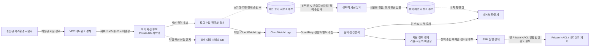

# 허니팟·기만 방어 설계 기준

## 문서 정보

| 항목 | 내용 |
|---|---|
| 적용 범위 | 프로젝트 목표 허니팟의 격리, 미끼 상호작용, 로그·분석·대시보드 연계, 차단 정책과 검증 기준 |
| 책임 역할 | 보안 설계자, 인프라/IAM 담당, 허니팟 구현 담당, 관제 담당, 격리환경 검증 담당 |
| 상태 | 허니팟은 목표 범위에 포함한다. 세부 기술, AI 공급자/모델, 대화 처리 방식, 자동 차단 정책은 미결정이다. |
| 관련 문서 | [`../README.md`](../README.md), [`../agents.md`](../agents.md), [`../terraform/infrastructure-design.md`](../terraform/infrastructure-design.md), [`../dashboard/dashboard-design.md`](../dashboard/dashboard-design.md), [`../project-management/security-scenarios.md`](../project-management/security-scenarios.md), [`../project-management/glossary.md`](../project-management/glossary.md), [`../project-management/decisions.md`](../project-management/decisions.md) |
| 조사 근거 | 기존 SEC-01~SEC-10 시나리오 가이드, AI 허니팟 아키텍처 다이어그램 프롬프트, 현재 Terraform·서비스 코드의 읽기 전용 조사 |
| 변경 이력 | 설계 선택은 `../project-management/decisions.md`, 구현·검증 근거는 `../project-management/tracking.md`에 버전으로 연결 |

이 문서는 확인된 현황과 후보 설계를 구분한다. 설계 후보를 기술 채택, 구현, 배포 또는 실환경 검증이 끝난 사실처럼 표현하지 않는다. AI가 만든 분석·응답은 신뢰할 수 없는 입력과 출력으로 다루며, 어떤 모델도 인프라 변경 권한을 자동으로 얻지 않는다.

## 목적, 용어와 책임 경계

허니팟은 승인된 시험 환경에서 관찰 가능한 상호작용을 유도해 공격 시도와 방어 대응을 연구하는 별도 미끼 자산이다. 보호 대상 서비스, 관제 대시보드, 실제 운영 데이터베이스와 분리하며, 이 자산에 입력된 명령·비밀번호·파일은 진짜 운영 자격증명이나 데이터로 연결하지 않는다. 구체적인 런타임은 기술 선택과 보안 검토가 끝나기 전에는 정의하지 않는다.

| 개념 | 이 설계에서의 의미 | 혼동하면 안 되는 대상 |
|---|---|---|
| 허니팟/미끼 | 의심 행위를 관측하도록 의도적으로 배치할 격리 자산 | 취약점 점검용 DVWA 또는 실제 서비스 서버 |
| 공격 상호작용 | 미끼의 노출된 인터페이스에 대한 연결·입력·세션 자료 | 확인된 침해나 해결 완료 상태 |
| 원시 세션 증거 | 미끼가 받은 연결/입력 및 수집 시각 등 제한 접근 자료 | 정규화한 보안 이벤트 또는 AI 요약 |
| AI 분석 제안 | 세션 증거를 요약·분류할 수 있는 비권한 분석 결과 | 사실로 검증된 탐지, 조치 승인 또는 차단 명령 |
| 차단 결정 | 명시적 정책이 네트워크 변경을 허용/거부하는 판정 | AI 요약의 자연어 결론 |

대시보드는 관제·검토 시스템이고 허니팟은 관측 대상이다. DVWA는 사용자가 선택한 별도의 웹 공격 실습 대상이며 허니팟으로 이름을 바꾸거나 같은 기능으로 간주하지 않는다. 서비스용 Nginx–Flask–컨테이너 MySQL 역시 별도의 보호 대상이다. Private-DB 서브넷 MySQL EC2는 별도의 보안 관제/공격 재현 대상이고, 허니팟 후보 자산과도 다르다.

## 조사 결과: 구현 사실과 과거 후보안

현재 참고 저장소에서 읽기 전용으로 확인한 결과는 다음과 같다.

| 자료 | 확인한 사실 | 설계상 해석 |
|---|---|---|
| `aws-security-project` 코드 | `terraform`의 `compute`, `network`, `security`, `soar`와 대시보드에서 별도 허니팟 런타임·EC2·Lambda·테이블·API를 확인하지 못함 | 허니팟 구현·AI 분석·자동 차단 기능이 존재한다고 주장하지 않음 |
| Terraform compute | DVWA 웹 EC2, 보호 대상 Docker 호스트, MySQL 관제 대상 EC2, 옵션 내부 attacker EC2가 각기 별개 역할로 선언됨 | DVWA·attacker는 허니팟 구현의 증거가 아님 |
| 기존 `SEC-01-10` 공격·조치 가이드 | SSH 관련 GuardDuty 신호, MySQL 인증 실패 CloudWatch 경로, SEC-06 NACL 수동 차단, DVWA 보안 테스트가 기술됨 | 사용자가 확정한 구분을 적용: MySQL 실패는 CloudWatch, SSH 경로는 GuardDuty. 허니팟 경로는 새로 설계·검증 필요 |
| 아키텍처 갱신 프롬프트 | Private-DB 미끼, Beelzebub, OpenAI 응답, Bedrock 분석, `ai_suggestions_table`, 접속 즉시 NACL 차단을 한 후보로 제시 | 이미지 생성 지시용 후보안이며 현재 코드나 확정 설계가 아님. 사용자는 기술과 자동 차단을 미결정으로 남기도록 후속 지정함 |

과거 프롬프트의 일부 안전 제약—미끼 입력이 실제 시스템 명령 실행이나 외부 파일 다운로드를 유발하지 않게 하자는 제안—은 합리적인 격리 요구 후보로 보존하되, 실구현의 보증으로 간주하지 않는다. 차단 정책, 공급자 선택, 세션 저장 구조, 요금, 데이터 위치는 결정 기록에서 승인하기 전까지 미결정이다.

## 설계 원칙과 보안 경계

1. **격리된 대상:** 미끼는 별도 신원·보안 그룹·데이터 경계를 가진다. 보호 대상 DB, 대시보드, 계정 권한과 불필요하게 신뢰 관계를 공유하지 않는다.
2. **합성 자료만:** 미끼 응답, 계정, 파일, 데이터베이스 레코드는 가짜 자료로 구성한다. 실제 자격증명·고객 정보·보호 대상의 비밀을 미끼에 복사하지 않는다.
3. **안전한 상호작용:** 공격자가 넣은 내용을 shell, SQL, SDK, 브라우저, 운영체제 호출로 그대로 실행하지 않는다. 런타임이 진짜 명령 실행을 요구한다면 이 기준 변경과 별도 위협모델·격리 승인을 먼저 받는다.
4. **최소 통신:** 인바운드는 승인된 시험 원천으로 제한한다. 인터넷/다른 서브넷 egress는 명시적 목적이 확인된 경우에만 허용하고, 로그·AI API 연결 필요성도 별도 정책으로 검토한다.
5. **최소 IAM:** 인스턴스는 세션 관리와 필요한 로그 전송 권한만 가진다. 로그 권한과 차단 권한을 같은 미끼 role에 부여하지 않는다.
6. **증거 우선:** 원시 관측, 정규화 이벤트, AI 요약, 정책 판정, 실제 네트워크 변경을 분리해 기록한다. 모델 출력은 증거의 출처·시각·대상·원본 식별자를 대체하지 않는다.
7. **사람이 이해 가능한 정책:** 자동 차단을 도입하기 전 정확한 입력 근거, 적용 대상, 유효 기간, 복구 책임, 충돌과 실패 동작을 문서로 정의한다. 자동 차단은 AI 점수만으로 결정하지 않는다.
8. **정상 기능 보존:** 미끼와 동일 서브넷 또는 같은 NACL에 있는 다른 자산의 영향을 확인한다. 테스트를 마친 후 정상 기능이 복구됐는지 같은 기준으로 검증한다.

## 후보 구성과 데이터 흐름

아래는 논리적 제안 흐름이다. 실선은 현재 프로젝트의 일반 관제 경계 또는 사용자 지정 배치 목표이며, 점선의 AI·차단 경로는 구성 후보로만 표시한다. 점선 경로는 현재 동작 중인 구현을 의미하지 않는다.

**설명:** 현재 허니팟 코드가 없으므로 수집, 분석, 저장, 차단은 목표 설계 경계로 표현했다. 세션이 AI 요약이나 차단 판정으로 변환될 때는 원본 이벤트와 연결되어야 하며, 대시보드 API·DynamoDB 스키마는 별도 계약 변경을 거친다. 미끼는 보호 대상에 직접 연결되지 않는다. 외부 모델·NACL·SSM 경로가 승인되기 전에는 구현하지 않는다.

| 인터페이스 | 입력 | 출력 | 필수 식별·제어 |
|---|---|---|---|
| 시험자 → 미끼 | 격리된 시험 연결과 테스트 입력 | 관측 가능한 미끼 세션 | 승인된 계정/VPC/대상/시간 범위; 세션 또는 상호작용 ID는 후속 계약에서 확정 |
| 미끼 → 로그 수집 | 연결 메타데이터, 시간, 안전하게 다룰 입력 기록 | 전달 성공/부분 실패/수집 불가 상태 | 자산 ID, 세션 상관 ID, UTC 관측 시각, 로그 출처 |
| 로그 → 탐지 | 수집된 레코드·기준 필드 | GuardDuty/CloudWatch 경보 또는 정규화 event | 탐지 출처와 원시 finding ID 구분; 중복 여부 기록 |
| 로그 → 선택 AI 분석 | 정책 승인된 비밀 제거 세션 입력 | 요약·분류·불확실성 표시가 있는 제안 | 공급자·모델·prompt version·호출 ID·세션/원본 ID; AI 출력은 제한된 비신뢰 텍스트 |
| 정책 → 차단 실행 후보 | 검증된 관측 근거, 정책 버전, 차단 대상 | 정책 판정 또는 명시된 실행 작업 | actor/source, 대상 CIDR/자산, 규칙 ID, 멱등 키, 유효/해제 정보 |
| 관제 API → 대시보드 후보 | 승인된 정규화 계약 | 세션·원본 증거·AI 제안·조치 이력의 독립된 화면 모델 | API 버전, 조회 권한, 범위, `requestId`, 최신성/부분 경고 |

## 배치·네트워크·운영 경계

요구된 목표 배치는 기존 VPC의 Private-DB 서브넷 내 별도 미끼 자산이다. 새로운 VPC를 임의로 추가하지 않는다. 다만 현재 VPC 구현에서 Private-DB 서브넷만의 정책을 허니팟에 적용할 수 있는지, 미끼의 가용 영역/주소/포트/인바운드 원천이 무엇인지 코드는 정하지 않았다. Beelzebub과 SSH `22`는 과거 시각화 프롬프트의 후보일 뿐 채택하지 않았다.

| 통제 | 기준 또는 미결정 사항 |
|---|---|
| 서브넷 | 후보 위치는 Private-DB. 외부에서 Private 자산에 직접 연결하지 않으며 승인된 내부 시험 경로와 정확한 pivot 모델을 결정한다. |
| 보안 그룹 | 전용 SG로 미끼만 대상으로 제한한다. 허용 source SG/CIDR, 프로토콜과 포트는 구현/플랫폼 선택 후 결정한다. 사용자가 SSH 탐지를 목표로 한다는 사실만으로 대외 SSH ingress를 열지 않는다. |
| IAM/관리 | SSH 관리 포트 개방 대신 프로젝트 표준 SSM 관리 경계를 우선 검토하되, SSM 세션과 관측용 미끼 서비스 포트는 서로 다른 역할이다. 미끼 role에 보안 변경 권한을 붙이지 않는다. |
| NACL | 현재 Terraform Private NACL은 Private-App과 Private-DB 서브넷에 함께 연결되어 있다. 그 NACL의 Deny에 공격 IP를 넣으면 미끼 하나가 아닌 두 서브넷의 트래픽에 영향이 갈 수 있다. 전용 NACL 분리, 전용 격리 서브넷, 기존 NACL 공유 중 선택은 보안·네트워크 검토가 필요하다. |
| 실행 주체 | 자동/수동 차단 정책 미결정. `ASR-BlockIpWithNacl` 문서는 현재 SEC-06 수동 시나리오에서 쓰는 후보이며, 허니팟 event가 이 문서를 호출하도록 연결된 것은 아니다. |
| egress | 로그/모델/API 통신, SSM, 패키지 설치와 업데이트 경로를 각각 나눈다. 선택한 AI 공급자로 원시 세션 자료를 보내기 전 개인정보·비밀 제거·외부 반출 승인을 받는다. |
| 가용성·복구 | 단일 EC2인지 컨테이너/관리형 미끼인지 미정. 실패 시 보호 대상에 영향이 없어야 하며 자산 재생성/로그 복구를 별도 확인한다. |

기존 Private NACL에서 SOAR Deny는 1–99, Terraform Allow는 100 이상 범위라는 운영 경계가 정의되어 있다. `ASR-BlockIpWithNacl`은 rule number와 IPv4 `/32`, rule quota를 문서 수준에서 제한하지만, 조사 문서에는 자동 만료(TTL)가 아직 없고 해제가 수동이라고 기록되어 있다. 이 한계를 해소하지 않은 상태에서 허니팟 접속 즉시 자동 차단을 채택하지 않는다. 복구 조건에는 대상 확인, 중복 차단, 규칙 한도 도달, 오탐, 반환 트래픽, 해제 책임과 감사가 포함되어야 한다.

## AI 응답 및 분석 경계

AI 기능의 유무, 공급자, 모델, 두 가지 역할(실시간 미끼 응답 생성과 사후 세션 분석)을 분리할지 여부는 결정되지 않았다. 과거 프롬프트의 OpenAI API 실시간 응답, Bedrock 사후 분석, `ai_suggestions_table`은 미구현 후보안이다. 이 문서는 SDK·서비스명·가격·지원기능이 검증됐다고 선언하지 않는다.

기술 선정을 검토할 때는 아래를 별개 요구로 비교한다.

| 질문 | 선택 후보/영향 |
|---|---|
| 미끼 상호작용을 어떻게 제공할 것인가? | 정적/deterministic 응답은 위험·비용·출력이 예측 가능하다. 모델 기반 실시간 응답은 다양성이 있지만 응답 시간, 사용 비용, 출력 검증과 외부 연결 위험이 생긴다. Beelzebub은 후보지만 도입 승인은 아님. |
| 세션 분석이 필요한가? | 규칙 기반 라벨링은 재현하기 쉽다. 모델 분석은 요약/분류에 도움을 줄 수 있으나, prompt injection·환각·민감정보 반출 위험 때문에 원시 증거와 별도 저장하고 사람이 검토해야 한다. |
| 어떤 자료를 외부 AI로 전달할 수 있는가? | 기본적으로 비밀·개인정보·토큰·내부 주소를 제거하고 샘플/합성 자료로 검증한다. 실제 트래픽 전송은 데이터 분류, 약관, 관할, 비용, 사용자 고지 검토 후 결정한다. |
| AI가 어떤 권한을 가지는가? | 후보 분석은 읽기·제안만 한다. 명령 실행, SSM, NACL, IAM 또는 승인 처리 권한을 모델·tool call에 직접 부여하지 않는다. |
| 실패·비용을 어떻게 처리할 것인가? | provider unavailable, rate limit, timeout, invalid/unsafe output은 분석 실패/보류로 표시한다. 세션 이벤트를 버리거나 임의 결과·데모 자료로 대체하지 않는다. 호출 한도·재시도·예산·데이터 유효시간은 결정이 필요하다. |

허니팟의 명령형 입력, 대화 텍스트, 복사한 공격 페이로드는 명령으로 실행하지 않고 신뢰할 수 없는 데이터로 표시한다. AI 응답은 화면상 분석 제안일 뿐 탐지의 진실, 세션의 주체 귀속, 심각도 변경, 자동 차단 사유로 바로 사용하지 않는다. AI가 만든 블록 규칙이나 CIDR은 검증된 정책 입력을 대체하지 않는다.

## 차단 정책 경계와 선택지

허니팟별 자동 차단은 미결정이다. 기본 목표는 현재 존재하지 않는 자동 차단을 구현된 것으로 그리지 않고, 연결 지점을 분리해 나중에 영향과 통제를 결정할 수 있게 하는 것이다. 프로젝트의 일반 자동조치에는 별도 사람 확인 단계를 새로 끼우지 않고 추후 설계 과제로 둔다는 사용자 지시가 있으나, 이것이 허니팟의 즉시 차단 규칙을 채택하거나 검증한 뜻은 아니다.

| 선택지 | 동작 | 영향 및 전제 |
|---|---|---|
| 관측·알림만 | 미끼 접속은 세션/알림에 남기고 차단하지 않음 | 오탐으로 인한 서비스 차단 위험이 가장 낮음; 조사자/운영자가 격리 절차 수행 |
| 사람이 검토하는 수동 차단 | 근거와 대상을 검토한 후 승인된 운영 경로에서 차단 | 현 `ASR-BlockIpWithNacl`의 수동 사용과 유사한 후보; 지연, 감사, 범위 확인을 설계해야 함 |
| 제한 정책 기반 자동 차단 | 명확한 기술 기준과 scope를 통과하면 자동 실행 | 빠른 억제와 함께 오탐·공유 NACL 영향·규칙 고갈·무기한 차단 위험; rule TTL, 범위 격리, 해제·복구, 멱등성, 감사, 검증 필요 |
| 분석 제안 + 조치 분리 | AI는 분석 제안만 생성하며 별도 정책 또는 사람이 차단 결정 | 분석과 권한 경계가 분명하지만 운영 플로우와 사용자 책임을 정의해야 함 |

차단 선택 전에 반드시 결정할 값: 차단을 유발할 확정 신호와 confidence 기준, 관측 기간과 반복 조건, IPv4/IPv6 처리, 대상 범위, 차단 만료와 수동 해제, 목록 상한과 중복 동작, allowlist와 오탐 복구, 실제 성공 확인 방법, audit 실패 행동, 비상 중지 스위치. 임계치·재시도 수·차단 기간은 자료가 없으므로 이 문서에서 임의값으로 확정하지 않는다.

## 데이터 모델·상태와 증거

별도 계약을 정할 때 아래 자료를 서로 다른 개념으로 모델링한다. 구체 테이블/인덱스/TTL/보존일은 결정 전 고정하지 않는다.

| 자료 집합 | 최소 의미 | 허용 상태 예시(계약 확정 전 용어 초안) |
|---|---|---|
| 수집 상태 | 로그 전달·Provider 접근의 상태 | `CONNECTED`, `PARTIAL`, `STALE`, `DISCONNECTED`, `ACCESS_DENIED`, `UNKNOWN` |
| 세션 증거 | 한 상호작용의 출처·시각·요약 가능한 원시 레코드 | `OBSERVED`, `INGESTED`, `PARTIAL`, `CORRELATION_PENDING`, `CORRELATED` |
| 분석 작업/제안 | AI 또는 규칙 분석의 수행 결과와 출력 | `NOT_REQUESTED`, `QUEUED`, `RUNNING`, `SUCCEEDED`, `FAILED`, `TIMED_OUT`, `REJECTED` |
| 차단 요청/실행 | 정책 판정과 실제 원격 네트워크 변경 | `NOT_CONFIGURED`, `DECISION_PENDING`, `DENIED`, `QUEUED`, `RUNNING`, `SUCCEEDED`, `FAILED`, `UNKNOWN`, `RECONCILING`, `EXPIRED`, `REVERTED` |
| 공격 문제 해결 | 미끼 세션·차단과 별개인 대상에 대한 확인된 보안 문제 상태 | 동일 조건 재점검 전에는 `RESOLVED`로 선언하지 않음 |

상태 초안은 공통 `glossary.md`에서 전체 프로젝트의 용어와 중복을 확인한 뒤 확정한다. `SUCCEEDED`인 분석은 AI가 사실에 맞았다는 뜻이 아니다. 차단 요청의 `SUCCEEDED`는 AWS 네트워크 변경이 반영됐다는 뜻일 수 있지만 공격 원천이 차단됐거나 보호 대상 문제가 해결되었다는 증거가 아니다. 실행 응답이 유실되면 `UNKNOWN`/`RECONCILING`을 유지하고 실제 AWS 상태를 조회하기 전 재실행하지 않는다.

| 증거 필드 후보 | 기록 원칙 |
|---|---|
| 자산/세션 식별 | 가명화 가능한 자산 ID, 상호작용/세션 ID, 계정·리전·시각을 연결; 생성 규칙과 개인정보 영향 평가 필요 |
| 원본 이벤트 | provider, source event/finding ID, 관측/수집 시각, 부분수집·지연 정보 |
| 분석 | 분석 요청 ID, provider/model/prompt version, 생성 시각, output hash 또는 제한된 결과, 불확실성/오류 |
| 정책/조치 | policy version, 결정 주체(규칙 또는 actor), 대상·규칙 번호, 작업 ID/SSM 실행 ID, 멱등 키 식별, 종료/해제 증거 |
| 감사 | `requestId`, 변경 actor, 근거 event ID, 이전/이후 상태, 이유와 결과 |
| 민감도 | 비밀, 키, 원시 인증정보는 필터링·마스킹; 원시 세션 transcript 접근은 최소화하고 보존 기간을 정책으로 정함 |

CloudWatch Logs, DynamoDB 업무 테이블, S3 증거 bucket은 역할이 다르다. 이벤트 원본을 분석 결과로 덮어쓰지 않고, 저장 실패·권한 부족·누락을 빈 결과로 해석하지 않는다. dashboard에 자료를 연동할 때 `dashboard-design.md` OpenAPI와 권한/보존 기준을 바꾸고, 원시 transcript 전체를 일반 이벤트 목록으로 복제하지 않는다.

## 실패, 복구와 안전 검증

| 상황 | 판별·사용자 표시 | 대응 원칙 |
|---|---|---|
| 미끼 미배포/연결 불가 | 자산 상태 미확인과 정상 무접속을 구별 | `no sessions`로 허니팟이 잘 동작한다고 결론내리지 않음; 배포/상태 증거 확인 |
| 로그 수집 끊김/권한 거부 | `DISCONNECTED`/`ACCESS_DENIED` 또는 부분 수집 | 경고와 마지막 성공 기준 시각 표시; 원본이 없다는 정상 판정 금지 |
| 세션 자료 일부/중복/지연 | 부분성·상관 상태로 분리 | 중복 식별과 원본 연결 후 재수집; 합의되지 않은 횟수로 자동 폐기/조치하지 않음 |
| AI 공급자 timeout·할당량·장애 | 분석 상태 실패/시간초과와 세션 수집 상태를 분리 | 실환경 실패를 데모 응답이나 가짜 요약으로 대체하지 않음; 안전한 요청만 제한 재시도 |
| prompt injection·악성 입력 | 입력을 비신뢰로 태깅; 출력 계약/허용 목록 밖 응답 감지 | 모델/tool에 실행 권한을 주지 않고 의심 결과는 보류·검토 |
| 민감정보가 transcript에 포함 | 필터 실패 또는 금지 데이터 감지 | 외부 모델 전송 중단, 최소 노출, 사건/감사 기록과 승인된 정리 절차 |
| 차단 정책/대상 모호 | 유효한 event·대상·범위·규칙 식별이 없거나 만료됨 | 변경 실행 금지; 정책 입력을 다시 검증 |
| NACL rule quota·중복·충돌 | 할당량/규칙 중복/Terraform 소유 번호대 충돌 | 기존 차단 대조·만료 규칙 정리 절차; Terraform-owned 100+ 규칙 수정 금지 |
| SSM 실행 결과 유실 | 실행 상태 `UNKNOWN` 또는 `RECONCILING` | SSM execution ID와 실제 NACL/SG 상태 확인 전 차단 재요청 금지 |
| 잘못된/과도한 차단 | 대상과 영향 서브넷·자산 확인 | 만료/해제 책임자가 승인된 복구 절차 수행; 인접 보호 대상의 정상 경로 재검증 |
| 로그 저장/감사 장애 | 증거 저장 상태와 조치 상태 구분 | 증거 유실을 숨기고 자동 차단했다고 표시하지 않음; 정책이 정의될 때까지 실행 경로 보류 |

유효 시간, 재시도 횟수, 로그/세션 보존 기간, 자동 차단의 기본 TTL은 미정이다. 운영 부담이나 AWS 기본 동작을 제품 정책으로 간주하지 않는다.

## 검증 기준과 완료 조건

허니팟의 “구현 완료”는 EC2나 Beelzebub 프로세스가 실행되는 것만으로 인정하지 않는다. 통합 검증은 전부 승인된 팀 소유 격리 계정/VPC에서 수행하며 외부·타 계정 자산은 스캔하지 않는다. 실환경 트래픽이 AI provider에 전달되는 시험은 데이터 전송 승인 없이는 수행하지 않는다.

| 검증 ID | 확인 항목 | 통과 증거 |
|---|---|---|
| HP-VAL-01 | 소유권·배치·격리 | Private-DB 후보 서브넷, 전용 SG/role, 라우트/egress와 실제 접근 가능한 주체 확인; 보호 대상·대시보드와 직접 신뢰가 없음을 확인 |
| HP-VAL-02 | 합성 미끼 동작 | 허가된 테스트 요청이 합성 자료만 반환하고 shell/SQL/실제 파일/보호 대상 secret을 실행·노출하지 않음 |
| HP-VAL-03 | 로그 생성·수집 | 시험 세션이 식별자·UTC 관측 시각·출처와 함께 목적지에 도착; 중단·일부 수집 오류가 화면에서 구분됨 |
| HP-VAL-04 | MySQL/SSH 탐지 분리 | MySQL 인증 실패는 CloudWatch 경로, SSH 공격 신호는 GuardDuty 경로에서 별도 확인; 두 결과를 같은 이벤트로 오분류하지 않음 |
| HP-VAL-05 | AI data governance | 공급자가 승인된 경우 합성/비밀 제거 자료만 전송; prompt injection, 비정상 출력, timeout/비용 제한, 외부 전송 차단 검증 |
| HP-VAL-06 | AI 권한 경계 | 어떤 모델 결과도 직접 SSM·NACL·IAM 변경을 호출할 수 없음을 검증; 제안과 정책 결정이 분리됨 |
| HP-VAL-07 | 차단 설계(채택 시에만) | 범위·규칙 충돌·NACL 공유 범위·멱등·TTL/해제·재시작·SSM 결과 유실과 복구를 격리 테스트; 정상 트래픽 영향 확인 |
| HP-VAL-08 | 대시보드 계약 | 로그인/권한 범위, 원본·부분·오래됨·분석실패 표시, AI proposal의 읽기 전용 성격과 감사 링크 확인 |
| HP-VAL-09 | 종료·복구 | 실험 입력/규칙/임시 자산 정리, NACL/SG 정상 확인, 보존 승인 증거와 삭제 증거 확인 |

마지막 사용자가 직접 보안 이벤트나 AWS 상태를 확인하고, 구현 상태·통합 검증·격리 실환경 검증을 서로 다른 추적 상태로 기록한다. 문서 작성만으로 위 검증의 통과를 주장하지 않는다.

## 구현 후보 경계와 미결정 사항

추후 구현 제안은 기존 얕은 모듈 구조를 활용한다. 후보 배치는 EC2/SG/instance profile은 `terraform/modules/compute`, 로그·event routing·선택 분석 Lambda/DynamoDB/SSM은 `modules/soar`, event UI/API는 dashboard backend 계약과 연결하는 방식이다. 이는 책임 배치 후보이며 아직 새 모듈이나 코드를 만들기로 결정한 것이 아니다. 구현 시 신규 코드가 들어갈 폴더와 API/table 계약은 실제 기술 선택에 맞춰 최소 깊이로 정한다.

| 결정 ID | 결정이 필요한 항목 | 선택지/영향 |
|---|---|---|
| HP-001 | 미끼 엔진/서비스 및 언어 | Beelzebub 또는 다른 전용 구현, 자체 응답기 등. 공격 표면·유지관리·경로·비용이 다르며 현재 채택되지 않음 |
| HP-002 | 허니팟 인터랙션에 AI가 필요한지, 생성 역할과 사후 분석 역할을 나눌지 | deterministic-only, live AI response, post-session analysis, 두 역할 분리. 모델/공급자·지연·외부 데이터 전송 영향 |
| HP-003 | 모델·데이터 거버넌스 | OpenAI/Bedrock/다른 승인된 공급자 또는 미사용. transcript 분류·마스킹·보존·약관/관할·예산 확인 필요 |
| HP-004 | 배포 경계 | Private-DB에 dedicated subnet/SG를 신설할지 공유 subnet에 둘지; 네트워크 blast radius·운영 복잡도·비용 영향 |
| HP-005 | 공격자의 허용 진입 경로와 포트 | private attacker EC2, 승인된 서비스 pivot 또는 다른 환경; 직접 public 노출은 기본 허용하지 않음 |
| HP-006 | 로그·세션 저장 계약 | CloudWatch Logs 중심, DDB 요약/상태, 별도 증거 bucket 등. 원시 transcript 보존·검색·접근 비용 영향 |
| HP-007 | AI suggestion 저장소와 대시보드 연계 | `ai_suggestions_table`은 과거 프롬프트 제안명일 뿐. 현재 DDB/API에 추가할지, 별도 자료 공간을 쓸지, 원시 로그를 노출하지 않는 계약 결정 필요 |
| HP-008 | 허니팟 자동 차단 | 관측/알림만, 수동 차단, 범위 제한 자동 차단 중 선택; 사용자에게 자동 차단 정책 미결정으로 확인됨 |
| HP-009 | NACL/차단 범위·TTL·해제 | Private NACL 공유 유지, 별도 NACL/subnet로 격리, 다른 네트워크 정책. TTL·rule cap·오탐·복구 영향이 다름 |
| HP-010 | 시나리오·성공 지표 | 허용 테스트 유형, session/finding 상관 기준, 성공 판정과 동일 조건 재검증을 확정 |

이 문서의 목적은 현재 구현에서 허니팟이 없는 사실을 기록하고, 프로젝트 목표가 구현 경계와 검증 기준으로 이어지게 하는 것이다. HP-001~HP-010은 tracking에서 요구 ID로 연결하고 확정 여부·이유는 decisions에 기록한다. 결정되지 않은 자동 차단·모델·런타임을 다음 개발자가 이미 합의된 것으로 오해하지 않게 한다.

## 문서 갱신·개발 완료 기준

| 변경 종류 | 갱신할 기준 |
|---|---|
| 허니팟 서비스/배치/네트워크 | 이 문서 흐름·격리표, Terraform 인프라 인터페이스, threat model·보안 시나리오, CIDR/SG/NACL 검증 |
| AI 공급자/입출력/프롬프트 | 이 문서 AI/데이터 경계, secrets·IAM·egress, 개인정보/비용·오류 시나리오, dashboard 데이터 계약, 공급자 버전 검증 |
| 로그/세션 저장 | glossary의 이벤트·증거 상태, retention/access, 대시보드 API, CloudWatch/DDB/S3 schema와 실패 검증 |
| 자동/수동 차단 | `decisions.md`의 승인된 정책, Terraform/SOAR ownership, SSM 입력/IAM/NACL scope, timeout·idempotency·reversal·재검증 시나리오 |
| 보존·보안 기준 변경 | 정보 분류/삭제·증거 정책, backup/recovery, 관련 기준/운영 runbook, 추적표 |
| 구현·검증 진행 변화 | 설계 본문이 아닌 tracking에 상태·실제 코드 경로·시각·증거를 연결 |

개발 완료 전 요구사항 ID, 이 설계의 경계와 데이터 계약, 보안 시나리오, 실패 처리, 테스트/실환경 구분, 복구·삭제 절차, 결정 상태와 문서 링크를 함께 점검한다. 검증을 실행하지 않았다면 통과로 기록하지 않는다. 승인된 변경은 커밋 버전과 결정·tracking 기록에 연결하고, 커밋 제목은 `vN` 또는 사소한 수정의 `vN.M`만 사용한다.

## 대시보드 화면과 차단 IP 관리 (v25, DEC-021)

허니팟 화면은 대시보드의 별도 메뉴이며 관제·검토 시스템이다(허니팟은 관측 대상). 화면 구성과 표시 원칙은 [`../dashboard/dashboard-design.md`](../dashboard/dashboard-design.md) "허니팟 화면", API는 `dashboard/backend/contracts/openapi.yaml`이 기준이다.

| 항목 | 내용 |
|---|---|
| 미끼 응답 기록 | 세션 재생을 위해 미끼가 보낸 응답도 `response` 이벤트로 남긴다(2,000자 상한, 명령은 실행되지 않으며 응답은 모델이 만든 가짜 출력) |
| 차단 목록 | 차단 성공 시 `asr_trigger`가 DynamoDB `ip_blocklist`에 행을 올린다(규칙 번호·만료 시각·근거). 만료 시각 = 차단 시각 + `ip_block_default_ttl_hours`(0 = 영구) |
| 자동 해제 | `block_expiry` Lambda가 5분마다 만료된 차단을 `ASR-UnblockIpWithNacl`로 해제한다(`enable_block_expiry`). 문서는 그 번호가 "인바운드 Deny + 그 IP/32"일 때만 지우고, 다르면 지우지 않고 실패한다 |
| 오탐 예외 | `allowlisted=true`인 IP는 자동 차단하지 않고 '수동 대응 필요'로만 기록한다. 예외 목록을 읽지 못하면 자동 차단을 보류하고 수동 대응으로 돌린다 |
| 해제 마무리 | 해제 접수(RELEASING)의 마무리(RELEASED·EXPIRED)는 `block_expiry`와 대시보드 조회가 같은 규칙으로 한다. 실행 ID 없이 5분 넘게 멈춘 해제는 차단 상태로 되돌린다 |

AI 분석(요약·의도·위험도)은 화면에 "참고용"으로만 보이며 차단·해제·예외 판단에 쓰지 않는다. 실제 차단 상태의 기준은 NACL이다.

## 공격 경로 지도 (v26)

허니팟 화면의 "공격 경로 지도"는 아키텍처(인터넷·WAF·ALB·VPC 3개 서브넷·Private NACL·탐지/SOAR 밴드) 위에
선택한 공격 IP 의 진행 단계 8개(접속·로그인·명령·AI 분석·알람·asr_trigger 판정·SSM 실행·NACL 차단)를 번호 배지와 선으로 그린다.

- 새 API·저장소가 없다. 기존 `GET /api/honeypot/timeline` 의 `steps` 를 그대로 옮긴다(`ui/pages/honeypot-map.js`).
- AI 가 그림을 만들지 않는다. 기록이 없는 단계는 회색 "기록 없음", 실패는 ✕, 읽지 못함은 ?로 표기하고 성공으로 그리지 않는다.
  상태는 색뿐 아니라 배지 글자와 지도 아래 글자 목록으로도 나온다.
- NACL 차단(8단계)이 기록돼 있을 때만 공격 선 위의 문(gate)이 닫히고 차단 표시가 뜬다.
- 애니메이션은 IP 를 고르거나 [다시 재생]을 누를 때만 돈다. `prefers-reduced-motion` 에서는 꺼진다.
- 단계 detail 등 공격자가 조종할 수 있는 문자열은 esc() 를 거쳐 텍스트·툴팁으로만 들어간다(`honeypot-map.test.mjs`).

## 대시보드 도우미 (v27, DEC-022)

대시보드 오른쪽 아래 `AI` 버튼으로 여는 조회 전용 챗봇. 허니팟뿐 아니라 이벤트·취약점·조치 이력·인프라를 묻는다.

- 서버: `assistant_service.py`(도구 실행·상한·프롬프트), `assistant_api.py`(`GET /api/assistant/status`, `POST /api/assistant/chat`), `integrations/aws/bedrock.py`(Converse 호출).
- 안전: 읽기 도구 11개뿐(변경 도구 없음) · 사용자 본인 권한으로 기존 서비스 호출 · 도구 결과는 "신뢰할 수 없는 데이터" 봉투 · 비밀 필드 제거 · 화면은 esc() 텍스트 렌더링.
- 상한: 질문당 도구 호출 4회·출력 700토큰 / 사용자당 10분 20회 / 하루 토큰 예산 `ASSISTANT_DAILY_TOKEN_BUDGET`.
- 켜기: terraform `enable_dashboard_assistant`(기본 true) → dashboard.env `ASSISTANT_ENABLED=true`, 대시보드 IAM `bedrock:InvokeModel`. 꺼져 있거나 권한이 없으면 화면이 "사용할 수 없음"과 이유를 보여 준다.
- 한계: 답변은 참고용이다. 프롬프트 주입을 완전히 막지는 못하지만 도구가 읽기뿐이라 최악의 결과는 "잘못된 설명"이다. 차단·해제 판단에 쓰지 않는다.
