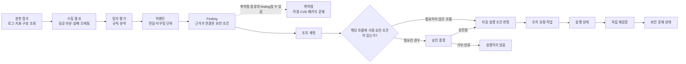

# 공통 용어 및 상태 정의

## 문서 정보

| 항목 | 내용 |
|---|---|
| 목적 | 팀 전반에서 탐지, 데이터, 조치, 승인, 검증과 해결 상태를 일관되게 해석한다. |
| 적용 범위 | 프로젝트 문서, API·이벤트 계약, 대시보드, SOAR, 테스트와 감사 기록 |
| 책임 역할 | 설계 책임자는 공통 의미를 관리하고, 기능 담당자는 API·코드 상태를 이 기준에 맞춘다. |
| 관련 문서 | [전체 설계](../README.md), [대시보드 설계](../dashboard/dashboard-design.md), [Terraform 설계](../terraform/infrastructure-design.md), [허니팟 설계](../honeypot/honeypot-design.md), [보안 시나리오](security-scenarios.md), [결정 기록](decisions.md), [추적 현황](tracking.md) |
| 갱신을 유발하는 변경 | 공통 용어, 식별자, 데이터·API 계약, 상태 의미·전이, 성공 판정 기준 변경 |

## 1. 용어 사용 원칙

같은 단어는 모든 문서와 API에서 같은 개념을 뜻해야 한다. AWS 원본 상태, 프로젝트 내부 정규화 상태, 사용자에게 보여 주는 설명은 서로 다를 수 있으므로 원본 값을 보존하고 의미를 분리한다. 원본 상태를 프로젝트 상태로 번역할 때는 출처, 변환 규칙, 관측 시각을 남긴다.

“없음”, “확인할 수 없음”, “실패”, “정상”은 서로 바꾸어 쓸 수 없다. 조회 성공 후 결과가 0건인 경우만 해당 범위에서 “결과 없음”으로 표현한다. 권한 거부, 시간 초과, 공급자 미연결, 일부 조회 실패, 오래된 데이터, 값 결측은 각각 원인과 영향 범위를 드러낸다. 미확정 임계값, 재시도 횟수, 유효 시간, 보존 기간은 상태 의미에 포함하지 않는다.

한 finding에는 여러 원천 이벤트가 연결될 수 있고, 하나의 취약점은 여러 자산에서 발견될 수 있다. 이벤트, finding, 취약점, 조치, 승인, 실행, 검증을 단일 레코드나 단일 상태값으로 합치지 않는다.

## 2. 개념 관계

아래 흐름은 개념 관계다. 실제 탐지·수집·자동화 연결 여부는 각 기능 설계와 추적 문서에서 확인한다. 점선 관계는 한쪽 개념이 항상 다른 쪽을 만들지는 않는다는 뜻이다.

수집 결과는 데이터가 관측 가능한지 설명하고, 탐지는 원천 증거를 규칙·분석에 대입한 결과를 설명한다. 이벤트는 라우팅·전달 단위이고 finding은 관찰된 보안 조건과 자산을 추적하는 단위다. 취약점은 보안 약점의 한 종류이며 모든 finding이 취약점인 것은 아니다. 승인과 실행은 별도 사건이다. 실행 성공은 조치 시스템이 작업을 성공으로 반환한 뜻이고, 해결 완료는 같은 기준의 재검증이 통과한 경우에만 판정한다.

| 개념·인터페이스 | 의미 | 대표 식별자·자료 | 반드시 구분할 점 |
|---|---|---|---|
| 원천 증거 | AWS 또는 보호 대상에서 수집한 원본 로그, 지표, 구성 응답, 공급자 finding | 로그 이벤트 ID, 메트릭 차원, 원본 finding ID, 리소스 ARN, 관측 시각 | 증거가 있다는 사실은 탐지·조치·해결을 뜻하지 않음 |
| 수집 결과 | 어떤 원천·범위·기간을 성공적으로 읽었는지와 실패·부분 범위 | 요청 ID, 원천, 기준 시각, 부분 여부, 오류 원인 | 조회 실패를 0건 또는 안전으로 번역하지 않음 |
| 탐지 | 증거를 규칙·분석 조건에 대입해 신호를 생성하는 판정 | 탐지 규칙·서비스, 규칙 버전, 평가 시각 | 탐지 신호는 보안 문제의 최종 해결 판정이 아님 |
| 이벤트 | 탐지 결과 또는 상태 변경을 전달·라우팅하는 봉투 | event ID, 발생 시각, 출처, 대상, 상관 키 | 하나의 이벤트가 finding 하나와 같다고 보장되지 않음 |
| Finding | 자산·근거·종류·심각도·시간을 연결한 관측 보안 조건 | finding ID, 원본 ID, 자산 ID, 상태, 최초·최근 관측 시각 | 이벤트·로그·취약점·조치 이력과 다른 개념 |
| 취약점 | 자산이나 패키지의 알려진 또는 평가된 보안 약점 | vulnerability ID, CVE 등 원본 키, 패키지, 자산, 버전 | 취약점은 finding의 가능한 유형이며 위협 이벤트와 동일하지 않음 |
| 자산·대상 | 탐지·조치·검증의 영향을 받는 계정 내 리소스 또는 서비스 | ARN, 인스턴스 ID, 보안 그룹 ID, 서비스 식별자 | 사람·요청자가 제출한 이름만으로 실행 대상 확정 금지 |
| 조치 계획 | finding 또는 운영 조건에 대응하기 위한 설명·대상·허용 매개변수 | playbook ID·버전, 대상, 매개변수 스키마 | 계획은 실행 요청이나 성공이 아님 |
| 승인 | 정책상 사람이 특정 실행 스냅샷을 허용·거부하는 결정 | approval ID, 승인 주체, 사유, 계획·매개변수 버전, 시각 | 승인 기능이 요구되는 흐름에만 존재하며 실행 자체가 아님 |
| 조치·작업 | 요청된 대응 단위와 비동기 추적 자료 | action ID, job ID, source, 요청 식별자 | 한 finding에서 여러 작업이 생길 수 있으며 중복 정책은 계약에서 정함 |
| 실행 | SSM 등 실행 공급자가 명령·자동화를 수행한 결과 | execution ID, 공급자, 시작·종료, 결과, 오류 | 공급자 성공 결과만으로 자산 상태 개선이나 해결을 선언하지 않음 |
| 재검증 | 같은 대상·기준·조건을 다시 관측하는 독립 검증 | verification ID, 조치 ID, 기준·도구 버전, 결과, 시각 | 실행 공급자 응답을 재검증 증거로 재사용하지 않음 |
| 해결 | 정의된 위험 조건이 같은 검증 기준에서 더 이상 관측되지 않는 판정 | finding ID, 재검증 증거, 해소 시각 | finding 원본의 종결 값이나 조치 성공만으로 자체 해결 상태를 대신하지 않음 |
| 감사 기록 | 누가 어떤 범위와 근거로 조회·승인·실행·검증했는지의 추적 자료 | actor, request ID, finding/action/job/execution ID | 일반 로그, 원천 증거, 변경 가능한 현재 상태와 다른 보존 개념 |

API 필드명과 식별자의 실제 형식은 OpenAPI 및 해당 데이터 계약이 정한다. 위 이름은 개념 구분을 위한 표준 용어이며, 실제 ID를 생성하거나 원본 ID를 덮어쓰라는 지시가 아니다.

## 3. 수집·조회 상태

수집 상태, 반환 결과 개수, 최신성, 오류 원인은 별도 차원으로 표현한다. 한 문자열 상태가 이 모든 정보를 잃게 만들어서는 안 된다.

| 차원 | 표준 의미 | 표현 원칙 |
|---|---|---|
| 수집 상태 | NOT_REQUESTED, RUNNING, SUCCEEDED, PARTIAL, FAILED, DISCONNECTED | 요청 실행 여부·원천 연결·조회 완료 여부를 나타냄 |
| 결과 존재 | NON_EMPTY, EMPTY, UNKNOWN | EMPTY는 성공 조회 범위 안에서 결과가 0건일 때만 사용; 결과를 읽지 못하면 UNKNOWN |
| 최신성 | CURRENT, STALE, UNKNOWN | STALE은 팀이 승인한 신선도 조건을 벗어난 자료; 시간 기준 미정이면 기준을 임의로 정하지 않음 |
| 실패 원인 | ACCESS_DENIED, TIMEOUT, SERVICE_UNAVAILABLE, INVALID_RESPONSE, CONFIG_MISSING 등 | 수집 상태와 함께 구체적인 원인 및 영향을 받은 원천·범위를 기록 |
| 부분 범위 | 성공한 원천·페이지와 실패한 원천·페이지 | PARTIAL 결과는 어떤 항목을 포함하지 못했는지와 경고를 제공 |

조회가 성공했지만 결과가 없는 경우는 수집 상태 SUCCEEDED와 결과 존재 EMPTY를 함께 표현할 수 있다. 일부 원천이 실패한 경우 성공 자료가 있더라도 PARTIAL이며 전체 합계를 완전한 결과로 표시하지 않는다. 공급자 미연결은 DISCONNECTED, 호출은 되었으나 권한 거부가 난 경우는 FAILED와 ACCESS_DENIED로 구분한다.

보호 대상 리소스의 상태는 수집 상태와 독립적이다. API 설계에서 사용하는 healthy, degraded, unhealthy, unknown은 자원의 관측 건강 상태를 뜻한다. unknown은 수집 불가나 증거 없음으로 인해 상태를 판정할 수 없다는 뜻이지 healthy가 아니다. 애플리케이션 프로세스의 생존 상태 역시 AWS 공급자·보호 대상 서비스의 건강을 보증하지 않는다.

실패, 지표 결측, 조회 범위, 원천 시각을 숫자 0 또는 정상 상태로 대체하지 않는다. 지표가 없으면 값을 null로 표현하고, 수집 상태와 결측 원인을 함께 제공한다.

## 4. 조치 승인과 실행 상태

승인 정책과 실행 진행은 서로 다른 축이다. 승인 필요 여부는 조치 유형과 명시된 정책에 따르며 모든 자동 조치에 승인 상태가 있다고 가정하지 않는다. 현재 정한 자동 조치 기준은 확인 단계를 새로 추가하지 않고, 추가 정책 설계는 후속 과제로 둔다. 수동 조치의 사람 승인 계약은 해당 기능 설계에 정의한다.

| 축·상태 | 정의 | 다음 판정 또는 금지 사항 |
|---|---|---|
| 승인 필요 여부: REQUIRED | 이 조치에서 사람의 승인 조건이 정책상 요구됨 | 유효한 승인 스냅샷 전 실행 금지 |
| 승인 필요 여부: NOT_REQUIRED | 해당 조치 경로에 확인 단계가 요구되지 않음 | 실행 권한·대상·조건 검사는 계속 적용; 이는 정책 안전성이 승인되었다는 뜻이 아님 |
| 승인 상태: PENDING | 구체적인 계획과 대상에 대한 사람의 결정 대기 | 실행 대기열에 넣지 않음 |
| 승인 상태: APPROVED | 특정 계획·대상·매개변수 버전에 대해 승인됨 | 승인은 실행을 시작하지 않으며 권한·대상·버전을 실행 직전에 다시 확인 |
| 승인 상태: REJECTED | 사람 또는 정책 주체가 실행을 허용하지 않음 | 같은 승인 레코드를 실행으로 전환하지 않음 |
| 승인 상태: EXPIRED 또는 CANCELLED | 승인 유효성이 끝났거나 실행 전 취소됨 | 새 실행 전 정책에 따라 새 승인·요청 필요 |
| 실행 상태: NOT_REQUESTED | 계획 또는 finding은 있으나 실행 요청이 없음 | 완료된 조치로 표시 금지 |
| 실행 상태: QUEUED | 작업이 영속 접수되어 실행 대기 중 | 실행 공급자 완료와 구분 |
| 실행 상태: RUNNING | 공급자가 해당 실행이 진행 중임을 확인 | 완료·실패 단정 금지 |
| 실행 상태: SUCCEEDED | 공급자가 요청된 실행 단계의 성공을 반환 | 보안 문제 해결 또는 재검증 통과로 간주 금지 |
| 실행 상태: FAILED | 실패가 공급자나 확인 증거로 판명됨 | 일부 효과 여부를 대상 상태에서 확인하고 실패 근거를 기록 |
| 실행 상태: UNKNOWN | 시간 초과·응답 유실 등으로 결과를 판별하지 못함 | 실패나 미실행으로 번역 금지; 새 실행 금지 |
| 실행 상태: RECONCILING | 실행 ID와 대상 상태를 대조해 UNKNOWN을 해소 중 | 판정 전 같은 조치 재전송 금지 |
| 실행 상태: CANCELLED | 실행 전 취소가 확정되었거나 공급자가 취소를 확인함 | 취소 요청 접수와 실행 중단 확인을 구분 |

UNKNOWN과 RECONCILING은 단순 실패 상태가 아니다. AWS 또는 SSM에서 원 실행 ID를 조회하고, 실제 대상 변경 여부와 영속 기록을 대조한 뒤 확인 가능한 최종 상태로 전이한다. 결과가 확인되지 않았다는 이유만으로 동일 요청을 다시 보내지 않는다. 재시도 횟수와 시간 제한은 합의된 정책에서 정하며 이 문서가 숫자를 정하지 않는다.

## 5. 보안 문제 해결 상태

보안 문제의 상태는 취약점·finding의 원본 상태, 조치 실행 상태, 재검증 상태와 구별한다. 다음 공통 의미를 사용하고, 기능별 API enum으로 옮길 때는 상태 계약과 결정을 갱신한다.

| 문제 상태 | 의미 | 다음 조건 |
|---|---|---|
| OPEN | 조건이 관측되어 해결되지 않은 상태 | 조사, 조치 계획 또는 위험 수용 검토 가능 |
| UNDER_REVIEW | 근거·영향·소유자·대응 방안을 검토 중 | 해결을 보증하지 않으며 원본 자료를 보존 |
| REMEDIATION_IN_PROGRESS | 허용된 대응 계획이 진행 중 | 작업 실행 상태와 별개로 문제는 미해결 |
| PENDING_REVALIDATION | 조치가 실행 결과상 성공했거나 대상이 바뀌었으나 해결 기준 확인 전 | 같은 범위와 기준으로 재검증 필요 |
| REVALIDATION_FAILED | 검증은 정상 수행됐고 문제 조건이 여전히 관측됨 | 미해결로 유지하고 추가 분석·수정 수행 |
| REVALIDATION_ERROR | 재검증 조회 자체가 실패했거나 증거가 불충분함 | 해결/실패 확정 금지; 확인 가능한 조건에서 다시 검증 |
| RESOLVED | 동일한 자산·조건·검증 기준에서 문제 부재가 증명됨 | 판정에 사용한 증거와 시각을 보존 |
| REOPENED | 해결 후 동일 또는 연관 조건이 다시 관측됨 | 새 증거를 기존 finding과 연결하거나 새 finding 생성 규칙 적용 |

RESOLVED는 원천 이벤트가 닫혔거나 조치 명령이 성공했다는 의미가 아니다. 보안 문제의 목표 기준이 같은 방법으로 다시 검사되어 충족되었다는 판정이다. 해당 자산을 검사할 수 없거나 재검증 조건이 바뀐 경우 RESOLVED로 전환하지 않는다. 재검증 결과를 확인할 수 없으면 REVALIDATION_ERROR 또는 그에 해당하는 미확인 상태를 유지한다.

원천 서비스가 제공하는 finding 상태, 예를 들어 해당 공급자 내 활성/보관/종결 값은 별도 필드로 보존한다. 공급자 상태를 자체 문제 상태로 무손실 대응할 수 없으면 원본 상태와 자체 상태를 나란히 둔다. 위험 수용·예외 억제·false positive 처리의 상태와 승인 절차는 별도 정책 결정 없이는 새로 정의하지 않는다.

## 6. 재검증과 성공 판정

재검증은 조치 결과를 확인하는 별도 관측 작업이다. 조치 전에 정한 목표 상태와 조건을 사용하며 다음 요소가 비교 가능해야 한다.

- 대상 자산 및 리소스 식별자
- 확인할 조건, 측정 단위, 조회 범위와 시간 구간
- 검사 도구·규칙·설정 버전
- 관측 결과, 원천, 기준 시각과 누락 범위
- 정상 기능을 보존해야 하는 경우 그 확인 증거

결과는 다음과 같이 해석한다.

| 결과 | 의미 | 문제 상태에 미치는 효과 |
|---|---|---|
| 통과 | 동일 기준에서 문제 조건이 더 이상 관측되지 않음 | 증거를 보존한 후 RESOLVED 가능 |
| 실패 | 검증은 성공했으나 문제 조건이 남아 있음 | REVALIDATION_FAILED, 문제 미해결 |
| 오류·미확인 | 검증 요청 실패, 원천 장애, 권한 부족, 오래된 증거 또는 범위 불일치 | REVALIDATION_ERROR 또는 미확인 유지. 해결 처리 금지 |

실행 성공 + 검증 통과가 확인되어도 수집 상태, 문제 해결 상태, 감사 이력을 각각 유지한다. 하나의 성공 플래그로 세 영역을 합치지 않는다. 탐지되지 않음도 시스템 안전 판정이 아니며, 탐지 원천 연결 및 수집 건강을 별도로 확인해야 한다.

## 7. 식별자와 증적의 연결

식별자는 서로 다른 엔터티를 합치지 않으면서 요청부터 검증까지 이어 주어야 한다.

| 식별자 | 식별 대상 | 용도 |
|---|---|---|
| requestId | 대시보드/API 요청 또는 호출 | API 응답·서버 로그·오류 연결 |
| eventId | 내부 라우팅 이벤트 | 이벤트 전달·중복 탐지·시간순 상관 |
| sourceFindingId | 원천 보안 서비스의 원본 finding | 원본 자료와 변환 결과 대조 |
| findingId | 내부 정규화 finding | 같은 보안 조건의 수명주기 추적 |
| vulnerabilityId | 취약점 자료 또는 원본 취약점 식별자 | CVE·패키지·자산 조합의 출처 추적 |
| resourceId | AWS 자원 또는 보호 대상 | 발견·조치·검증 대상 확정 |
| actionId | 특정 조치 계획 또는 요청 | 대상·계획 버전·결과 연결 |
| approvalId | 특정 승인 또는 거부 결정 | 승인 주체·사유·스냅샷 연결 |
| jobId | 비동기 작업 | 큐·작업자·상태 복구·이력 조회 |
| executionId | SSM 등 외부 실행 | 작업과 실행 공급자 결과 연결 |
| verificationId | 재검증 시도와 결과 | 조치 후 확인 증거 연결 |
| auditId | 감사 기록 | 행위·판정·변경의 감사 참조 |

프로젝트 구현의 현재 ID 필드와 관계는 코드 및 OpenAPI에서 확인해 tracking.md에 기록한다. ID가 없거나 공급자 간 동일하다고 증명되지 않은 경우 임의로 같은 키를 재사용하지 않는다. 시간 정보는 가능한 한 원본 시각, 수집 시각, 처리 시각을 각각 보존해 지연과 순서 변경을 판별한다.

## 8. 문서·계약 갱신 규칙

| 변경 | 갱신 대상 | 검토 기준 |
|---|---|---|
| 새 공통 개념 또는 기존 의미 변경 | 이 문서, README.md, 영향을 받는 기능 설계 | 비슷한 용어·원본 상태와 혼동되지 않는가 |
| 상태 이름·전이 변경 | 이 문서, API/OpenAPI, 시나리오, 기능 설계, tracking.md | 하위호환, 기존 자료의 변환, 오류·복구 전이 |
| 식별자 추가·재사용 범위 변경 | 이 문서, API/이벤트/저장 계약, 결정 기록 | 중복, 연결성, 원본 키 보존 |
| 해결 기준·성공 조건 변경 | README.md, 시나리오, 관련 설계, decisions.md, tracking.md | 증거의 동일성, 실패와 미확인 분리 |
| 코드 구현 또는 검증 현황 변경 | tracking.md | 상태 의미는 유지하고 관측 증거만 갱신 |

개념의 한국어 명칭, 영어 원문, 정의와 실제 API 값이 다르게 쓰이면 영향을 받는 문서를 한 번에 갱신한다. 개발 완료 검토 시 새 필드와 상태가 이 용어집에 정의되어 있는지, 실패·부분 자료·미확인 결과가 정상·실패·해결 중 하나로 잘못 합쳐지지 않았는지 확인한다. 커밋과 상세 변경 기록의 연결은 README.md의 버전 규칙을 따른다.
