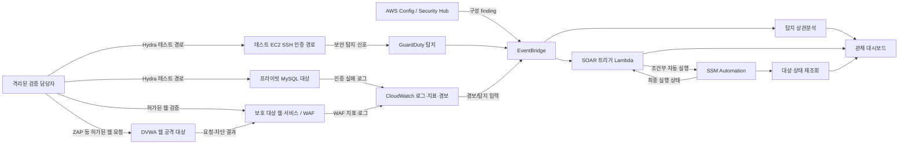

# 보안 시나리오 및 조치 검증 기준

## 문서 정보

| 항목 | 내용 |
|---|---|
| 문서 목적 | 탐지부터 재검증까지 보안 검증 시나리오와 안전한 증적 기준 정의 |
| 적용 범위 | SEC-01~SEC-10, 웹·인증 경로 검증, 수동 및 자동 조치 확인 |
| 책임 역할 | 보안 설계자: 시나리오·통제 승인, 구현 담당자: 코드·계약 반영, 검증 담당자: 격리된 환경에서 증적 수집 |
| 기준 문서 | [project.md](../project.md), [agents.md](../agents.md), [dashboard-design.md](../dashboard/dashboard-design.md), [infrastructure-design.md](../terraform/infrastructure-design.md), [honeypot-design.md](../honeypot/honeypot-design.md), [glossary.md](glossary.md), [tracking.md](tracking.md), [decisions.md](decisions.md) |
| 확인 근거 | 읽기 전용 소스와 기존 가이드 정적 검토. 이 문서는 AWS 실행, 공격 재현, 통합 검증이 완료되었다고 주장하지 않는다. 구현 조사 기준일과 경로별 근거는 tracking.md에서 관리한다. |

## 1. 목적과 적용 원칙

각 시나리오는 취약 상태를 안전한 범위에서 준비하고, 감지 신호를 확인하고, 사건 및 조치 상태를 구분하고, 조치 후 대상 상태를 다시 검증하는 공통 절차를 따른다. 알림이 발생하거나 자동화 실행이 성공했다는 사실만으로 보안 문제가 해결되었다고 간주하지 않는다.

시나리오의 흐름은 다음과 같다.

1. 격리된 비운영 환경, 테스트 계정, 테스트 자산, 명시된 소스 주소와 시간 범위를 확인한다.
2. 재현 전 구성과 대상 상태를 기록한다. 테스트용 자격 증명은 임의로 만들고 재사용하거나 실사용 비밀을 노출하지 않는다.
3. 승인된 시나리오에서만 탐지 조건을 유발한다. 공격 트래픽은 소유하거나 명시적으로 허가받은 대상에 한정한다.
4. 원천 로그, 탐지 결과, 상관분석, 대시보드 표시, 조치 상태를 상호 대조한다. 조회 실패와 미수집은 0건으로 치환하지 않는다.
5. 조치 후 대상 제어면을 직접 재조회해 결과를 검증하고, 미해결 상태·부작용·정리 결과까지 증적에 남긴다.

실환경 자산에 대한 공격 또는 변경은 이 문서만으로 승인된 것이 아니다. 운영 실행은 별도 변경 승인과 환경별 운영 절차를 따른다. 실환경 장애나 권한 부족이 생기면 데모 데이터로 대체하지 않고, 결과를 확인할 수 없는 자동화는 재실행 전에 원 실행의 상태와 부작용부터 확인한다.

## 2. 관제 검증 흐름과 인터페이스

다음 흐름은 현재 확인한 구성요소와 사용자가 확정한 검증 경로를 분리해 보여준다. GuardDuty를 통한 SSH 공격 탐지 경로는 시나리오 기준으로 채택되었지만, 확인한 SOAR 트리거 필터에는 해당 SSH 공격 유형을 자동 조치 대상으로 넘기는 연결이 확인되지 않았다. 따라서 이 화살표는 탐지·검증 경로이며 자동 차단 계약을 뜻하지 않는다.

도식에서 검증 대상은 보호 대상 서비스와 관제·조치 시스템으로 나뉜다. 대시보드는 관측 결과를 표시하는 관제 경로이고, 대상 자산의 실제 제어면을 대체하지 않는다. 구성 오류 탐지와 공격 행동 탐지는 서로 다른 탐지 계약을 가진다.

| 인터페이스 | 입력 → 출력 | 식별자·상태 계약 | 검증 및 경계 |
|---|---|---|---|
| 웹·WAF | 요청 → 응답, WAF 로그·지표 | 요청 시간, 대상 호스트, 응답 코드, WAF 규칙 결과 | HTTP 상태 코드만으로 SQLi 차단을 입증하지 않는다. 대상이 DVWA인지 실제 서비스인지 먼저 확인한다. |
| MySQL 인증 관측 | MySQL 인증 실패 로그 → CloudWatch 지표/경보 | 로그 그룹, 지표명 MySQLAuthFailure, 자산·시간 구간 | 로그 부재, 권한 오류, 기간 불일치는 인증 실패 0건과 구분한다. |
| SSH 위협 관측 | SSH 활동 → GuardDuty finding | finding ID, finding type, 리소스, 생성 시각, 심각도 | Hydra로 유발한 행위가 GuardDuty에서 실제로 지원·탐지되는지 실환경 검증 전에는 보장하지 않는다. |
| 구성 탐지 | AWS Config 평가 → Security Hub finding | 리소스 ARN, 규칙/표준, finding ID, 상태 | 보안 그룹 설정 finding을 SSH 무차별 대입 탐지와 혼합하지 않는다. |
| SOAR 실행 | 이벤트 → SSM Automation 및 기록 | 입력 이벤트 ID, 자동화 실행 ID, 대상 ID, 결과 상태 | 현재 모든 finding이 자동 실행으로 이어지는 것은 아니다. 필터와 게이트를 확인한다. |
| 재검증 | 조치 전후 대상 제어면 조회 → 재검증 결과 | 동일 자산 식별자, 관측 시각, 기대 상태 | 알림 또는 SSM 성공만으로 해결 완료를 선언하지 않는다. |

## 3. 공통 사건·조치 상태와 실패 처리

세 종류의 상태를 별도로 관리한다.

- **수집 상태**: 정상 조회, 일부 조회 실패, 권한 부족, 미연결, 데이터 없음, 오래된 데이터, 시간 초과.
- **조치 실행 상태**: 요청 전, 요청됨, 실행 중, 성공, 실패, 결과 미확인, 취소 또는 중복 의심.
- **보안 문제 상태**: 탐지됨, 검토 중, 조치됨, 재검증 대기, 재검증 실패, 해결 확인, 재발 또는 재개.

데이터가 없다는 사실은 쿼리 성공과 범위가 확인된 경우에만 “해당 범위에서 관측 없음”으로 해석한다. 수집 상태가 실패·부분 실패·오래됨이면 화면은 그 이유와 기준 시각을 드러내고, 숫자 카드에 정상 0건처럼 표현하지 않는다.

| 조건 | 판별 및 표시 | 재시도·중복 처리 | 감사·복구·재검증 |
|---|---|---|---|
| 미연결·권한 부족 | 연결/권한 상태와 영향 데이터 범위를 표시 | 권한·연결 복구 후 재조회. 같은 변경 조치는 자동 재실행하지 않음 | 호출 주체, 대상, 권한 오류, 복구 시각 기록 |
| 데이터 없음 | 조회 성공, 범위·기준 시각·원천 확인 뒤에만 관측 없음 표시 | 원천 지연 여부를 확인한 뒤 정책에 따라 재조회 | 조회 범위와 원천 응답 기록 |
| 일부 조회 실패·오래된 데이터 | 부분 상태 또는 오래됨으로 표시하고 수집 시각 노출 | 실패 원천만 재조회할 수 있는지 계약 확인 | 부분 성공 목록과 마지막 성공 시각 기록 |
| 실행 시간 초과·결과 미확인 | 완료/실패로 단정하지 않고 “결과 확인 필요” 유지 | 대상 상태와 SSM 실행 ID를 조회해 중복 여부를 판별한 뒤 결정 | 원 요청 ID, 자동화 ID, 최종 상태 조회 기록 |
| 조치 실패 | 실행 실패와 보안 문제 상태를 분리 표시 | 원인 해소와 재시도 가능성 확인. 정해진 재시도 횟수가 없으면 운영자 판단 | 오류, 실패 단계, 부작용, 복구 책임자 기록 |
| 재검증 실패 | 조치는 성공했을 수 있으나 문제 해결은 미확인 또는 실패로 표시 | 조치 결과와 독립된 재조회. 재조치 전에 부작용 확인 | 전후 값, 검증 시각, 남은 위험과 후속 작업 기록 |

재시도 횟수, 경보 임계값, 데이터 신선도 허용 시간, 로그 보존 기간, 중복 억제 시간은 근거가 확인될 때까지 결정 항목이다. 각 API 계약은 해당 상태와 원천별 기준 시각을 보존해야 한다.

## 4. 자동·수동 조치 안전 경계

현재 확인한 보안 그룹 자동 조치에는 다음 조건이 모두 적용된다.

1. 보호 대상 화이트리스트 검사.
2. 전역 ENABLE_AUTO 설정 확인.
3. 대상 보안 그룹에 AutoRemediation=enabled 태그 존재 확인.

IAM Access Key 비활성화 경로에는 확인한 코드상 화이트리스트와 전역 ENABLE_AUTO 검사는 있으나, 보안 그룹 태그 검사는 없다. 따라서 두 경로를 동일한 “3중 안전장치”라고 문서화하지 않는다. 사용자는 현 단계의 자동 조치에 추가 확인 단계를 넣지 않고, 확장된 승인·정책 설계는 후속 과제로 두도록 결정했다. 이미 연결된 자동 경로의 실행 전 확인 게이트를 이번 기준에서 새로 추가하지 않는다.

NACL의 ASR-BlockIpWithNacl 문서는 별도 수동 승인 방식으로 작성되어 있다. 이를 자동 조치로 바꾸거나 접속 즉시 차단하는 정책은 확정된 사실이 아니다. 해당 문서가 요구하는 승인 흐름은 별도 설계 결정 전까지 유지한다. Private NACL이 애플리케이션 및 DB 서브넷에서 공유될 수 있으므로 차단 영향 범위를 확인한다.

| 조치 경로 | 확인된 제어 조건 | 사용자 확인 단계 | 재검증 기준 |
|---|---|---|---|
| 보안 그룹 인바운드 회수 | 화이트리스트 + ENABLE_AUTO + AutoRemediation 태그 | 현 기준에서 추가 확인 게이트를 새로 요구하지 않음 | SG 규칙을 다시 읽어 허용이 제거됐는지 확인 |
| IAM Access Key 비활성화 | 화이트리스트 + ENABLE_AUTO | 현 기준에서 추가 확인 게이트를 새로 요구하지 않음 | 키 상태를 재조회하고 소유자 영향 확인 |
| NACL IP 차단 문서 | 전용 SSM 문서의 범위·규칙 제약, 수동 승인 주석 | 문서가 명시한 사람의 승인 후 실행 | NACL 규칙과 공유 서브넷 영향, 정리 상태 확인 |
| Nginx 강화 문서 | 수동 실행 대상. 현재 SOAR Lambda 연결 미확인 | 변경 승인에 따른 수동 실행 | 설정 검증, 실제 리스너·인증서·헤더 확인 |

현재 자동 이벤트의 중복 실행 방지는 코드에서 확인되지 않았다. SSM 요청 결과가 모호한 경우 같은 finding을 다시 넣기 전에 실행 ID, 대상의 현 상태, 기록 저장 결과를 조회한다. 이 기준은 중복 방지가 구현되었다는 주장이 아니며, 실제 멱등성 계약과 재시도 설계는 구현 수정 및 별도 추적 대상이다. 조치 이력 저장에 실패해도 실행이 계속될 수 있는 경로가 확인되므로, 감사 기록의 내구성은 추적표와 결정 기록에서 다룬다.

## 5. SEC 시나리오 카탈로그

| ID | 검증 목적과 트리거 | 감지·관측 경로 | 기준 조치와 재검증 |
|---|---|---|---|
| SEC-01 | SSH 인바운드가 허용된 보안 그룹 구성 | AWS Config 규칙 restricted-ssh → Security Hub 구성 finding | 정책상 불필요한 허용을 제거하고 SG 재조회. 이는 SSH 무차별 대입 탐지가 아님 |
| SEC-02 | Nginx 리스너·보안 헤더 구성 | Nginx 응답, curl/ZAP 등 허가된 확인 | 수동 강화. HTTP→HTTPS, TLS, 헤더는 실제 리스너와 인증서 구성이 완성되어야 확인 완료 |
| SEC-03 | 테스트 DB의 3306 노출 및 태그 기반 자동/수동 비교 | Config/Security Hub 구성 탐지 → EventBridge/SOAR 조건 | 격리된 테스트 SG에서만 확인. 자동 대상은 태그 조건 충족 시 회수, 그 외 경로는 알림/검토. 규칙을 재조회 |
| SEC-04 | 컨테이너 이미지 취약점 검토 | 기존 가이드의 Inspector/ECR/Trivy 경로 | 취약 이미지 판정과 교체를 수동 검토. 실제 연결·자동 배포 여부는 tracking.md 근거에 한해 기술 |
| SEC-05 | IAM 자격 증명 위험 탐지 및 키 비활성화 | Access Analyzer/GuardDuty/CloudTrail 중 확인된 finding 경로 | 화이트리스트와 전역 토글을 확인하고 키 상태를 재조회. 실사용 키가 아닌 테스트 키 사용 |
| SEC-06A | MySQL 인증 실패 행위 검증 | MySQL 로그 → CloudWatch metric filter/alarm → 알림 | Hydra 경로는 격리된 MySQL 테스트 대상에 제한. 로그·지표·경보 각각을 확인하고 계정 잠금 등 부작용을 점검 |
| SEC-06B | SSH 공격 시도의 보안 탐지 검증 | SSH 경로 → GuardDuty finding 확인 | MySQL CloudWatch 경로와 분리. GuardDuty finding이 실제 생성되는지 증명해야 하며 현재 SOAR 필터가 자동 조치 연결을 보장하지 않음 |
| SEC-07 | 비밀정보 노출 예방 확인 | 코드·이미지 스캔, Secrets Manager 관련 기존 가이드 | 합성 테스트 비밀만 사용. 노출 흔적 제거, 회전 필요성, 로그 유출 여부 확인 |
| SEC-08 | DVWA 대상 웹 공격 및 WAF 차단 결과 확인 | DVWA 별도 리스너, 허가된 ZAP/SQLi 검증, WAF 지표/로그 | DVWA는 보호 대상 서비스와 별도 실습 대상. WAF 차단 규칙과 대상 매핑을 검증하고 실제 차단 결과를 재조회 |
| SEC-09 | CloudTrail, Config, VPC Flow Logs 등 감사 신호 확인 | 원천별 콘솔/API 조회 및 중앙 관측 | 원천별 수집·보존·권한 상태를 기록. 누락 원천은 데이터 없음으로 합치지 않음 |
| SEC-10 | EC2 CPU·메모리 및 WAF 지표 경보 확인 | CloudWatch metric/alarm 및 SNS | 임계값과 평가 조건이 환경별 변수인지 확인. 경보 발생과 서비스 영향 및 회복을 별도로 검증 |

### AI 허니팟 후보 시나리오 경계

AI 허니팟은 프로젝트 목표 범위에 포함하되, 구현 기술과 자동 차단 정책은 미결정이다. 기존 공격 시뮬레이션·조치 검증 가이드만으로 구현이 존재한다고 간주하지 않는다. Beelzebub, OpenAI, Bedrock, 접속 즉시 NACL 차단은 확정 시나리오가 아니며, 별도 설계·결정과 안전 통제 승인을 거친 후 검증 항목으로 편입한다. 현재 이 문서의 SEC-01~SEC-10에는 구현 또는 검증 완료 상태로 포함하지 않는다.

## 6. 핵심 시나리오 상세

### SEC-01: SSH 구성 finding과 SSH 공격 탐지의 분리

기존 검증 가이드는 SSH 인바운드 구성 평가를 Config 규칙 restricted-ssh와 Security Hub에 연결한다. 이것은 “보안 그룹이 SSH 노출 정책을 위반하는가”를 평가하는 경로다. SSH 인증 실패나 무차별 대입 공격을 탐지하는 행위 기반 경로와 같은 finding으로 합치지 않는다.

사용자가 선택한 SSH 공격 검증 경로는 GuardDuty다. 이 선택을 반영하되, 검증 전에 GuardDuty finding 유형, 지원 데이터 원천, 테스트 환경의 탐지 가능 조건을 확인한다. 코드의 EventBridge→ASR IAM 이벤트 필터는 UnauthorizedAccess:IAMUser, CredentialAccess:IAMUser, Discovery:IAMUser 유형으로 제한되어 있어 SSH brute-force finding의 자동 조치 연결로 해석하지 않는다. 탐지 확인, SOAR 이벤트 전달, 자동 조치 여부를 각기 독립적으로 증명한다.

### SEC-02: Nginx 강화와 TLS 검증

기존 Nginx 설정과 SSM 문서에는 HTTP→HTTPS 리다이렉션, 자체 서명 인증서, 보안 헤더 구성이 제안되어 있다. 현재 Compose 설정은 포트 80을 노출하고 SSM 문서는 443 포트 미연결 시 경고하는 것으로 확인된다. 따라서 설정 파일 작성만으로 HTTPS 완료나 안전한 TLS 종료를 주장하지 않는다.

Nginx 강화는 현 기준에서 수동 변경과 검증으로 둔다. 운영 노출 전에는 443 리스너, 인증서 파일의 배치·마운트, 신뢰 체인, TLS 종료 위치, 헬스체크, 원복 절차를 설계하고 연결해야 한다. 헤더 검증은 실제 서비스 응답의 헤더를 확인한다. Content-Security-Policy는 앱의 자원 사용을 고려해 호환성 검토 후 적용한다. 권고 헤더 문자열이 파일에 존재하는 것만으로 검증 완료가 되지 않는다.

### SEC-03: DB 포트 노출, 자동 및 수동 비교

비교 검증은 격리된 테스트 자산을 대상으로 한다. 기존 가이드는 자동 대상과 수동 대상을 구분하는 SG 태그를 사용한다. Terraform 구성에서 공격자 인바운드 SG의 DB 포트 허용은 조건부 구성이다. 테스트 후 넓은 CIDR 허용이 남지 않았는지 SG 상태를 조회하고, 관측 가능한 외부 연결 시험의 한계도 기록한다.

대시보드·알림에 표시된 finding과 실제 SG 규칙을 서로 대조한다. 자동 경로는 세 조건이 모두 충족된 경우에만 SSM 실행 요청을 예상한다. 비대상 태그에서는 알림 또는 수동 검토 흐름이 기대되며, 이 동작은 실제 연결된 핸들러로 확인한다. 테스트 보조 스크립트가 Security Hub 이벤트를 직접 Lambda에 전달하는 경로는 실제 Config/Security Hub/EventBridge 탐지를 증명하지 않으므로 증거 유형을 구분한다.

### SEC-04: 이미지 취약점

Inspector, ECR, Trivy는 기존 시뮬레이션 가이드에 등장한다. 어떤 스캐너가 어떤 저장소·이미지 버전을 대상으로 실행되고, 결과가 어떤 finding 또는 작업 항목으로 이어지는지는 코드 및 설정 연결을 통해 별도로 확인한다. 발견 기록만으로 스캔 파이프라인이나 자동 조치를 구현했다고 쓰지 않는다.

대응 기준은 영향도·사용 중인 이미지·수정 버전을 검토하고, 테스트 환경에서 이미지 교체 후 재스캔하는 것이다. 이미지 태그만 변경되었는지 실제 다이제스트가 바뀌었는지 확인한다. 배포 롤백과 증적에는 이미지 다이제스트, 스캔 시각, finding ID, 승인된 변경 버전을 남긴다.

### SEC-05: IAM 자격 증명

CloudTrail 및 GuardDuty finding의 주체, 키 식별자, 리소스, 시각을 대조한다. 자동 키 비활성화 경로는 확인된 구현에서 화이트리스트와 ENABLE_AUTO 토글을 검사한다. 보안 그룹 경로의 태그 검사를 IAM 키 경로에도 적용한다고 가정하지 않는다.

테스트는 폐기 가능한 키와 비운영 계정으로 수행한다. 비활성화 요청 이후 키 상태를 IAM에서 다시 확인하고, 해당 키에 의존하는 워크로드의 운영 영향을 살핀다. 키 소유자와 회전/복구 절차가 명확하지 않으면 운영 조치 대신 미결정으로 기록한다.

### SEC-06A: MySQL Hydra 검증은 CloudWatch 경로

사용자가 선택한 MySQL 인증 실패 검증의 관측 경로는 CloudWatch다. 확인한 Terraform에는 MySQL 로그 그룹, “Access denied for user” 문자열 metric filter, MySQLAuthFailure 지표가 있다. 알람 기본값은 변수로 조정 가능하며 코드 기본 구성에서 임계값 10, 300초 기간, 1회 평가, Sum, missing data 미위반으로 처리한다. 이 기본값은 프로젝트의 승인된 보안 임계값으로 승격하지 않는다.

검증은 로그가 실제로 CloudWatch에 도착하는지, metric filter가 합성된 인증 실패를 세는지, alarm 상태와 SNS 전달이 예상대로 이어지는지 분리해서 확인한다. Hydra는 소유권과 격리가 확인된 DB 대상에서만 허가된 범위로 사용하고, 실제 계정 또는 실사용 암호를 대상으로 하지 않는다. 오류 로그가 없거나 쿼리 권한이 없는 경우 관측 0회로 표기하지 않는다.

### SEC-06B: SSH Hydra 검증은 GuardDuty 경로

SSH 무차별 대입 검증은 MySQL과 별도 시나리오로 GuardDuty를 관측한다. Config의 restricted-ssh finding은 SSH 포트 노출 상태만 검증하며 Hydra 행위 탐지의 대체 증거가 아니다. GuardDuty에서 어떤 finding type이 생성되어야 하는지, 공격 시뮬레이션이 그 조건을 충족하는지 검증 환경에서 사전 확인한다.

현 Terraform EventBridge→ASR 규칙은 IAM 자격 증명 유형을 대상으로 하므로 SSH finding을 자동 조치에 연결한다고 간주하지 않는다. GuardDuty 이벤트가 대시보드 또는 상관분석에 표시되는지, ASR 이벤트 입력·필터·실행·재검증이 실제 연결되어 있는지 별도로 기록한다. SSH 자동 차단은 확정되지 않았다.

### SEC-08: DVWA와 WAF

Terraform은 별도 DVWA 리스너 포트 8081과 대시보드 HTTP 포트 8080을 구성한다. DVWA는 취약점 연습 대상이며 운영 웹 서비스, 허니팟, 대시보드와 혼동하지 않는다. 대상 URL과 계정은 비운영 환경을 확인한 후 사용하고, 허용 범위 밖의 웹 자산으로 요청을 보내지 않는다.

ZAP 또는 유사 도구의 확인은 취약점 응답, WAF 규칙 평가, 차단 로그·지표, 최종 응답을 연결해 증명한다. HTTP 403만으로는 WAF가 차단했다고 단정할 수 없고, 다른 서비스의 거절 응답일 수 있다. WAF finding Lambda와 EventBridge 연결이 있더라도 이를 차단 정책이나 완전한 SOAR 자동화라고 확대 해석하지 않는다.

## 7. 증적과 검증 완료 기준

각 검증 기록에는 시나리오 ID와 버전, 환경·계정·리전, 대상 리소스 식별자, 실행 주체, 승인 범위, 시작·종료 시각, 트리거, 원천 finding/log/alarm ID, API 또는 콘솔 조회 결과, 조치 요청 ID와 SSM 실행 ID, 조치 전후 값, 재검증 결과, 오류·정리 결과를 포함한다. 민감 데이터는 마스킹하고 테스트 비밀을 증적에 보관하지 않는다.

시나리오의 성공은 최소한 다음을 모두 확인해야 한다.

- 기대한 원천에서 관측 데이터가 실제로 생성되거나, 미생성 원인이 분류되었다.
- 데이터 수집 상태와 보안 문제 상태가 서로 구분되어 표시되었다.
- 이벤트 식별자와 자산 식별자를 따라 탐지·상관분석·대시보드 경로를 추적할 수 있다.
- 조치가 있었다면 실제 제어면에서 목표 상태를 재조회했다. 결과 미확인 상태를 성공 또는 단순 실패로 바꾸지 않았다.
- 조치 실패, 재검증 실패, 중복 실행 의심, 부작용 및 복구 필요성이 기록되었다.
- 테스트용 노출·계정·규칙·리소스가 정리되었고 정리 완료를 실제 상태로 확인했다.
- 검증 증거의 종류를 정적 코드 확인, 단위 검증, 통합 검증, 실환경 검증 중 하나로 표시했다. 문서 생성이나 코드 경로만 읽은 것은 실행 검증이 아니다.

기존 demo/trigger-auto-remediation.sh는 테스트 보안 그룹을 변경하고 Security Hub 페이로드를 직접 Lambda에 전달하는 구조로 확인되므로, 이를 실행해 실환경을 변경하지 않는다. 정적 검토상 이 방식은 구성 탐지부터 EventBridge까지의 실제 연결을 입증하지 않는다. demo/verify-controls.sh는 연결 실패, DNS·라우팅 오류, 응답 코드만으로 PASS를 산정할 가능성이 있고 curl 인증서 검증을 생략하는 옵션도 확인되므로 단독 합격 증거로 삼지 않는다. demo/cleanup.sh의 범위도 보편적 정리 완료를 입증하지 않는다. 개선 전까지 해당 스크립트의 출력은 보조 단서로만 취급한다.

## 8. 변경 유발과 연관 문서

| 변경 종류 | 갱신 대상 | 완료 확인 |
|---|---|---|
| 탐지 원천, 상관분석 또는 finding 경로 변경 | project.md, 이 문서, 해당 기능 design.md, tracking.md | 입력 finding과 식별자 흐름 및 실패 상태 연결 확인 |
| 조치 게이트, 승인, 권한, 멱등성 변경 | project.md, 관련 Terraform/dashboard 설계, decisions.md, tracking.md | 경로별 조건, 운영 영향, 결과 미확인 복구 기준 기록 |
| 공격 대상·테스트 도구·안전 범위 변경 | 이 문서, honeypot-design.md 또는 보호 대상 설계, decisions.md | 비운영 대상과 정리·복구 절차 검토 |
| 임계값, 보존 기간, 재시도, 데이터 신선도 변경 | 기능 설계, glossary.md, decisions.md, tracking.md | 결정 근거와 검증 환경, 영향 범위 연결 |
| 검증 결과 또는 코드 연결 상태 변경 | tracking.md | 경로별 증거와 검증 등급 갱신. 설계 기준 변경은 별도로 이 문서와 decisions.md에 기록 |

문서 변경은 확정 커밋 버전과 연결한다. 커밋 이름은 사용자가 정한 버전만 표기한다. 상세 변경 내역과 검증 증거는 별도 변경 기록 및 tracking.md에서 해당 버전에 연결한다.
