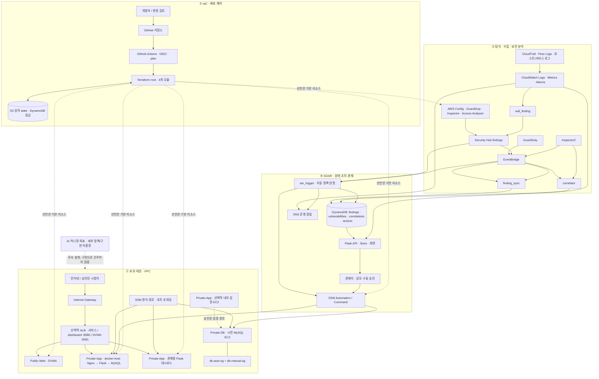

# AWS 보안 관제·자동조치 프로젝트

> **목적:** 전체 프로젝트의 목표, 책임 경계, 상위 아키텍처와 각 기능 설계로 가는 기준점을 제공한다. 이 문서는 설계 기준이며, 특정 날짜의 구현 완료나 검증 완료를 선언하지 않는다.

| 문서 정보 | 내용 |
|---|---|
| 적용 범위 | Terraform, 보호 대상 서비스, 탐지·수집, SOAR, 관제 대시보드, 허니팟 목표, 운영·검증 |
| 책임 역할 | 전체 설계 책임자와 각 기능 소유 역할 |
| 관련 문서 | [AI 작업 지침](agents.md), [대시보드](dashboard/dashboard-design.md), [Terraform](terraform/infrastructure-design.md), [허니팟](honeypot/honeypot-design.md), [시나리오](project-management/security-scenarios.md), [공통 용어](project-management/glossary.md), [결정·질문](project-management/decisions.md), [추적 현황](project-management/tracking.md), [그림 제작 기준](project-management/design-standards.md) |
| 갱신을 유발하는 변경 | 목표·범위·성공 기준, 네 계층의 책임·연결, 공통 경계 또는 문서 체계 변경 |

## 1. 프로젝트 목표와 범위

이 프로젝트는 팀이 소유한 격리된 AWS 환경에서 보호 대상 서비스와 클라우드 자원의 위험을 탐지하고, 근거와 조치 이력을 관제 화면에 제공하며, 승인 또는 정책에 따라 SSM을 통해 개선하는 보안 관제·자동조치 체계다. 인프라는 Terraform으로 재현한다. 로그 원문, 탐지 결과, 취약점, 상관분석 결과, 조치와 검증 증거는 서로 다른 자료로 취급한다.

### 1.1 설계 범위

- **IaC와 운영:** VPC, 네트워크 경계, 컴퓨팅, IAM, 로깅, 보안 서비스, SOAR, 원격 Terraform 상태, CI의 plan과 배포 책임, 비용·복구·정리 절차.
- **보호 대상:** 서비스용 Nginx–Flask–MySQL 컨테이너, 별도의 시연 MySQL EC2, 별도의 DVWA 취약 웹 자산, 선택적 내부 공격용 EC2.
- **탐지와 수집:** AWS Config, GuardDuty, Inspector, IAM Access Analyzer, Security Hub, CloudTrail, VPC Flow Logs, 호스트·서비스 로그, CloudWatch 지표 및 동기화 상태.
- **SOAR와 관제:** 탐지 이벤트 라우팅, 상관분석, 자동·수동 대응, SSM 실행, DynamoDB 저장, SNS 알림, Flask 대시보드와 API.
- **시나리오와 보증:** SEC-01~SEC-10, ZAP/Hydra 검증, 정상 기능 보존, 동일 조건 재검증, 실패·복구·감사 증거.
- **AI 허니팟:** 목표 범위에는 포함한다. 제품·모델·배치·세션 처리·차단 정책은 확정되지 않았으며 코드에서 구현 근거를 확인하지 못했다. 이 항목은 구현된 시스템 요소처럼 표시하지 않는다.

대시보드는 **관제 시스템**이고, 컨테이너 서비스·시연용 DB·DVWA는 **보호 또는 시험 대상**이다. 대시보드가 서비스 MySQL에 직접 연결하지 않는다. 서비스 컨테이너 안의 MySQL과 Private-DB 서브넷의 시연 MySQL EC2도 별개 자산이다.

### 1.2 목표 성공 기준

아래 기준은 기존 프로젝트 설계에 기록된 목표를 정돈한 것이다. 팀 기본기획서 원본이 실제 참고 위치에서 확인되지 않아 문구의 최종 승인은 추적 문서에서 원본 요구 근거와 함께 관리한다. 코드 선언만으로 통과를 주장하지 않는다.

| 기준 ID | 성공 기준 | 통과에 필요한 증거 |
|---|---|---|
| GOAL-01 | 인프라를 4개 Terraform 기능 모듈(network, compute, security, soar)로 관리하고 반복 가능한 plan·배포·정리 절차를 갖춘다. State bootstrap과 사람의 배포 승인을 별도로 다룬다. | 고정된 코드 기준점, CI plan, 검토 가능한 plan, 승인된 격리 계정의 배포·정리 기록 |
| GOAL-02 | 자동·수동 모니터링과 자동·수동 개선의 대표 시나리오를 각각 둘 이상 제공한다. | 각 시나리오의 입력·탐지·판정·조치·정상 기능·증적. 자동 분류에 이견이 있는 SEC-02는 수동 조치로 분류한다. |
| GOAL-03 | CPU·메모리 기준 초과를 CloudWatch와 SNS 알림으로 전달한다. 기존 요구자료는 80%를 기준으로 제시한다. | 실제 metric 출처, 데이터 결측 구분, 선택된 threshold와 기간, 알람 전이 및 구독 수신 증거. 현재 기본값을 실환경 검증으로 간주하지 않는다. |
| GOAL-04 | 보안 개선 전후를 비교하고, 동일 조건의 재검증을 통과한 경우에만 해결 완료로 판정한다. | 동일 대상·측정법·단위·범위의 전후 증거, 실행 기록, 재검증 결과 및 정상 기능 증거 |
| GOAL-05 | 검증 공격을 승인된 격리 환경에서만 수행하고, 자동·수동 판정과 복구 가능성을 시연한다. | 대상 계정·VPC·범위 확인, 공격 경로 기록, 영향 확인, 정리·재검증 증거 |

탐지 성공, 조치 요청 접수, 원격 실행 성공, 보안 상태 개선, 해결 완료는 각각 별도 판정이다. 데이터 조회의 성공은 리소스가 안전하다는 뜻이 아니다. 알림 발행은 수신 확인과 같지 않다. 상세 상태와 성공 판정 계약은 [공통 용어 및 상태 정의](project-management/glossary.md)와 각 기능 설계에 둔다.

## 2. 사용자와 사용 흐름

| 사용자 역할 | 주 작업 | 시스템 경계 |
|---|---|---|
| 인프라·Terraform 담당 | 코드 변경, plan 검토, 승인된 배포, 권한·네트워크·비용·복구 확인 | GitHub Actions는 plan을 준비하고 apply는 사람이 통제한다. AWS 변경은 프로젝트 문서와 실제 작업 권한을 따른다. |
| 보안 관제 담당 | 탐지·취약점·인프라 상태·동기화 경고·조치 이력을 검토하고 증적을 남긴다. | 대시보드 조회 범위와 AWS IAM 권한을 모두 적용한다. |
| 조치 승인자·운영자 | 대상과 계획을 확인하고 허용된 수동 조치 및 재검증을 요청한다. | 서버가 상태·권한·범위를 확인한다. UI 버튼만으로 권한을 부여하지 않는다. |
| 검증 담당자 | 승인된 ZAP/Hydra 등 시험을 격리된 대상에 수행하고 탐지·조치·정상 기능을 비교한다. | DB 무차별 대입과 SSH 무차별 대입은 서로 다른 경로·탐지 원천으로 기록한다. |

대표 흐름은 `계획·배포 → 보호 대상 요청 및 시험 → 로그·finding 수집 → 대시보드 검토 → 허용된 자동 판정 또는 수동 승인 → SSM 작업 결과 확인 → 같은 기준 재검증 → 증거 보존 및 정리`다. 각 화살표는 아래 4계층 명세에 정의된 인터페이스를 통과한다. 자료가 없거나 실패한 단계를 다음 정상 단계로 간주하지 않는다.

## 3. 전체 시스템 아키텍처 — 네 계층

다이어그램은 논리 흐름과 소유권을 표현한다. Terraform 토글이나 계정 환경에 따라 달라지는 조건부 리소스를 항상 배포된 것처럼 해석하지 않는다. **DVWA와 서비스용 Nginx–Flask–MySQL은 별도 경로**다.



**읽는 법:** 첫 계층은 코드와 환경에 따라 리소스를 정의하고 plan을 제시한다. 두 번째는 인터넷 경계와 Private 서브넷 안의 보호·관제 자산을 구분한다. 세 번째는 설정·행위·취약점·로그를 관측해 finding 또는 알람을 제공한다. 네 번째는 탐지 자료를 영속 이력에 연결하고 자동 경로 또는 사람 승인 경로를 통해 SSM에 요청한다. 실행 종료와 보안 문제 해결은 같은 사건이 아니며, 해결 판정에는 별도의 같은 기준 재검증이 필요하다.

자동조치의 **추가 공통 확인 단계·통제 정책은 후속 설계 과제**로 남긴다. 아래 자동 게이트와 그림은 목표 정책의 승인으로 읽지 않는다. 현재 코드에는 SG 경로의 유형 허용목록·SG 태그·전체 실행 스위치 확인과 IAM 키 경로의 유형 허용목록·실행 스위치 확인이 서로 다르게 구현돼 있다. 이 관측 차이와 미결정 정책은 추적·결정 문서에 따로 남긴다. AI 허니팟은 이 계층 흐름에 붙일 목표 후보이며, 현재 구성 요소나 실행 경로가 아니다.

| 경계 / 인터페이스 | 입력 | 출력·식별자 | 제어와 오류 의미 |
|---|---|---|---|
| GitHub → Terraform CI | 검토 가능한 IaC 변경, OIDC 신원 | terraform plan, PR 검토 자료, artifact | 현 워크플로는 plan 중심이다. plan은 apply 승인이 아니다. state는 S3와 잠금 구성으로 협업한다. |
| Terraform → AWS 구성 | root 변수, module 입력, 환경별 활성 조건 | VPC·서브넷·SG/NACL·EC2·보안 서비스·역할·연동 자원 | 토글이 꺼진 리소스는 없을 수 있다. 배포 결과 확인 없이 파일 선언만으로 운용을 주장하지 않는다. |
| 보호 자산 → 로그·탐지 | AWS 설정·CloudTrail·VPC·호스트·웹/DB 관측 | 로그 이벤트, 지표, Config 결과, GuardDuty·Inspector·Security Hub finding | 로그·finding·지표는 서로 다른 자료다. CloudWatch 데이터 누락은 안전한 0값이 아니다. |
| Security Hub/GuardDuty → SOAR | 원본 finding ID·유형·리소스 ARN·계정·리전 | 상관 분석·조치 판정과 실행 ID | 인입 필드와 조인 키는 공급자별 계약을 따른다. 거부·불완전 수집은 정상 빈 결과로 바꾸지 않는다. |
| finding_sync → 저장소 | Security Hub 또는 Inspector 이벤트·주기 대조 | findings / vulnerabilities 행, `view_state`, `version`, `__sync__` 상태 | 원본 갱신 버전·중복·역순·부분 실패를 보존한다. 마지막 성공 시각과 경고를 함께 전달한다. |
| correlator → 상관분석 표 | GuardDuty finding과 대상 리소스의 Inspector 조회 | `finding_id`, `instance_id`, 기본·승급 심각도, CVE 목록 | GuardDuty ID와 Security Hub ID가 달라 조인할 때 소스 키를 확인한다. Inspector 조회 실패는 CVE 0건과 구분한다. |
| 대시보드 브라우저 ↔ Flask | 사용자 세션·필터·요청 ID·표준 조회/명령 DTO | `{data, meta}` 응답, 허용된 화면 모델, 상태·오류 | 브라우저에는 AWS 자격증명이 없다. 로그인·권한·CSRF·계정/리전/자원 범위를 서버에서 검증한다. |
| 사람 또는 자동 경로 → SSM | 서버가 허용한 문서·대상·매개변수·작업 식별자 | 접수·SSM 실행 ID·종료 상태·증거 | 요청 성공은 실행 완료가 아니다. 결과를 확인하지 못한 조치는 무조건 재실행하지 않는다. |
| SSM → 상태 저장 / 재검증 | 실행 종료·같은 조건으로 다시 측정한 자료 | 조치 이력·감사 행·검증 판정·증거 위치 | SSM 성공은 해결 완료가 아니다. 동일 기준 재검증 통과 전 해결 상태로 바꾸지 않는다. |
| CloudWatch/SOAR → SNS | 알람·운영 알림 | 토픽 발행 및 구독 전달 결과 | 발행 성공과 수신 확인을 구분한다. 구독 미설정·전달 실패는 별도 운영 상태다. |

## 4. 네 계층의 책임 경계

### 4.1 IaC · 배포 제어 계층

Terraform 루트는 공유 리소스 이름과 의존성을 연결한다. 목표 module 책임은 `network`, `compute`, `security`, `soar`로 나뉜다. 선택적 `bootstrap`은 원격 state와 CI 연동을 준비하는 선행 관리 영역이다. GitHub Actions의 OIDC plan과 사람이 수행하는 실제 apply는 구분한다. 코드 저장소의 CI 통과를 AWS 실환경 상태의 증거로 간주하지 않는다.

NACL 규칙과 SOAR 실행 소유권, Terraform이 덮어쓸 수 있는 리소스 속성, Secrets Manager 초기값과 로테이션 충돌을 하나의 변경 경계에서 검토한다. 구체 모듈·입력·권한·배포·비용 계약은 [Terraform 설계](terraform/infrastructure-design.md)에 둔다.

### 4.2 보호 대상 인프라 계층

VPC 안에는 Public-Web, Private-App, Private-DB 역할의 서브넷과 ALB·IGW, NAT/SSM용 VPC Endpoint 조건이 있다. Terraform에는 ALB에서 서비스, DVWA, 관제 화면을 나누는 리스너가 선언돼 있다. DVWA는 서비스 Nginx 앞에 둔 필수 프록시가 아니다.

Terraform이 명시한 대시보드 접근 방식은 다음 두 경로다.

- ALB가 활성화되면 `:8080`의 HTTP ALB 경로로 관제 Flask에 접근한다. 보안 그룹 범위는 `dashboard_ingress_cidr`로 설정하며 현재 변수 기본값은 `0.0.0.0/0`이다.
- Terraform 출력의 SSM Session Manager 포트 포워딩 명령을 통해 Private-App의 관제 포트 5000으로 접속할 수 있다. SSH 22 접근 규칙은 두지 않는다.

이는 저장소에 정의된 접근 방식의 명세다. 접근 범위와 웹 전송 암호화의 운영 승인·강화 필요성은 구현 현황 및 결정 문서에 연결한다. 보안상 필요한 TLS나 회사 인증 공급자를 이미 배포한 사실로 단정하지 않는다. 서비스 이미지 소스와 배포 산출물도 Terraform 템플릿 참조만으로 모두 제공됐다고 간주하지 않는다.

### 4.3 탐지 · 수집 계층

Config는 선언된 리소스 유형과 관리형 규칙에 따라 설정을 평가한다. GuardDuty는 행위 기반 finding을 제공하고, Inspector는 EC2/ECR 이미지 취약점 결과를 제공한다. IAM Access Analyzer는 외부 접근 가능 정책을 분석한다. Security Hub는 지원 탐지 서비스 finding을 모은다. CloudTrail, VPC Flow Logs, CloudWatch Logs 및 Metrics는 감사·네트워크·서비스·성능 자료로 각각 구분한다.

Security Hub finding과 Inspector 취약점은 EventBridge·`finding_sync` 경로에서 DynamoDB로 적재하거나, 대시보드가 AWS 원본을 직접 조회하는 설정이 있다. 탐지와 취약점 각각의 선택 모드가 실제 데이터 원천이다. 스케줄 대조, DLQ, `__sync__` 신선도 상태를 데이터 목록과 함께 해석한다. 자동조치 판정·상관분석은 별도 Lambda 경로를 사용한다. 수동 SSM 검사 문서가 S3에 남기는 Trivy 결과가 Inspector 취약점 목록에 자동 통합된다고 주장하지 않는다.

MySQL 무차별 대입은 시연 MySQL의 로그와 CloudWatch 메트릭 경로로 확인한다. SSH 무차별 대입은 GuardDuty 경로로 따로 확인한다. CloudWatch CPU는 EC2 기본 지표, 메모리는 인스턴스 CloudWatch Agent에서 보내는 사용자 지정 지표다. 탐지·상관·수집 계약은 대시보드 및 Terraform 상세 설계와 [시나리오 명세](project-management/security-scenarios.md)에 연결한다.

### 4.4 SOAR · 상태·조치 계층

`asr_trigger`는 GuardDuty 또는 Security Hub finding을 받고 코드에 연결된 SG 규칙 회수·노출 Access Key 비활성화 경로를 판정하며 SSM Automation을 시작한다. SSM 종료 이벤트는 별도 EventBridge 경로를 통해 자동 조치 이력을 갱신한다. **ASR-HardenNginx는 등록된 SSM Command 문서가 있어도 자동 Lambda 분기에 연결돼 있지 않으므로 수동 조치로 분류한다.** 공격 IP 차단의 NACL 조치와 DB 비밀값 회전 역시 승인된 수동 경로로 다룬다. 비밀 회전 문서만으로 DB와 애플리케이션까지 함께 정상 회전한다고 보지 않는다.

추가 검증 단계나 공통 자동조치 게이트 정책은 이번 기준에서 확정하지 않고 후속 설계 과제로 둔다. 자동화를 넓히거나 새 자산을 포함하기 전에 조치 대상·복구·중복·감사 요구를 결정 문서에서 해소해야 한다. 코드에 이미 있는 조치 분기의 실제 실행 여부와 실증 검증은 별도 추적한다.

관제용 Flask 앱은 프런트엔드 Store·응답 어댑터·API·업무 계약·Provider/Repository를 통해 AWS를 조회한다. AWS 원본과 작업 이력은 서로 다른 읽기 자료다. 승인·작업 접수·감사 저장에 대한 설계 표준은 DynamoDB를 목표로 삼고, 현재 SQLite 구현과의 차이는 **구현 수정 대상**으로 기록한다. 실 조치와 실 재검증 Provider가 활성화됐다고 추정하지 않는다. DTO·인증·오류·데이터 계약은 [대시보드 설계](dashboard/dashboard-design.md)에 둔다.

AI 허니팟은 본 계층의 설계 대상 후보로만 표시한다. 실제 프로젝트에서 미끼 서버·AI 응답·세션 분석·차단 watcher 구현 경로를 확인하지 못했다. 모델·저장 필드·접속 처리·자동 차단 및 사람 검토 관계는 결정을 받은 뒤 별도 설계에 확정한다. 단순 공격·조치 가이드는 허니팟 구현 증거가 아니다.

## 5. SEC 시나리오 범위

아래 매핑은 기존 프로젝트 설계와 코드에서 식별한 **검증 범위**다. “탐지”가 실제 계정에서 발생한 finding이라는 뜻은 아니며, “조치”가 성공·검증되었다는 뜻도 아니다. 각 시나리오의 대상 전제, 공격 단계, 증적, 복구, 통과 판정은 [시나리오 문서](project-management/security-scenarios.md)에서 명세한다.

| 시나리오 | 보호·시험 항목 | 탐지·기록 경로 | 조치·확정 범위 |
|---|---|---|---|
| SEC-01 | 과도하게 공개된 보안 그룹 규칙 | Config / Security Hub, 필요 시 승인된 포트 점검 | SG 자동 조치 코드는 존재한다. 검증 전후 규칙과 서비스 정상성을 함께 본다. |
| SEC-02 | HTTP·보안 헤더 구성 | 승인된 curl/ZAP 수동 검사 | Nginx 보안 설정은 **수동 개선**으로 분류한다. 등록 SSM Command와 자동 호출 여부를 혼동하지 않는다. |
| SEC-03 | 3306 공개 및 자동/수동 비교 | Config·Security Hub, 별도 Hydra/MySQL 인증 실패는 CloudWatch 로그 | 시연 DB 한 대에 자동 대상·수동 대조군 SG 두 개가 붙는다. 하나의 SG 조치로 DB 포트 전체 차단을 주장하지 않는다. |
| SEC-04 | EC2 또는 ECR 이미지의 CVE | Inspector와 승인된 Trivy 검사 결과 | 이미지 교체·재배포 뒤 동일 이미지 범위로 재검사한다. Trivy S3 결과의 화면 통합 여부는 별도 계약이다. |
| SEC-05 | 노출된 자격증명·과도 권한 | GuardDuty·Access Analyzer·CloudTrail·Config | Access Key 자동 비활성화 코드는 권한과 대상 범위 검토가 필요하다. 최소권한 정책 수정은 수동이다. |
| SEC-06 | MySQL·SSH 무차별 대입을 분리 검증 | MySQL Hydra → CloudWatch Logs/metric alarm; SSH Hydra → GuardDuty | 공격 원천·finding을 별도 증거로 기록한다. IP 차단은 기존 NACL 수동 승인 문서에 따른다. |
| SEC-07 | 비밀값 노출·자격증명 분리 | 코드 검토·파일시스템 검사·Secrets Manager 이력 | DB·애플리케이션에 값이 적용되는지와 Terraform 소유권·복구를 확인한 뒤 회전 완료를 판정한다. |
| SEC-08 | DVWA 웹 공격 및 WAF 반응 | 승인된 ZAP/SQLi 검사, WAF CloudWatch Alarm → Security Hub finding | DVWA는 별도 공개 시험 대상이다. WAF 생성·차단은 조건부이며 정책 변경은 수동 검토 경로다. |
| SEC-09 | 감사·구성·서비스 로그 | CloudTrail/S3/KMS, Flow Logs, CloudWatch Logs, Config·Security Hub | 원본 로그 보관과 finding 통합을 분리하고 수집 누락·권한 부족을 확인한다. |
| SEC-10 | CPU·메모리 과부하 및 운영 알림 | EC2 CPU·Agent 메모리 → CloudWatch Alarm → SNS | 기존 목표 threshold는 80%로 기록돼 있다. 기간·환경·수신 증거 확인 없이 알람 완료를 주장하지 않는다. |

## 6. 횡단 설계 원칙

### 데이터 부재와 오류

응답 불가·미연결·권한 거부·실제 0건·부분 성공·오래된 적재 데이터·페이지 누락은 각각 구분한다. 공급자 연결 실패를 빈 목록으로 바꾸지 않는다. 다른 소스나 데모 자료를 통해 실환경 응답 실패를 숨기지 않는다. 메타데이터에는 가능한 범위에서 자료 원천, 기준 시각, 부분 응답, 경고, 요청 식별자를 제공한다.

### 실행·중복·복구

실행 접수, SSM 실행 상태, 실행 종료, 동일 조건 재검증은 별개 상태다. 외부 호출 타임아웃이나 응답 유실은 실행을 하지 않았다는 증거가 아니다. 실행 결과를 확인하지 못한 경우 기존 요청과 SSM 실행 ID·멱등 식별자를 먼저 대조해야 하며, 무조건 재실행하지 않는다. 승인·감사·조치 이력을 기록할 수 없을 때 허용할 동작과 자동조치 이력 기록 실패 정책은 후속 설계와 현재 구현 차이를 나눠 기록한다.

### 신원·권한과 격리

브라우저는 AWS 자격증명을 갖지 않는다. 서버 측에서 사용자 인증, 역할, 계정·리전·자원 범위, CSRF, 조치 대상·문서·매개변수를 확인한다. AWS의 읽기 권한과 SSM 변경 권한을 구분한다. 검증 공격은 팀 소유 격리 자산과 승인된 범위 안에서만 실시한다. 각 계층은 다음 계층에 필요한 최소 정보와 권한만 넘긴다.

### 운영·증거

Terraform 토글, NAT/endpoint 연결, AMI·ECR 준비, IAM 역할, Secrets, DNS/TLS, 로그 보존, 비용, 백업·복구·정리 조건은 함께 변경 검토한다. 데모 명령이나 정적 테스트는 실환경 배포 검증과 별개다. 증거는 시나리오·요구 ID·대상·도구·기준 시각에 연결하며 비밀값을 담지 않는다.

## 7. 관리 문서 체계

아래 파일이 저장소에서 팀 공유 기준 문서를 보관하는 얕은 구조다. `project.md`와 `agents.md`, 에디터 자동 인식 파일은 저장소 루트에 둔다. 기능별 설계 문서는 해당 구성요소 폴더에, 공통 관리 문서는 `project-management/`에 둔다. 상태 현황이나 설계 예외를 각 기능의 정본에 섞지 않는다. 별도 기능 문서를 잘게 나누기보다 해당 설계의 목차에 통합한다.

```text
aws-security-project/
├── .cursorrules
├── .windsurfrules
├── .github/
│   └── copilot-instructions.md
├── project.md
├── agents.md
├── dashboard/                         # 애플리케이션 코드와 대시보드 설계
│   └── dashboard-design.md
├── terraform/                         # Terraform 코드와 인프라 설계
│   └── infrastructure-design.md
├── honeypot/
│   └── honeypot-design.md
└── project-management/
    ├── security-scenarios.md
    ├── design-standards.md
    ├── glossary.md
    ├── decisions.md
    └── tracking.md
```

`project.md`는 목표와 상위 시스템 아키텍처를 소유한다. `agents.md`와 세 자동 인식 지침은 AI의 작업 행동을 소유한다. 기능별 `*-design.md`는 그 기능의 책임·상세 구조·자료/API 계약·실패·검증을 소유한다. 시나리오 문서는 검증 순서·안전 범위·증적을 소유한다. 용어집은 공통 개념·상태를 정의한다. 결정 기록부는 승인된 선택·근거·미결정 질문을 보관한다. 추적 문서는 코드 경로와 관측 시점별 구현·검증 근거를 보관한다. 발표용 이미지 제작 규칙은 `design-standards.md`에만 둔다. 설계 본문에는 Mermaid와 Markdown 표를 사용한다.

## 8. 개발·문서 완료 기준

각 변경은 완료를 선언하기 전에 아래 영향을 확인하고 관련 문서를 갱신한다.

1. 요구 ID와 승인된 설계 기준을 식별하고, 충돌은 결정 기록부에서 해소하거나 미결정으로 표시한다.
2. 데이터/API 계약, 네트워크·IAM·배포 책임, 상태 전이, 중복 방지, 실패·복구와 정상 기능 영향 범위를 점검한다.
3. 관련 시나리오와 통과 조건·실패 조건·필요 증거를 갱신한다. 수행하지 않은 테스트나 실환경 검증을 완료로 기록하지 않는다.
4. 추적표에 요구 ID, 출처, 설계 위치, 코드 경로, 구현 판정, 검증 판정, 근거와 후속 작업을 연결한다.
5. 문서 링크와 공개 범위, 민감 정보 제외 여부를 확인한다. 상위 프로젝트 설계와 하위 문서가 같은 책임을 중복 정의하지 않는지 검토한다.
6. 변경 기록과 실제 커밋 SHA를 연결한다. 커밋 이름은 확정된 형식인 `vN` 또는 `vN.M`만 사용하고 설명을 덧붙이지 않는다. 커밋이 없으면 버전·SHA를 만들어 내지 않는다.

**이 문서 기준:** 실제 구현 상태·확인 시점·수행한 검증은 [추적 현황](project-management/tracking.md)에만 둔다. 설계 기준은 내용이 바뀔 때만 갱신 이력에 반영하며 날짜만 바꿔 최신이라고 표시하지 않는다.
