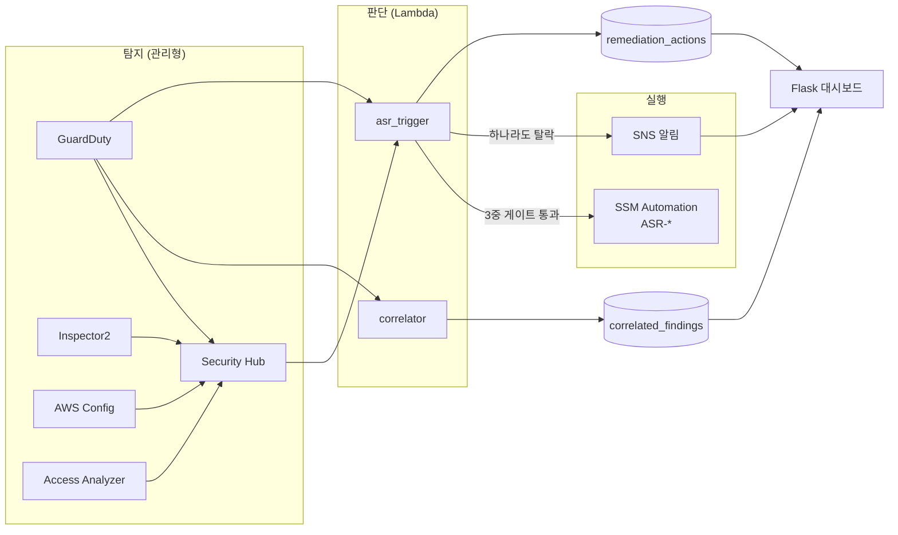
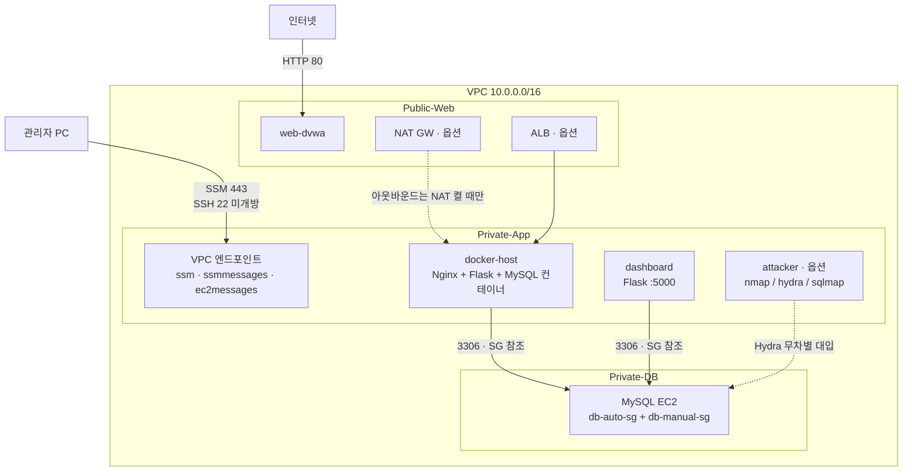
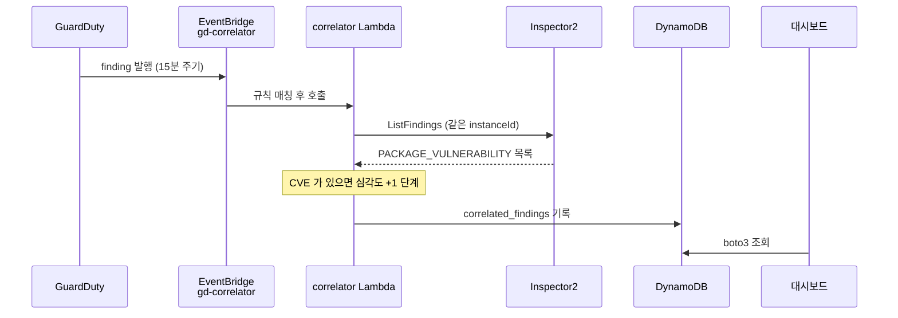
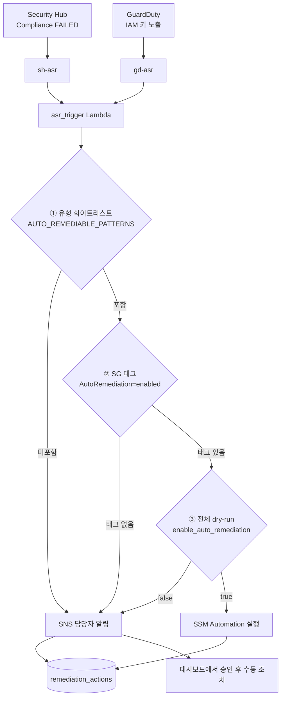
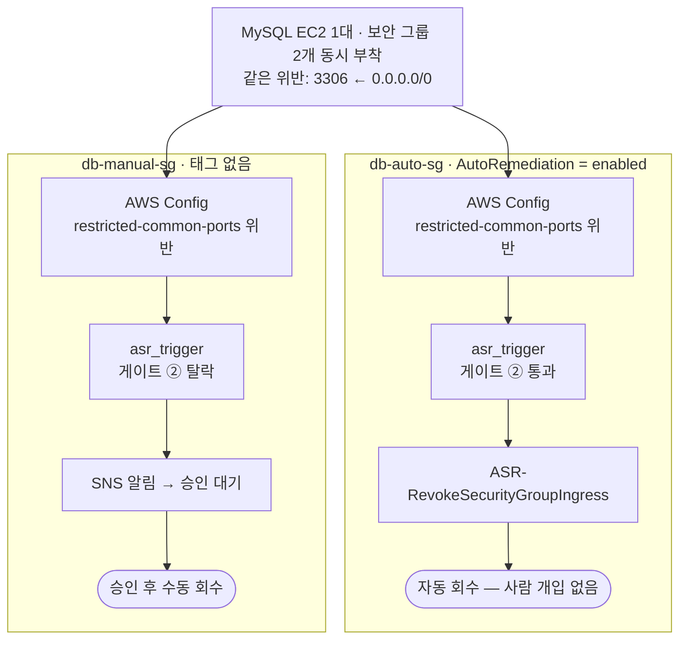

# 아키텍처

`terraform`

이 문서는 **런타임에 무엇이 어떻게 흐르는지**를 설명합니다.
파일이 어디에 있고 왜 나뉘어 있는지는 `docs/구성설명.md`,
[Terraform 책임·배포 기준](../infrastructure-design.md)을 참고하세요. 비용은 `docs/비용예측.md`를 봐 주세요.

---

## 1. 한눈에

탐지는 AWS 관리형 서비스가, 판단은 Lambda 가, 실행은 SSM 이 맡습니다.
**Lambda 는 직접 조치하지 않습니다.** 판정만 하고 실행은 SSM Automation 문서에 넘기므로,
Lambda 권한이 `ASR-*` 문서 범위로 묶입니다.



모듈 의존 순서는 `network → compute → security → soar` 입니다.
`soar` 가 마지막인 이유는 `compute` 가 만든 인스턴스 ID 를
알람 차원(dimension)으로 받아야 하기 때문입니다.

---

## 2. 네트워크 배치

VPC `10.0.0.0/16`, 서브넷 4개입니다.

| 서브넷 | CIDR | AZ | 들어가는 것 |
|---|---|---|---|
| Public-Web | `10.0.0.0/24` | primary | web-dvwa, ALB, NAT GW |
| Public-Web-b | `10.0.3.0/24` | secondary | ALB 2 AZ 요건 전용 (평소 비어 있음) |
| Private-App | `10.0.2.0/24` | primary | docker-host, dashboard, attacker, VPC 엔드포인트 |
| Private-DB | `10.0.1.0/24` | primary | MySQL EC2 |



공격자를 VPC **안**에 두는 이유는, 외부에서 스캔할 때 생기는
"허가 없는 대상 스캔" 문제를 피하면서도 GuardDuty 와 Flow Logs 에
확실히 잡히게 하기 위해서입니다.

### 접속 경로

SSH 22 번은 **어디에도 열려 있지 않습니다.** 관리자는 Session Manager 로 들어갑니다.

```bash
# 인스턴스 접속
aws ssm start-session --target <instance-id> --region ap-northeast-2

# 대시보드 (5000 은 외부에 열려 있지 않습니다)
aws ssm start-session --target <dashboard-id> \
  --document-name AWS-StartPortForwardingSession \
  --parameters '{"portNumber":["5000"],"localPortNumber":["5000"]}'
```

> **제약**: VPC 엔드포인트는 `ssm` 3종뿐입니다. user_data 가 `apt-get`·PyPI·
> `download.docker.com` 을 쓰므로 **첫 부팅에는 `enable_nat_gateway = true` 가 필요합니다.**
> NAT 를 끈 채로 CloudWatch Agent 로그 수집까지 살리려면
> `secretsmanager`·`logs`·`monitoring` 엔드포인트를 추가해야 합니다(월 약 $28).

---

## 3. 탐지 → 조치 파이프라인

### 3-1. 상관분석 경로

GuardDuty finding 하나만으로는 심각도 판단이 약합니다.
같은 인스턴스에 Inspector CVE 가 함께 있으면 한 단계 올립니다.



심각도 승급 규칙은 `LOW → MEDIUM → HIGH → CRITICAL` 이며 `CRITICAL` 에서 멈춥니다.

이 경로는 **EC2 를 전제로 합니다.** `correlator` 가 GuardDuty finding 에서
`resource.instanceDetails.instanceId` 를 꺼내 Inspector 를 조회하기 때문에,
DB 가 EC2 여야 DB 도 상관분석 대상이 됩니다.

### 3-2. 자동조치 판정 경로



어느 쪽으로 갈라지든 판정 결과는 **항상** `remediation_actions` 에 기록됩니다.
`before_state` / `after_state` 가 함께 남아 Before-After 증적이 됩니다.

> **알려진 차이**: 게이트 ② 는 SG 분기에만 적용됩니다.
> IAM 키 비활성화 경로는 ①·③ 만 거치는 2중 구조입니다.
> 코드 독스트링의 "안전장치 3중" 과 실제가 다릅니다.

---

## 4. 자동 / 수동 대조군

이 프로젝트의 핵심 시연입니다. **인스턴스는 하나, 위반도 같습니다.**
다른 것은 보안 그룹에 붙은 태그 하나뿐입니다.

AWS Config 가 EC2 가 아니라 **보안 그룹 단위**로 평가하기 때문에 가능합니다.



> 이 시연의 탐지 주체는 **AWS Config** 입니다. GuardDuty 는 SG 설정 위반을 잡지 않습니다.
> 아키텍처 그림을 그릴 때 Config 를 빠뜨리면 이 흐름이 설명되지 않습니다.

---

## 5. 구성요소

### 컴퓨팅 (EC2 5대)

| 인스턴스 | 타입 | 위치 | 역할 | 시나리오 |
|---|---|---|---|---|
| docker-host | `t3.small` | Private-App | Nginx + Flask + MySQL 컨테이너 3-Tier 서비스 | SEC-02, 04, 07 |
| db | `t3.small` | Private-DB | MySQL — 탐지·조치 대상 | SEC-03, 06 |
| dashboard | `t3.micro` | Private-App | SOAR 보안 대시보드 (Flask) | — |
| web-dvwa | `t3.micro` · 옵션 | Public-Web | 웹 공격 시연 대상 | SEC-08 |
| attacker | `t3.micro` · 옵션 | Private-App | 내부 공격 재현 | SEC-06 |

> docker-host 의 MySQL 은 **컨테이너**이고 db 인스턴스와 별개입니다.
> 전자는 **보호 대상 서비스**의 DB, 후자는 **탐지·조치 대상**입니다.

### DB 를 RDS 가 아니라 EC2 에 두는 이유

관리형 DB 가 아니어서 잃는 것보다 얻는 것이 많습니다.

| 항목 | EC2 MySQL | RDS 였다면 |
|---|---|---|
| Inspector2 CVE 스캔 | ✅ 대상 | ❌ RDS 는 Inspector 대상이 아님 |
| GuardDuty EBS 멀웨어 스캔 | ✅ 대상 | ❌ 대상 아님 |
| correlator 상관분석 | ✅ 대상 | ❌ finding 구조가 달라 제외됨 |
| SSM Run Command 점검 | ✅ `SCAN-*` 실행 가능 | ❌ OS 접근 불가 |
| SG 2개 대조군 | ✅ | ✅ (양쪽 다 가능) |
| 로그 수집 | ⚠️ CloudWatch Agent 필요 → NAT 의존 | ✅ 네이티브 전송 |

RDS 의 이점은 **NAT 의존이 줄어드는 것** 하나입니다.
보안 관제 시연이 목적이므로 탐지 커버리지가 넓은 EC2 를 선택했습니다.

### 플레이북 (SSM 문서 7개)

| 문서 | 유형 | 자동/수동 | 하는 일 |
|---|---|---|---|
| `ASR-RevokeSecurityGroupIngress` | Automation | 자동 | SG 인바운드 규칙 회수 |
| `ASR-DisableExposedAccessKey` | Automation | 자동 | 노출된 액세스 키 비활성화 |
| `ASR-HardenNginx` | Command | 자동 *(미배선)* | Nginx 보안 헤더·TLS 강화 |
| `ASR-BlockIpWithNacl` | Automation | 수동 | 공격 IP 를 NACL 1~99 번대에 Deny |
| `ASR-RotateDbSecret` | Automation | 수동 | Secrets Manager DB 자격증명 로테이션 |
| `SCAN-PortAndWeb` | Command | 점검 | nmap / ZAP 실행 후 S3 업로드 |
| `SCAN-ContainerImage` | Command | 점검 | Trivy 이미지 스캔 후 S3 업로드 |

> `ASR-HardenNginx` 는 SSM 문서와 Lambda 환경변수(`DOC_NGINX_HARDEN`)가 모두 있지만
> 이를 실행하는 코드 분기가 없습니다. 자동개선이 설계상 3개, 실제로는 2개입니다.

### NACL 번호 규칙

Private NACL 의 번호대를 용도별로 나눠 씁니다. NACL 은 **번호 순으로 평가**되므로
Deny 가 Allow 보다 앞 번호여야 합니다.

| 번호 | 용도 |
|---|---|
| 1 ~ 99 | Deny — SEC-06 수동 IP 차단이 여기 들어갑니다 |
| 100 이상 | Allow — VPC 내부 통신, 응답 트래픽 |

---

## 6. 탐지 기준값

| 항목 | 기준 | 경로 |
|---|---|---|
| CPU | > 80% · 5분 × 2회 | `AWS/EC2 CPUUtilization` → SNS |
| 메모리 | > 80% · 5분 × 2회 | CloudWatch Agent 커스텀 지표 → SNS |
| MySQL 인증 실패 | ≥ 10회 / 5분 | `"Access denied for user"` 메트릭 필터 → SNS |
| GuardDuty 발행 주기 | 15분 | EventBridge → Lambda |
| 상관분석 승급 | +1 단계 | GuardDuty finding + 같은 인스턴스 CVE |

MySQL 무차별 대입 탐지는 **GuardDuty 로 잡을 수 없습니다.**
EC2 에 직접 설치한 MySQL 의 로그인 실패는 관리형 탐지 범위 밖이라,
CloudWatch Agent → Logs → 메트릭 필터 → Alarm → SNS 경로로 따로 만들었습니다.

---

## 7. 알려진 제약

| # | 내용 | 영향 |
|---|---|---|
| 1 | user_data 가 인터넷을 필요로 함 (`apt`·PyPI·docker.com) | NAT 없이 첫 부팅하면 EC2 3대가 빈 깡통이 됨 |
| 2 | `ASR-HardenNginx` 가 Lambda 에서 호출되지 않음 | 자동개선 3 → 실제 2 |
| 3 | 게이트 ② 가 SG 경로에만 적용 | IAM 키 비활성화는 2중 방어 |
| 4 | NAT 를 끄면 CloudWatch Agent 전송 중단 | 메모리 알람과 SEC-06 탐지가 동작하지 않음 |
| 5 | `RDS_LOGIN_EVENTS` GuardDuty 기능이 켜져 있음 | RDS 가 없어 탐지 대상 없음 (과금은 0) |
| 6 | ALB 인그레스가 `0.0.0.0/0` | 뒷단이 DVWA 이므로 실습 중에는 `admin_cidr` 로 좁히는 편이 안전 |

---

## 8. 검증 상태

```bash
terraform init -backend=false   # ✅
terraform validate              # ✅ Success
terraform fmt -recursive -check # ✅ clean
checkov -d . --framework terraform
```

정적분석은 통과합니다. **런타임(`apply` 이후)은 아직 검증되지 않았습니다.**
checkov 실패 항목 대부분은 실습 의도에 따른 선택입니다
(DVWA 의도적 취약점 · `force_destroy` · ALB 평문 HTTP · NACL 개방).
