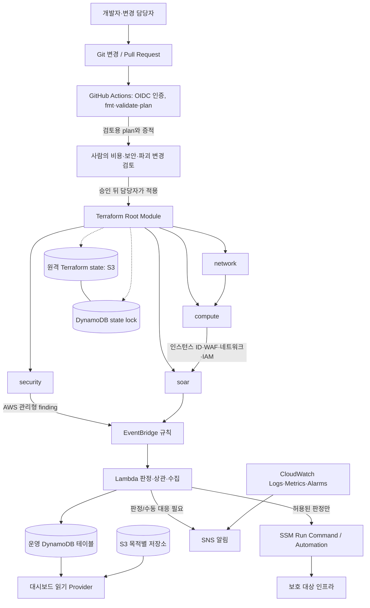

# Terraform 인프라 설계 기준

## 문서 정보

| 항목 | 내용 |
|---|---|
| 적용 범위 | Terraform 원격 state, AWS 인프라 자원, 4개 기능 모듈(선택 구성으로 `honeypot` 모듈과 시연용 다중 리전 `attacker` 모듈 포함)의 책임과 인터페이스, 탐지·SOAR 연결, IAM, 배포·운영·비용·검증 경계 |
| 책임 역할 | IaC 담당, 네트워크·보안 담당, SOAR/대시보드 담당, 배포 승인자, 운영·비용 담당 |
| 관련 문서 | [`../README.md`](../README.md), [`../agents.md`](../agents.md), [`../dashboard/dashboard-design.md`](../dashboard/dashboard-design.md), [`../project-management/honeypot-design.md`](../project-management/honeypot-design.md), [`../project-management/security-scenarios.md`](../project-management/security-scenarios.md), [`../project-management/glossary.md`](../project-management/glossary.md), [`../project-management/decisions.md`](../project-management/decisions.md), [`../project-management/tracking.md`](../project-management/tracking.md) |
| 조사 근거 | Terraform HCL, GitHub Actions workflow, 루트 README와 공통 관리 기준을 대조 |
| 변경 이력 | 설계 선택·예외는 `../project-management/decisions.md`, 구현 및 검증 증거는 `../project-management/tracking.md`에 커밋 버전과 연결 |

이 문서는 인프라 코드가 어떤 자원을 선언하는지와 목표 책임 경계를 정한다. 코드는 현재 구현 상태의 증거이지 설계 목표의 자동 승인 근거가 아니다. 현황과 기준이 다르면 아래의 조사 결과 및 추적표에서 구현 수정, 설계 변경 또는 임시 예외로 구분한다.

## 설계 목표와 Terraform 경계

Terraform은 AWS 자원의 선언 상태를 관리하고, 보안 관제 런타임이 사용할 네트워크·컴퓨팅·탐지·SOAR 기반 자원을 제공한다. 보호 대상 서비스의 애플리케이션 코드와 데이터 처리, 대시보드의 화면/API 계약, 사건 대응 의사결정은 Terraform이 소유하지 않는다. Terraform이 소유하는 리소스와 SOAR가 런타임에 변경하는 속성을 겹치지 않게 정의하여 후속 `apply`가 조치 결과를 무심코 되돌리지 않도록 한다.

기준은 프로젝트의 합의된 환경 입력을 받아 재현 가능한 plan을 만들고, 변경 내용을 검토한 뒤 사람이 승인한 계획만 적용하는 것이다. `terraform apply -auto-approve`나 plan을 확인하지 않은 배포는 허용하지 않는다. 환경 계정·리전·CIDR·인증서·비용 토글·실제 state 유무처럼 자료로 확정할 수 없는 값은 적용 환경의 입력으로 결정한다. 이 문서는 AWS 자원에 배포하거나 검증 명령을 실행하지 않았다.

추적에 사용할 설계 요구사항 ID는 `TF-001`부터 `TF-018`까지 부여한다. 실제 코드 경로와 확인 근거는 후속 `tracking.md`에서 상태별로 채운다.

## 인프라 구성과 흐름



배포 계층은 `network`, `compute`, `security`, `soar` 네 모듈의 소유 자원을 선언한다. 런타임은 관리형 보안 서비스와 로그 신호를 EventBridge·Lambda로 전달하고, 판정 결과를 DynamoDB에 남긴다. Lambda는 직접 인프라 변경 API를 수행하는 일반 목적 주체가 아니라, 허용된 SSM 문서의 호출과 기록 흐름으로 제한한다. 자동조치의 추가 확인 정책은 미확정 후속 설계이며 이 구성도가 무승인 자동 실행을 승인하지 않는다.

| 인터페이스 | 입력 | 출력 | 통제·소유 관계 |
|---|---|---|---|
| CI/담당자 → Terraform | 고정된 코드 버전, 변수, AWS 임시 자격 증명 | plan, 적용 후 출력 | CI는 plan 중심; apply는 승인 주체가 실행. state 잠금 사용 |
| root → `network` | VPC/CIDR/AZ, ingress CIDR, 네트워크 토글 | VPC·서브넷·라우트·SG·NACL·엔드포인트 ID | 네트워크 자원은 Terraform 소유; 동적 차단 칸은 명시적으로 SOAR 소유 |
| root → `compute` | `network` 식별자, 인스턴스 유형, 테이블명, 알림 ARN, 인증서/배포 변수 | EC2 ID, IAM 역할, 보안 자원, 서비스/대시보드 진입점 | 보호 대상, DVWA, 대시보드, 옵션 공격자 구성 |
| `security` → `soar` 런타임 | GuardDuty/Security Hub/CloudWatch 이벤트 계약 | EventBridge 호출 대상과 finding 흐름 | finding 신호와 SOAR 판단을 구분; 서비스 비활성 시 규칙/데이터 공백을 표시 |
| `compute` → `soar` | 모니터링 대상 인스턴스, WAF 리소스, SNS ARN | 알람 차원·WAF finding 연결 | Terraform module output/input으로 연결 |
| `soar` → SSM | 허용된 Automation/Command 문서와 검증된 대상 매개변수 | 실행 ID, 종료 상태, before/after 증거 | 플레이북별 IAM과 문서 입력 검사; 불확실 결과는 조정 대상으로 남김 |
| `soar` → DynamoDB/S3/CloudWatch/SNS | finding, 판정, 수집·점검·실행 결과 | 상관분석·조치·finding 자료, 스캔 증거, 로그·알림 | state 저장소와 업무 데이터 저장소는 서로 다른 목적·권한 |
| 대시보드 → 인프라/API | 관제 요청 | 읽기 결과와 이력 | `dashboard-design.md`의 Provider, API·작업/감사 계약 준수 |

## 네 모듈의 책임

| 모듈 | 소유 책임 | 입력·출력 관계 | 책임 밖 / 주의 |
|---|---|---|---|
| `modules/network` | VPC, IGW, 퍼블릭/프라이빗 서브넷, 라우트, 선택 NAT, 인터페이스·게이트웨이 VPC endpoint, SG, NACL, VPC Flow Logs | 루트 변수에서 네트워크 범위를 받고 VPC·서브넷·SG·NACL ID를 `compute`에 제공 | EC2 안의 앱 방화벽이나 Terraform 외부 공격 시나리오 입력을 소유하지 않음. NACL 1–99 SOAR 예약 범위를 코드에서 선언하지 않음 |
| `modules/compute` | Docker 호스트, MySQL 탐지 대상 EC2, 대시보드 EC2, 선택 DVWA/공격자, 인스턴스 프로파일·IAM, ECR, Secrets Manager, 선택 ALB/WAF, 대시보드 코드 아카이브/배포 | `network` 식별자·`soar` 테이블/역할/알림 이름 입력; 인스턴스 ID와 WAF 값 제공 | 보호 대상 애플리케이션 기능·DB 스키마를 소유하지 않음. 대시보드의 기존 EC2는 로컬 SQLite를 보존하기 위해 user-data 변경을 무시하므로 S3 zip 갱신 후 SSM으로 코드·환경을 제자리 배포한다. 명시적 인스턴스 교체 전에는 데이터 보존 절차가 필요 |
| `modules/security` | GuardDuty, Inspector2, AWS Config 규칙/기록, IAM Access Analyzer, Security Hub, CloudTrail·S3·KMS 구성 | 서비스 enable 변수와 계정/리전 정보 입력; AWS 관리형 finding·감사 데이터 생성 | 탐지 finding의 SOAR 정책상 의미나 조치 결정을 단독 소유하지 않음. 계정 기존 서비스와 중복 활성화 가능성 점검 |
| `modules/soar` | EventBridge 규칙, Lambda 함수·역할, SSM 문서·실행 역할, DynamoDB 업무 테이블, 스캔 결과 버킷, SNS, CloudWatch 로그·알람·메트릭 필터·대시보드 | 보안 finding을 라우팅하고, `compute` 인스턴스와 WAF 신호를 받아 상관·판정·알림/작업을 연결 | 새로운 자동 확인/승인 정책을 암묵적으로 추가하지 않음. Terraform으로 선언한 문서가 호출 코드에 연결되었는지 별도 검증 |

루트 `main.tf`는 환경별 이름·태그·로그 그룹·테이블명과 모듈간 공통 식별자를 조립한다. 공통 태그는 Project, Environment, Team, Owner, ManagedBy 기준으로 유지한다. 선언된 리소스 개수는 `count`/`for_each` 입력에 따라 달라지므로 배포 개수는 구성과 입력값을 기준으로 확인한다.

실제 HCL에서는 `network` 완료 후 `compute` 생성이 명시적으로 보장된다. `compute`는 `soar`에 인스턴스 ID와 WAF 출력값을 전달한다. `security`의 finding은 런타임 EventBridge 패턴으로 소비된다. 문서에 기재된 `network → compute → security → soar`는 설명상의 적용 순서이지 네 모듈 모두가 Terraform 그래프상 선형 의존이라는 뜻으로 단정하지 않는다. 정확한 plan 그래프와 자원 간 암묵 의존은 승인된 환경에서 정적 검증한다.

## 네트워크와 배치 기준

현재 자료의 기준 예시는 VPC `10.0.0.0/16`, 서울 리전, Public-Web `10.0.0.0/24`, Private-DB `10.0.1.0/24`, Private-App `10.0.2.0/24`, ALB 보조 AZ용 Public-Web-b `10.0.3.0/24`다. 실제 주소 공간과 AZ는 환경 충돌을 검토한 뒤 설정한다. 예시 CIDR은 다른 네트워크와 겹칠 수 있으므로 재사용을 강제하지 않는다.

| 경계 | 배치 및 허용 관계 | 목적·실패 고려 |
|---|---|---|
| Public-Web | 선택 DVWA, 선택 외부 ALB, 선택 NAT Gateway | ALB는 2개 AZ의 서브넷을 요구; 보조 퍼블릭 서브넷은 ALB용. DVWA 노출은 관리자 CIDR로 제한 |
| Private-App | 보호 대상 Docker 호스트(Nginx/Flask/MySQL 컨테이너), 대시보드, 선택 내부 공격자, SSM VPC endpoint | SSH `22` 미개방, SSM(Session Manager) 사용. 컨테이너 서비스의 외부 트래픽은 ALB 또는 승인된 관리자 점검 경로 |
| Private-DB | MySQL EC2 — 보안 탐지·조치 실습 대상 | Public IP 없음. 허용 3306은 서비스/대시보드 SG 참조 및 합의된 시나리오 경로에 한정 |
| 보안그룹 | 계층 간 허용은 가능한 한 source CIDR이 아닌 다른 SG ID 참조 | 인스턴스 단위 2차 방어; default all egress 등 넓은 규칙은 주기적 검토 |
| NACL | Public/Private 서브넷 단위 방어; Terraform 허용 규칙 번호는 100 이상, 1–99는 SOAR IP 차단용 예약 | 순차 평가·응답 트래픽 고려. 인라인 전체 규칙 소유 패턴 및 기본 NACL 리소스 관리 금지 |
| VPC endpoint / egress | SSM용 `ssm`, `ssmmessages`, `ec2messages`, CloudWatch metric `monitoring`, S3 gateway endpoint가 코드에 선언 | endpoint만으로 `apt`/PyPI/Docker 저장소 등 일반 인터넷 설치가 해결되지 않음. NAT 또는 별도 배포/endpoint 설계 필요 |

### 대시보드·DVWA 진입 경로

사용자가 선택한 Terraform 대시보드 접근 기준은 ALB 경로와 SSM 포트 포워딩 경로다. ALB가 비활성이면 대시보드 웹 진입은 SSM 경로만 제공한다.

| 경로 | Terraform 계약 | 제한과 위험 |
|---|---|---|
| ALB → Dashboard | `enable_alb && enable_dashboard_deploy`일 때 HTTP listener `8080` → target group → Private-App의 Flask `5000`; 출력 URL은 `http://<alb>:8080` | `dashboard_ingress_cidr`의 코드 기본값은 `0.0.0.0/0`. 사용자 데이터가 보이는 관제 화면이므로 운영 ingress 제한을 적용한다. 전용 `8080` listener는 HTTP이고 서비스용 `443` 인증서·listener가 대시보드 listener TLS를 보장하지 않음 |
| SSM Session Manager | 출력 `dashboard_ssm_port_forward`가 인스턴스 포트 `5000`을 로컬 `5000`으로 forwarding; 대시보드 SG는 VPC CIDR에서 `5000` 허용 | 운영자 IAM·SSM 세션 권한과 로그를 관리. SSH 22를 열지 않음 |
| ALB → DVWA | 옵션 DVWA를 `8081` listener로 전달; HTTP `8081` ingress는 관리자 CIDR 기준 | 의도적으로 취약한 독립 공격 대상. 보호 대상 Nginx 서비스와 혼동 금지; `0.0.0.0/0` 공개 금지 |

Terraform user-data는 배포 zip을 S3에서 가져와 `/opt/dashboard/dashboard.env`와 systemd 서비스를 구성한다. 현재 환경 입력에는 `DATA_PROVIDER=aws`, AWS 리전·테이블·토픽 이름, `DASHBOARD_HOST=0.0.0.0`, `DASHBOARD_PORT=5000`, `WRITE_ENABLED=true`가 포함된다. 이 설정은 프로세스 구성을 나타낸다. 실제 AWS 쓰기·조치·재검증 가능 여부는 대시보드 Provider 구현과 권한을 별도로 확인하며, 환경 변수만으로 활성화를 주장하지 않는다.

기존 대시보드 EC2의 코드와 환경 변수는 Terraform user-data를 다시 실행하지 않는다. 배포 zip 갱신 후 SSM에서 코드를 임시 경로에 풀고 의존성·필수 파일을 확인한 뒤 서비스와 앱 경로를 교체한다. `/opt/dashboard/instance`의 SQLite 계정·감사·조치 이력은 유지한다. 배포 실패 시 이전 앱 경로와 환경 파일을 복원한다. 부팅 구성 변경으로 EC2 교체가 필요하면 데이터 보존·복구를 먼저 승인하고 검증한다.

대시보드 웹 UI의 계정 인증과 네트워크 접근은 서로 다른 경계다. ALB ingress나 SSM 세션이 가능하다고 해서 애플리케이션 인가를 우회하지 않는다. 도메인·인증서·종단간 HTTPS, CIDR 기본값은 실제 환경별 결정 항목이다.

### 외부 연결 및 부트스트랩 의존

Private 인스턴스의 user-data는 패키지/컨테이너 도구를 외부에서 설치하거나 받아야 하는 경로가 있다. SSM endpoint는 Session Manager용이며 일반 인터넷 egress 대체가 아니다. 현재 NAT default는 Terraform 변수에서 `true`; NAT를 끄면 첫 부팅 의존, 로그 송신, 비밀 조회, 지표 송신에 필요한 endpoint/경로의 실제 구성을 각각 점검해야 한다. `logs`와 `secretsmanager` endpoint가 현재 interface endpoint 목록에 없다는 것을 고려해 NAT off 지원 여부를 적용 프로필별로 명시한다.

## 탐지·로그·SOAR 자원 인터페이스

Terraform은 로그와 finding을 같은 데이터로 취급하지 않는다. GuardDuty는 Flow Logs·CloudTrail 등 입력을 분석해 finding을 만들고, Security Hub는 다른 서비스의 finding을 수집하며, CloudWatch Logs는 파일 로그와 메트릭 필터/알람의 경로다.

| 신호·자료 | 경로와 저장소 | 설계상 구분 |
|---|---|---|
| SSH 관련 비정상 접근/Hydra 경로 | 사용자 결정: GuardDuty 경로로 검증. GuardDuty finding → EventBridge → correlator 및/또는 자동조치 판단 경로 | MySQL 계정 로그인 실패 로그와 동일 신호가 아님. GuardDuty는 원시 SSH 로그 저장소로 설명하지 않고 finding 공급자로 다룸 |
| MySQL 인증 실패/Hydra 경로 | MySQL 로그 파일 → CloudWatch Agent → CloudWatch Logs → 메트릭 필터/Alarm → SNS | GuardDuty 경로와 별도. 기본 변수 자료에는 실패 임계치 `10회/5분`이 있지만 이를 목표 정책으로 확정하려면 시나리오 문서와 운영 결정이 필요 |
| VPC 통신 | VPC Flow Logs(traffic `ALL`, 60초 집계) → CloudWatch Logs | 트래픽 메타데이터를 남기는 로그 원천이다. 코드에서 CloudWatch 로그 그룹을 GuardDuty에 직접 전달하는 경로는 선언하지 않음 |
| AWS API 감사 | 다중 리전 CloudTrail → 버저닝·퍼블릭 차단·KMS 암호화된 S3 | API actor/time/action 감사 자료; destroy 시 보존·정리 절차 필요 |
| 구성 위반 | AWS Config의 제한된 기록 리소스와 관리 규칙 → Security Hub → EventBridge | 현재 Config 기록 범위는 7 리소스 유형. 기록하지 않는 타입의 변경을 완전 감시한다고 주장하지 않음 |
| 위협·취약점 | GuardDuty + Inspector2 finding; `correlator`가 동일 EC2/Inspector CVE를 상관분석 | EC2 식별자 기준 상관에 한정; 누락/타입 불일치 시 상관되지 않았음을 드러냄 |
| Finding 적재 | `finding_sync`가 Security Hub/Inspector 자료를 findings/vulnerabilities DynamoDB에 동기화 | 동기화 상태 행, 원본 시각/version, `view_state`, 실패 경고를 보존; 실패한 sync를 정상 빈 목록으로 취급하지 않음 |
| 수동 점검 증거 | SSM `SCAN-*` 문서가 nmap/ZAP/Trivy 등 결과를 S3에 저장 | 결과 파일은 로그 스트림이나 SOAR 조치 결과와 별개. S3 접근·보존·삭제 정책을 정의 |
| 자동조치 상태 | EventBridge → `asr_trigger` → 게이트/SSM/SNS → `remediation_actions` DynamoDB | 판단 이력과 SSM 실행 결과를 구분; 실행 성공만으로 재검증/해결완료가 아님. 기록에 판정 이유(`reason`)·규칙 ID(`control_id`)를 남긴다 |
| 무차별 대입 자동 차단 | MySQL 인증 실패 알람(SEC-06A)·Flow Logs SSH(22) 거부 알람(SEC-06B, VPC 내부 출발지) → EventBridge → `asr_trigger` → 로그에서 최다 출발지 IP → `ASR-BlockIpWithNacl` | DEC-018·DEC-019. VPC CIDR 밖·보호 자산 주소는 알림만. 1~99번 Deny, 자동 만료 없음. 로그 전송 경로가 없으면 출발지를 못 찾아 수동 알림 |
| 차단 목록·만료·해제 (v25) | `asr_trigger`가 차단할 때 DynamoDB `ip_blocklist`에 행(규칙 번호·만료 시각·근거) 기록 → `block_expiry` Lambda(EventBridge 5분, `enable_block_expiry`)가 만료된 차단을 `ASR-UnblockIpWithNacl`로 해제. 대시보드 오탐 해제·기간 변경·예외 등록도 같은 표·문서를 쓴다 | DEC-021. 자동 차단 기본 기간 `ip_block_default_ttl_hours`(기본 24, 0 = 영구). 해제 문서는 그 번호가 인바운드 Deny + 그 IP/32 일 때만 삭제(1~99만). 새 IAM: block_expiry 역할(표 Scan/UpdateItem, 해제 문서만 실행, NACL 조회), 대시보드(표 읽기·UpdateItem/PutItem), 자동화 역할 `ec2:DeleteNetworkAclEntry`. 대시보드 user_data(env) 변경 → 대시보드 인스턴스 교체 |
| Nginx 강화 | `ASR-HardenNginx` SSM Command 문서는 확인되나 자동 Lambda 호출 경로는 연결되지 않음 | 사용자 선택에 따라 수동 조치 기준으로 둠. Terraform이 이를 자동조치했다고 표현하지 않음 |
| AI 허니팟 | 조사한 네 모듈과 compute 리소스에서 별도 AI 허니팟 배포 모듈·자원은 확인되지 않음 | 프로젝트 목표에 포함하되 기술·데이터 경로·비용·격리·차단 정책은 미결정. 허니팟 설계 문서에서 제안과 사실을 구분 |

### 로그 원천·저장 계약

아래 경로는 Terraform과 user-data가 선언하는 연결이다. 설정이 존재한다는 사실만으로 실환경 수집을 확인한 것은 아니다.

| 원천 | 대상·도착지 | 보존·소비 경계 |
|---|---|---|
| VPC Flow Logs | VPC 전체 `ALL` 트래픽, 최대 집계 간격 60초; `/<project>/<env>/vpc/flowlogs` CloudWatch Logs 그룹 | `log_retention_days`를 적용하며 코드 기본값은 14일. 전용 역할은 해당 로그 그룹에 이벤트를 쓴다. 로그 전송 상태는 별도 확인 |
| CloudTrail | 전 리전 및 global service events; 계정별 S3 감사 버킷, SSE-KMS, 버저닝, public access block, log file validation | `force_destroy=false`; 객체·버킷 삭제는 별도 보존·승인 절차가 필요 |
| Nginx | `/var/log/nginx/access.log`와 `error.log` → `/<project>/<env>/web/nginx`, 인스턴스별 `access`·`error` stream | `log_retention_days` 적용. CloudWatch Agent와 송신 경로가 필요 |
| MySQL | `/var/log/mysql/error.log`와 `general.log` → `/<project>/<env>/db/mysql`, 인스턴스별 `error`·`general` stream | `log_retention_days` 적용. `error.log`의 `Access denied for user`만 인증 실패 지표로 변환 |
| 수동 보안 점검 | SSM 점검 문서의 nmap/curl/Trivy 출력 → 별도 scan-results S3 버킷 | 로그 스트림이 아니다. 실행별 파일이며 사람이 시작한다. 접근·보존·삭제는 로그 그룹과 별도 관리 |
| Lambda 실행 | Lambda 함수별 CloudWatch Logs 경로 | 코드에서 명시적 로그 보존 기간을 구성했는지 별도 확인한다. 존재하는 로그 그룹만으로 보존 계약을 주장하지 않음 |

MySQL 인증 실패 경보는 `Access denied for user` metric filter → `MySQLAuthFailure` → 300초 기간 합계 경보 → SNS 흐름이다. 코드 기본 threshold는 10이며, 승인된 운영 임계값이라는 뜻은 아니다. 알람의 `treat_missing_data=notBreaching`은 데이터 결측을 알람 위반으로 보지 않으므로, 별도 수집 상태 확인이 필요하다. 메모리 지표는 CloudWatch Agent의 `monitoring` 경로를 사용한다. 현재 interface endpoint 목록에는 `logs`와 `secretsmanager`가 없으므로 NAT를 끈 환경에서 로그·비밀 송신이 된다고 가정하지 않는다. user-data의 CloudWatch Agent 설치·구성 호출 일부는 실패해도 부팅을 계속하도록 되어 있으므로, 인스턴스 정상 기동만으로 Agent 수집 성공을 판정하지 않는다.

### SOAR 안전장치와 실행 경계

현재 Terraform 자료는 `asr_trigger`의 유형 화이트리스트, SG `AutoRemediation=enabled` 태그, 전역 `enable_auto_remediation` 토글을 게이트로 설명한다. 소스 주석과 실제 코드 설명에는 **태그 게이트가 SG 조치 분기에만 적용되고 노출 IAM key 경로는 2개 검사만 거친다**는 차이가 기록되어 있다. 모든 유형이 동일한 3개 게이트를 통과한다고 단정하지 않는다. `enable_auto_remediation=false`는 판정 후 실행을 막는 전체 dry-run 용도다.

Security Hub 규칙 ID가 `auto_remediable_controls`에 정확히 있으면(DEC-017) 패턴 화이트리스트보다 먼저 규칙별 문서를 실행한다. 대상은 EC2.2·EC2.7·EC2.182·S3.1·IAM.7·SSM.6·SSM.7로, 재부팅이 없고 Terraform이 관리하지 않는 계정·리전 설정이다. 이 경로의 게이트는 규칙 목록과 전역 토글이며 태그 검사는 없다. EC2.2는 프로젝트 VPC(`vpc_id`)의 기본 보안그룹만 바꾸고, 문서도 이름·VPC를 다시 확인한다. 같은 finding의 실행이 `IN_PROGRESS`면 다시 실행하지 않고, 문서는 현재 값이 이미 준수면 바꾸지 않는다. 자동화 역할에는 각 설정의 읽기·쓰기 권한만 추가했다(SSM 서비스 설정은 두 설정 ARN으로 한정).

자동 실행 전에 사람 확인을 추가할 정책은 사용자가 후속 설계 과제로 지정했다. 따라서 기존 Terraform/EventBridge/Lambda 경로의 실제 동작을 관찰·기록하되 확인 단계가 구현되어 있다고 쓰지 않는다. 추가 승인을 실제 적용하기 전에는 트리거 유형별 영향, 권한, 대상 범위, 예외, rollback, 중복 실행, 결과 유실 시 조정, 자동 실행 책임을 결정 기록에서 승인한다.

## Terraform state와 S3/DynamoDB 구분

Terraform state와 런타임 관제자료는 별도 데이터 영역이다. `terraform.tfstate`에는 자원 속성, 연결 정보와 일부 민감 입력·secret 자료가 포함될 수 있다. Terraform의 `sensitive` 표시는 CLI 노출을 제어하는 표시일 뿐 state 저장에서 secret을 제거하지 않는다.

| 저장소 | 현재 선언·관찰 | 목표 관리 기준 |
|---|---|---|
| Terraform state S3 | `backend.tf`는 S3 bucket, key `soar-sec/terraform.tfstate`, 서울 리전, `encrypt=true`, DynamoDB lock table을 가리킴. bootstrap 코드는 S3 버킷 versioning, SSE-S3 기본 암호화, public access block, `force_destroy=false`를 선언 | state 전용 bucket/prefix를 사용하고 접근 가능한 role을 제한한다. 환경 간 key 충돌을 막고 버전으로 복구할 수 있게 한다. backend 실제 존재·접근·이관 완료는 AWS 조회 없이 확인된 것으로 주장하지 않음 |
| Terraform state lock DynamoDB | bootstrap은 `LockID` 문자열 키와 `PAY_PER_REQUEST` 잠금 테이블을 선언; root backend는 이를 lock table로 참조 | 모든 공동 plan/apply가 같은 backend와 lock 계약을 사용한다. 잠금 해제는 원인·소유자를 확인하고 임의로 삭제하지 않음 |
| Bootstrap state | `bootstrap/`에는 별도 remote backend 선언이 보이지 않으므로 기본 실행 시 그 state는 로컬일 수 있음 | bootstrap 자원 자체 state의 보관·복구와 제한 접근도 운영 절차에 포함. bootstrap bucket/lock을 일반 stack destroy에 포함하지 않음 |
| SOAR 운영 데이터 | `correlated-findings`, `remediation-actions`, `findings`, `vulnerabilities`의 DynamoDB 테이블 자원과 기간 조회 인덱스/TTL 일부 확인 | Cloud dashboard SQLite를 대체하기 위한 승인·job·idempotency·감사 데이터 모델의 범위는 이 테이블들과 구분해 설계한다. 단일/복수 테이블, 키·보존·PITR/백업 기준은 결정 전 확정하지 않음 |
| 조사 결과 S3 | scan 결과 bucket은 public access 차단과 versioning을 선언하며, dashboard deploy zip도 현재 이 버킷의 `deploy/` prefix를 사용 | 점검 결과와 코드 아티팩트의 주체·권한·수명주기·정리 정책을 구별한다. 별도 bucket 분리는 운영/보존 요구 검토 후 결정 |
| CloudTrail S3 | 버저닝·public access block·KMS 암호화·키 회전 및 CloudTrail log validation 설정 확인; `force_destroy=false` | 감사 보존물은 일상 환경 teardown으로 삭제되지 않도록 보호한다. 삭제 전 증거 보존·승인 절차 필요 |
| Config S3 | public access block, recorder 및 delivery 설정 확인; 버킷은 `force_destroy=true` | 설정 이력 보존 기간·암호화·삭제 보호 요구를 결정. 현재 destroy 가능 설정과 보안 보존 기준 간 충돌을 검토 |

표에 적은 업무 DynamoDB 테이블은 state 잠금 테이블이 아니다. 마찬가지로 scan 결과와 dashboard deploy zip을 저장하는 bucket은 Terraform state bucket이 아니다. S3와 DynamoDB 권한은 목적별 IAM role로 분리한다.

### State 생성·이관·복구 기준

1. `bootstrap` stack으로 state bucket과 lock table을 준비하고, bootstrap 자체의 state 사본·담당자·복구 방법을 기록한다.
2. root Terraform backend 설정은 환경, 계정, 리전, state key, lock table과 실제 자원 이름이 맞는지 확인한다. 비밀 또는 account-specific backend 입력은 저장소에 무심코 고정하지 않는다.
3. 로컬 state가 있을 때 remote로 이전하는 경우 전용 변경 창에서 공식 migration 흐름을 사용하고, 이관 전 로컬 사본의 접근 통제된 백업을 확보한다. 이전 전후 state lineage/serial, backend 주소와 plan을 검토한다.
4. 공동 작업자는 같은 backend 설정과 잠금을 사용한다. 동시 run은 CI concurrency와 backend lock을 같이 적용한다.
5. 손상/오류 시 S3 object version 및 보존된 state 백업에서 복구하고, state를 편집하거나 잠금 레코드를 임의 삭제하지 않는다. 복구 후 plan은 실제 변경을 적용하기 전에 사람이 검토한다.
6. 일반 stack 정리는 backend bucket·lock table을 제거하지 않는다. state backend 폐기는 모든 소비 stack의 state migration/보존·승인 완료 뒤 별도 절차로 한다.

State object 및 접근 로그의 보존, 암호화 키 선택(KMS 전환 여부), DDB lock 테이블 복구, 운영환경별 state key는 아직 별도 합의가 필요하다. bootstrap bucket은 SSE-S3이고 CloudTrail bucket은 KMS를 쓰므로 둘의 암호화 기준이 같다고 쓰지 않는다.

## IAM과 Terraform/SOAR 소유권 경계

EC2와 Lambda는 장기 IAM access key 대신 instance profile/Lambda execution role을 사용한다. `compute/iam.tf`에 dashboard read policy와 execute policy 문서가 나뉘어 있지만 현재는 두 policy가 같은 dashboard instance role에 붙는다. 문서 객체가 나뉜 것을 AWS principal 분리나 read-only 권한의 보장으로 설명하지 않는다. 역할 침해 시 가능한 조치 범위를 평가하고 최소 권한 및 운영 role 경계는 별도 결정·검증한다.

Terraform이 보유한 리소스/속성은 코드로 관리한다. SOAR가 바꾸는 상태는 Terraform 소유와 겹치지 않는 영역에만 기록한다.

| 대상 | 소유 경계 | 충돌·운영 조건 |
|---|---|---|
| NACL rules | Terraform은 허용 규칙 100 이상, `ASR-BlockIpWithNacl`은 Deny 규칙 1–99 | Terraform에 인라인 NACL ingress/egress 또는 `aws_default_network_acl` 사용 금지; next apply가 deny를 삭제할 위험 |
| SG 테스트 취약 규칙 | 의도적 demo 취약 규칙은 Terraform 밖 주입이며 Terraform 기본 SG 코드의 정상 허용을 의미하지 않음 | 테스트 종료 후 정리하고, Terraform 변수 toggle로 위험 규칙을 영속 선언하지 않음 |
| IAM access key | 자동 비활성화 대상 키는 Terraform resource 소유가 아님 | Terraform이 해당 키 status를 Active로 복구하거나 secret 값을 state에 저장할 위험을 피함 |
| DB Secret version | Terraform 초기 버전과 SOAR rotation `AWSCURRENT`가 공유 상태 | secret 변경 후 Terraform plan이 새 버전으로 덮을 수 있는지 조사 필요; ignore_changes/외부 관리 선택 미결정 |
| Nginx config | 컨테이너/인스턴스 내부 파일 또는 SSM 관리 상태 | 자동 수정이 user-data/instance replacement로 되돌아갈 수 있음; 현재 선택된 수동 hardening 경로와 복구 규칙 기록 |
| WAF, EC2 type, Terraform 선언 SG | Terraform 소유 | 콘솔 수동 수정은 다음 apply에서 되돌아갈 수 있음; 변경은 코드와 승인 plan을 사용 |
| DynamoDB action items | 서비스/Lambda가 업무 항목을 기록, Terraform은 테이블 구조만 소유 | 자동/수동 데이터 쓰기는 조건부 상태·감사 계약을 따르며 테이블 교체·TTL 변경의 데이터 영향을 검토 |

#### NACL·보안 그룹 적용 세부 기준

- 현재 Public NACL의 Terraform Allow 규칙은 인바운드 100·110·120, 아웃바운드 100이고, Private NACL은 인바운드 100·110, 아웃바운드 100이다. 1–99는 Private NACL 인바운드 Deny를 위한 SOAR 예약 번호대다.
- 수동 `ASR-BlockIpWithNacl`은 규칙 번호 1–99, 단일 IPv4 `/32`(unspecified 주소 제외), NACL ID 형식을 검증하고 기존 SOAR Deny 규칙이 10개 이상이면 거부한다. IAM 조건 키만으로 규칙 번호를 제한하지 못하므로 SSM 문서 입력과 실행 코드 양쪽에서 검사한다.
- NACL Deny에는 자동 만료(TTL)가 없다. 담당자가 영향과 필요성을 확인하고 수동으로 제거해야 한다. 인라인 `ingress`/`egress` 또는 `aws_default_network_acl`을 관리하면 규칙 전체 소유권이 겹쳐 SOAR Deny가 다음 apply에서 제거될 수 있다.
- 시연용 `0.0.0.0/0`·`::/0` 취약 SG ingress는 Terraform 리소스나 토글로 선언하지 않는다. demo 경로가 Terraform 밖에서 추가하며, eligible SG에 대한 SOAR 회수 뒤 Terraform이 같은 규칙을 선언하면 apply가 다시 만들 수 있다.
- Terraform이 DB Secret 초기 version을 관리하고 수동 회전이 `AWSCURRENT`를 바꾼다. 입력 비밀번호·사용자·DB 이름이 바뀐 plan은 회전값을 덮을 가능성을 확인하고, 관리 소유권 선택은 결정 전까지 미결정으로 둔다.

Plan에 NACL 1–99 Deny 삭제, 인라인 NACL 규칙 변경, 시연 취약 ingress 재생성, 외부 관리 시험 IAM key의 `Active` 복구, 또는 DB Secret version 교체가 나타나면 원인을 확인하기 전 적용하지 않는다.

`terraform refresh-only`는 state를 현실과 동기화할 뿐 다음 일반 apply의 원복을 방지하는 소유권 조정 수단이 아니다. `lifecycle.ignore_changes`도 리소스 교체 시 무시 속성이 초기화될 수 있으므로, 단일 운영 규칙으로 남용하지 않는다.

## 변수, 환경, 비밀과 비용

환경 차이는 코드 수정이나 암묵적 감지가 아니라 명시적 입력·환경별 승인된 설정으로 전달한다. `terraform.tfvars.example`은 예시이며 실제 `terraform.tfvars`, plan/state, 인증서, DB secret, PEM/key는 형상관리하지 않는다. `mysql_*_password` 변수는 sensitive로 표시되어도 state 및 plan artifacts에 값이 포함될 수 있으므로 임시 자료 접근과 보존을 제한한다. 임시 디렉터리에 출력/로그를 남기는지 먼저 살피고, plan 결과를 공개 채널에 전부 붙이지 않는다.

현재 `variables.tf`에서 확인된 default와 문서 충돌은 다음과 같다.

| 토글/입력 | HCL 변수 default(조사 사실) | 비용·운영 영향 |
|---|---|---|
| `enable_nat_gateway` | `true` | NAT 시간·데이터 요금과 Private subnet egress에 영향 |
| `enable_vpc_endpoints` | `true` | SSM 3종과 `monitoring` interface endpoint 및 S3 gateway endpoint를 생성; endpoint 수와 송신 경로 확인 필요 |
| `enable_alb`, `enable_waf`, `enable_dvwa_instance` | 각각 `true` | ALB public 경로, WAF·DVWA 사용량 및 비용에 영향 |
| `enable_attacker_instance` | `false` | 내부 공격 재현 인스턴스 비용/DB SG 경로를 비활성 상태로 둠 |
| `enable_auto_remediation` | `true` | SOAR action 실행 허용 범위와 비용·영향에 큰 변화; 적용 환경에서 별도 승인 필요 |
| `dashboard_ingress_cidr` | `0.0.0.0/0` | ALB 대시보드 포트의 넓은 공개 기본값; 환경별 허용 CIDR을 명시할 것 |

구현 default는 현재 코드 상태지만 곧바로 승인된 권장값은 아니다. 배포 기준은 공개 ingress와 비용 발생 자원을 명시적으로 활성화하고, 개발/검증/시연/운영 환경별 default를 문서·example·CI 변수와 일치시켜야 한다. 어느 환경에서 어떤 토글을 켜는지 정하기 전까지 위 차이는 **결정 필요**로 남긴다. 수치 임계값이나 리소스 크기도 존재하는 HCL 기본값과 합의된 운영 SLO를 구분한다.

비용을 검토할 때 EC2/EBS, NAT, ALB/LCU, WAF, VPC endpoints, GuardDuty, Inspector, Security Hub, Config, CloudWatch Logs, KMS, S3 저장량과 리전 단가를 포함한다. 자료의 과거 예상 가격은 최신 비용 견적으로 사용하지 않는다. apply 전에 Pricing Calculator/예산과 예상 실행 시간을 갱신하고, 단기 시연 뒤 남은 유료 자원과 GuardDuty/Inspector/Config 활성 상태를 확인한다. 자원 stop이 데이터·로그·감지에 주는 영향도 기록한다.

## 배포·CI/CD 및 운영

현재 `.github/workflows/terraform-plan.yml`은 OIDC로 임시 AWS 자격 증명을 받아 PR/push/workflow_dispatch에서 `fmt -check`, `validate`, `plan`을 수행하고 PR에 결과를 남기며 plan 파일과 텍스트를 14일 artifact로 저장한다. CI는 Terraform `1.9.8`을 고정한다. 공용 backend 작업은 로컬·CI 실행 버전을 맞춰 `1.9.8`을 사용한다. `required_version >= 1.6.0`은 호환 범위 선언이며, 다른 실행 버전이 state 형식을 자동으로 올린다는 뜻은 아니다. `admin_cidr` CI 입력의 빈 값과 `0.0.0.0/0`은 workflow가 거부한다. bootstrap에는 plan role과 apply role 선언이 있으나 확인된 workflow는 plan 전용이며 apply 역할로 자동 배포하지 않는다. 기준상 apply는 plan 검토 후 권한 있는 담당자가 승인 절차에 따라 수행한다.

plan artifact는 state 구조·민감 속성 정보를 드러낼 수 있는 운영 자료로 취급한다. GitHub artifact 접근 권한과 보존 기간, PR 댓글에 포함되는 민감 필드, 외부 fork PR의 자격증명 경계를 검토한다. OIDC trust의 repository/ref 조건을 유지하고 access key를 CI secret으로 저장하지 않는다. 현재 apply role에 `PowerUserAccess`와 광범위한 IAM write 문서가 확인되므로 장기 운영 전 최소 권한 정책으로 조정해야 한다.

권장 배포 흐름은 다음과 같다.

1. 변수 파일/CI 환경에 계정·리전·CIDR·certificate·비용 및 detector 토글을 지정하고 변경 범위를 설명한다.
2. 고정된 commit에서 formatter, provider-aware validation, 보안 검사, plan을 수행한다. 이 문서 작성에서는 이 명령을 실행하지 않는다.
3. 담당자가 create/update/replace/destroy, 공개 ingress, IAM, 비용, DB replacement/data loss, user-data 교체를 포함한 plan을 검토하고 별도 비용·변경 승인 기록을 남긴다.
4. 승인한 plan 파일과 동일한 코드/입력으로 apply한다. plan이 바뀌거나 승인 뒤 입력이 달라지면 새 plan과 승인을 받는다.
5. 출력된 endpoint/리소스 ID는 제한된 증적으로 보관한다. AWS 서비스의 활성화·로그 수집·인스턴스 부팅·SOAR 연결은 자원 생성과 분리된 검증으로 확인한다.
6. 종료 전 스캔/감사 자료와 로그 보존 요구를 확인하고, destroy plan을 검토한다. CloudTrail bucket의 object versions, Config, KMS 대기 삭제, 로그 그룹, ECR, endpoint, public IPv4, 남은 보안 서비스 등을 별도 확인한다. backend state bucket/lock table은 일반 stack과 함께 삭제하지 않는다.

### 정상/실패 검증 계약

| 검증 | 판별 기준 | 실패·복구 원칙 |
|---|---|---|
| Terraform 코드 | 포맷·문법/provider schema·module variable/output·archive inputs | 자동 formatter로 읽기 전용 저장소의 소스를 바꾸지 않음; validation 실패는 apply 차단 |
| Plan/state | 계정·리전·backend/key 확인, 잠금 획득, 예상 diff·대체 확인 | state backend 접근 불가/잠금 충돌은 정상 빈 state로 처리하지 않고 수정·병렬 적용을 중지 |
| 네트워크/인스턴스 | 서브넷 라우트·SG/NACL·SSM·ALB health 경로 | instance user-data 실패·NAT/DNS/endpoint 장애는 “서비스 건강”으로 나타내지 않고 보안 범위에서 진단 |
| 탐지·로그 | GuardDuty/Inspector/Config/Security Hub 활성과 source, Flow Logs·CloudTrail, MySQL CloudWatch 로그/경보 | 서비스 미연결·권한 부족·아직 finding 없음·로그 전송 실패를 구분; 없음이 정상 동작 증거는 아님 |
| SOAR | EventBridge target·Lambda invoke 권한·DDB 기록·SSM 실행/상태 피드백 | 실행 결과 유실은 재실행보다 reconcile; SNS 실패도 작업 상태와 별도로 기록 |
| dashboard | Terraform 접근 경로와 backend provider/status 계약 | 대시보드 UI/API 기준을 `dashboard-design.md`에서 검증; Terraform output URL만으로 로그인·조회·조치 성공을 주장하지 않음 |
| destroy/복구 | 이전 보존 요구, resource ownership, 계획된 데이터 손실 확인 | 영속 증거/State/DB를 무심코 삭제하지 않으며 수동 잔여 자원 정리 절차를 증거화 |

성공 판정에는 해당 검증이 실제 수행된 환경과 시각, commit, plan/apply artifact, 관련 request/job/AWS ID가 필요하다. Terraform plan은 변경 예정 리소스를 말할 뿐 런타임 기능·실제 보안 효과·로그 수집·조치 성공을 증명하지 않는다.

## Terraform 코드 책임 구조

Terraform의 정본은 이 문서다. 구현 코드는 책임별 모듈 경계를 유지하며 분류 목적으로 폴더를 더 겹겹이 만들지 않는다.

```text
terraform/
├── bootstrap/                 # state bucket·lock 기반 계정 자원
├── modules/
│   ├── network/               # VPC·routing·SG/NACL·Flow Logs
│   ├── compute/               # EC2·IAM·Secret·ECR·ALB/WAF
│   ├── security/              # 관리형 탐지·감사·Config
│   └── soar/                  # EventBridge·Lambda·SSM·DDB·SNS·CloudWatch
├── demo/                      # 격리 환경 실행/정리 절차
├── backend.tf                 # 원격 state backend 선언
├── main.tf                    # root composition
├── variables.tf               # 환경 입력/기본값
└── outputs.tf                 # 접근·대상 리소스 출력
```

모듈 안의 `templates/`, `documents/`, `lambda_src/`는 배포에 필요한 실행 자산으로 책임 있는 단위다. 임의의 “resource type별 폴더”를 새로 만들지 않는다. 소스 이동은 Terraform module 경로, `templatefile`, archive exclusions, S3 artifact key와 참조를 함께 갱신하고 plan 영향 검토를 포함한다.

## 구현·설계 불일치 및 미결정

| 항목 | 읽기 전용 확인 근거 | 분류 | 필요한 결정·영향 |
|---|---|---|---|
| NAT/ALB/WAF/DVWA default | 현재 HCL 변수 기본값은 모두 `true`; 내부 공격자 인스턴스는 `false` | 운영 입력과 검토 대상 | 비용과 공개 범위에 직접 영향. 적용 환경의 기본값·tfvars·CI 입력을 함께 검토 |
| VPC endpoint 및 egress | 현재는 SSM 3종·`monitoring` interface endpoint와 S3 gateway endpoint를 선언; `logs`·`secretsmanager` endpoint는 없음 | 구현·운영 경계 | NAT를 끄는 환경의 user-data 설치, 로그 전송, 비밀 조회 경로를 별도로 보장해야 함 |
| 원격 state 활성 여부 | `backend.tf`는 계정 ID가 포함된 S3/DynamoDB backend를 가리키고 `bootstrap/`은 기반 자원을 선언. 실제 AWS 자원 존재·접근·migration 완료 여부는 코드만으로 확인 불가 | 현황 확인 필요; 설계 기준 변경 아님 | 담당자가 실제 backend 대상과 migration 상태를 확인. 이 문서는 remote state 사용 완료를 주장하지 않음 |
| backend naming | `backend.tf`의 bucket은 계정 포함 고정값, `backend.hcl.example`은 다른 예시 이름·key, bootstrap은 `state_bucket_name`을 받으며 lock table 이름은 고정 | 구현/문서 정렬 대상 | bootstrap output과 실제 backend 값 연결, environment state key 분리 여부 결정 |
| SOAR 게이트 수 | 코드 주석/문서가 3중이라 설명하지만 SG tag 검사는 SG branch이며 IAM key 경로는 두 검사 | 구현·설명 일치 검증 대상 | 시나리오별 실제 통제 계층과 명명 표준을 확인; 보편적 3중 방어라 주장하지 않음 |
| DynamoDB dashboard workflow | Terraform 선언 운영 테이블은 findings/vulnerabilities/correlation/자동 action 중심; dashboard SQLite 기반 승인/jobs/audit는 별도 코드에서 확인 | 구현 수정 대상 | `dashboard-design.md` 목표에 맞는 승인/작업/멱등/감사 데이터 계약·저장 책임과 migration 순서 결정 |
| Dashboard IAM 역할 | read/execute 정책 문서는 나뉘어 있으나 현재 같은 dashboard role에 부착 | 구현 수정 또는 위험 수용 결정 | principal 격리, PassRole, AWS 권한 피해 범위 검토. IAM policy 분리와 identity 분리를 구분 |
| Dashboard 쓰기 설정 | Terraform user-data는 `WRITE_ENABLED=true`를 전달한다. 이 값은 API의 write-disabled 검사를 통과시킨다. 이벤트 승인 경로(`workflow`)의 provider 실행·재검증 메서드는 `ACTION_PROVIDER_DISABLED`를 반환하고, 대시보드 원클릭 조치(`/api/events/<id>/remediate`)는 별도 경로로 SSM Automation을 시작·재검증한다(실환경 실행은 미검증). 이 경로용으로 user-data에 `PROJECT_VPC_ID`, 읽기 정책 `ReadRemediationVerification`(재검증용 조회 5개)을 추가했다. user-data 변경은 대시보드 인스턴스 교체를 유발할 수 있어 plan 확인 필요 | 구현/설계 일치 확인 | 환경변수만으로 실제 조치가 활성화됐다고 보지 않는다. 실제 AWS 실행·측정 연결은 대시보드 코드와 tracking에서 별도 판정 |
| v36.1 EC2 user-data 수명주기 | 팀 변경으로 compute의 docker-host·db·DVWA·attacker, 별도 attacker·honeypot EC2는 `ignore_changes=[user_data]`를 둔다. dashboard EC2는 이 목록에 없고 `user_data_replace_on_change=true`다 | 배포 운영 확인 | 앞의 인스턴스는 부팅 스크립트 내용 변경이 일반 apply에 반영되지 않으므로 의도한 변경이면 대상별 명시적 교체 plan을 검토한다. dashboard의 `PROJECT_VPC_ID` 변경은 교체 가능성을 plan에서 확인한다 |
| CloudWatch Logs 경로 | `modules/soar/cloudwatch.tf`의 MySQL 실패 로그 metric filter/알람 및 GuardDuty의 SSH 관련 finding 흐름 별도 확인 | 설계·시나리오 문서와 계약 | 사용자가 선택한 MySQL→CloudWatch, SSH→GuardDuty 경로를 검증 행으로 두고 각 탐지 증적 확인 |
| AI 허니팟 | Terraform 네 모듈에서 AI 허니팟 배포 자원 확인되지 않음 | 신규 설계 제안/미결정 | 목표 범위에는 포함. 서비스·격리·데이터 보존·Bedrock 등의 선택과 자동 차단은 별도 승인 전 인프라 구현 없음 |
| Nginx hardening | SSM Command 문서가 있으나 자동 Lambda 호출 분기는 확인되지 않음 | 임시/수동 기준 | 사용자가 권장한 수동 hardening 경로를 반영; 배포 시점·재부팅/재생성 후 유지 확인 |
| CloudTrail/Config 보존 강도 | CloudTrail bucket은 `force_destroy=false`, Config bucket과 scan bucket은 `force_destroy=true`; 업무 목적/보존 차이 존재 | 설계 갱신 대상 | 증적 보존기간·destroy 승인·버킷 보호정책 정렬 |
| state 암호화·복구 | backend `encrypt=true`; bootstrap state bucket은 SSE-S3/versioning/public block, DDB lock 테이블 설정 확인. PITR/별도 복구 runbook은 확인되지 않음 | 운영 기준 제안/미결정 | 운영 요구 수준의 KMS·PITR·백업·접근 로그와 보존 주기를 결정 |
| CI apply 권한 | 확인된 Actions workflow는 plan 전용; bootstrap에는 main용 apply role과 PowerUserAccess 정책 선언 | 구현/권한 갱신 대상 | apply 권한을 실제 자동 workflow에서 쓸지 결정. 현재 적용은 승인된 사람의 명시적 작업 기준 유지 |

위 표의 사실 근거와 실제 코드는 `tracking.md`의 요구사항 행에 기록하고, 확정/보류한 선택은 `decisions.md`에 조건·영향·책임자와 함께 정리한다. 조회하지 않은 AWS 계정 상태를 코드를 통해 추론하거나, 목표 설계와 다른 코드를 설계 승인으로 승격하지 않는다.

## 요구사항과 문서 갱신

| ID | 설계 요구사항 | 갱신 트리거 |
|---|---|---|
| TF-001 | state bucket·key·lock table·migration·복구 기준 | backend/state 자원, 계정, 환경, 협업 방식 변경 |
| TF-002 | state·tfvars·plan·secret 보호 및 access | IAM, secret 전달, 아티팩트 저장·보존 변경 |
| TF-003 | VPC/subnet/routing/egress/endpoints | CIDR, AZ, NAT, private connectivity 변경 |
| TF-004 | Security Group/NACL 계층과 Terraform/SOAR 소유권 | 포트·네트워크 경로·자동 IP 차단·resource lifecycle 변경 |
| TF-005 | 보호/관제/실습 EC2, IAM, ECR, Secrets Manager 배치 | instance role, image, user-data, secret rotation 변경 |
| TF-006 | GuardDuty/Inspector/Config/Access Analyzer/Security Hub 범위 | 탐지 서비스, rule, 기록 범위, Region 변경 |
| TF-007 | Flow Logs/CloudTrail/CloudWatch/S3 로그 경로와 증거 보존 | 로그 원본·메트릭 필터·bucket·retention 변경 |
| TF-008 | EventBridge/Lambda/SSM/SNS SOAR 계약과 게이트 | trigger, playbook, approval/automatic policy, retry/reconcile 변경 |
| TF-009 | DynamoDB operational data와 dashboard storage integration | 스키마, TTL, GSI, idempotency, audit, SQLite migration 변경 |
| TF-010 | S3 artifact deployment, CI OIDC, plan/apply approval | deploy method, workflow, role trust, artifact lifecycle 변경 |
| TF-011 | ALB/SSM dashboard 접근과 TLS/CIDR | listener, target port, DNS/certificate, SSM policy 변경 |
| TF-012 | 토글 default, 비용·예산·정리 기준 | 비용 민감 자원, detector default, 실행 환경 변경 |
| TF-013 | plan/apply 승인·동시성·증적 | 변경관리·CI·승인 담당 또는 apply 경로 변경 |
| TF-014 | 기능/통합/실환경 검증 및 복구 | 신규 모듈, 탐지 시나리오, output/health/rollback 변경 |
| TF-015 | 네 모듈·root·artifact 디렉터리 경계 | HCL 파일·module·template/document 이동 또는 신규 영역 추가 |
| TF-016 | protected service와 DVWA/attacker 분리 | 서브넷, SG, target, 공격 환경 변경 |
| TF-017 | AI honeypot 목표와 infrastructure boundary | `modules/honeypot`(EC2·전용 SG·최소 IAM·로그 그룹·알람)이 `terraform/honeypot.tf`의 `enable_honeypot`으로 배치된다(DEC-020). 남은 확인: 미끼 egress 범위, 세션 로그 보존·개인정보, 실환경 격리 검증 |
| TF-018 | Terraform 변경 완료 및 커밋 연계 | 요구사항, 코드 증적, 변경 이력 형식 변경 |

Terraform 변경의 완료 조건은 영향받는 설계·API/로그 데이터 계약·공격/대응 시나리오·검증 기준·코드/문서 링크·추적표 행을 검토한 뒤 충족한다. apply를 실행했다면 승인된 plan hash/commit, actor, account/region, 출력·로그의 제한된 증적, 정상/실패·정리 결과를 기록한다. 커밋 제목은 사용자 확정 형식 `vN` 또는 사소한 수정의 `vN.M`만 사용하고, 자세한 변경은 별도 결정/변경 기록에 버전으로 연결한다.
